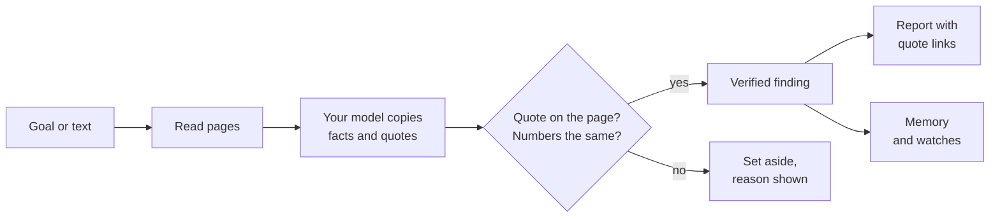
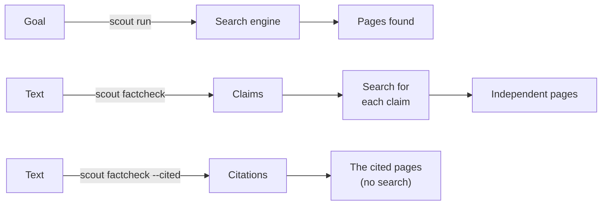
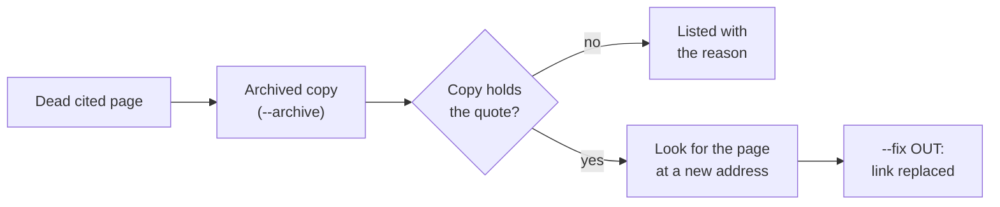
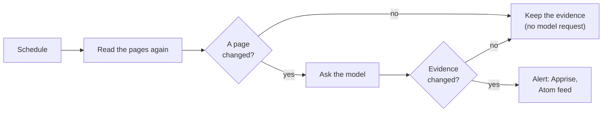

# Scout

[](https://github.com/RakhilML/Scout/actions/workflows/ci.yml)


Private, verifiable web research, fact-checking and monitoring with your own local LLM.

Scout searches the web, reads the pages, and uses your model to extract facts. Every fact must
come with a quote from a page. Scout finds the quote on the page and compares its numbers. If the
quote is not on the page, or a number is different, the fact does not count.



## What Scout does

| Feature | Command | Details |
|---|---|---|
| Research a question | `scout run GOAL` | [Research](docs/research.md) |
| Fact-check a text or a web page | `scout factcheck TEXT` | [Fact-check](docs/fact-check.md) |
| Check that cited pages say what the text says | `scout factcheck --cited` | [Citations](docs/citations.md) |
| Find dead citations, archived copies and moved pages, and fix the links | `--archive`, `--find-moved`, `--fix OUT` | [Dead links](docs/dead-links.md) |
| Check a goal, claims or citations again on a schedule | `scout watch add` | [Watches](docs/watches.md) |
| Give the tools to an AI assistant | `scout mcp` | [MCP](docs/mcp.md) |
| Use any model, or an agent, or recorded answers | `SCOUT_LLM` | [Models](docs/models.md) |

The three checks differ in where the pages come from:



## Why use Scout

- **No quote, no claim.** A fact counts only when its quote is on the page, and the page states
  its numbers.
- **Rulings come from evidence.** A ruling comes from the verified quotes, not from the model's
  verdict. The quotes are in the report, so you can examine each ruling.
- **Every quote is one click from its page.** The link opens the page with the quote
  highlighted.
- **Dead links are fixed with proof.** Scout replaces a dead link only with an archived copy, or
  a new address, that holds the quote.
- **Changes come from the pages.** A watch alerts only when a page changed. When no page changed,
  Scout does not ask the model.
- **Private.** Your text goes only to your model. See [Privacy](docs/privacy.md).

To learn how these rules work, read [How Scout works](docs/how-it-works.md).

## Quick start

1. Install Scout (Python 3.11 or later):

   ```bash
   pip install -e ".[notify,mcp]"
   ```

2. Copy `.env.example` to `.env`. Set `LM_STUDIO_BASE_URL` and `LM_STUDIO_MODEL`.
3. Test the model server:

   ```bash
   scout check
   ```

   Scout gets the context window and the reasoning levels of the model. It also tests
   schema-constrained output. It keeps the result for a day.

4. Research a goal:

   ```bash
   scout run "What are the new features in Python 3.13?"
   ```

5. Check the citations in a text, for example an AI answer:

   ```bash
   scout factcheck --cited -f answer.md
   ```

To use a server other than LM Studio, an agent, or recorded answers, read [Models](docs/models.md).
For all settings, read [Configuration](docs/configuration.md).

## Example: check the citations in a text

This text cites four pages:

```
Python 3.13 was released on October 7, 2023.[1] It removed the global interpreter lock by default.[2]
Its JIT makes it 40% faster than 3.12 ([realpython.com](https://realpython.com/python313-new-features/)).
It runs on iOS as a tier 3 platform.[4]

Sources
[1] https://www.python.org/downloads/release/python-3130/
[2] https://docs.python.org/3/whatsnew/3.13.html
[4] https://example.org/gone
```

`scout factcheck --cited` reads each cited page and judges each claim on its own cited pages:

```
Verdict — medium confidence (2 of 4 cited claims settled by the pages they cite; 1 cited page could not be read)
Of 4 cited claims: 2 contradicted, 1 not found, 1 unreadable.

1. Contradicted by [1] (1 site): Python 3.13 was released on October 7, 2023.
   - refutes (finding 1): "Python 3.13.0 was released on October 7, 2024." (source 1, python.org, 2024-10-07)
2. Contradicted by [2] (1 site): Python 3.13 removed the global interpreter lock by default.
   - refutes (finding 2): "The free-threaded mode is experimental and the GIL remains enabled by default." (source 2, docs.python.org)
3. Not found in [3]: Python 3.13's JIT makes it 40% faster than Python 3.12.
   - no quote on the page it cites states or contradicts it
4. Could not read [4]: Python 3.13 runs on iOS as a tier 3 platform.
   - could not read [4] example.org (not found: HTTP 404)
```

Each check also writes an annotated page: your text, with the checked sentences coloured by their
result.

## Dead citations

A cited page can be gone. Some dead pages still answer: they redirect to a home page, or show a
"Page not found" template. Scout finds these pages too. Then it can look for the page elsewhere:



`--fix OUT` writes your text with each dead link replaced by the new address, or else by the
archived copy. A replacement must hold the quote that the sentence relies on, word for word. For the full rules, read [Dead links](docs/dead-links.md).

## Watches

A watch runs a goal, a text's claims or a text's citations again on a schedule. It tells you what
changed:

```bash
scout watch add gpu "cheapest RTX 5090 price" --every 6h \
    --alert "price below 1800 USD" --alert "drop 5%" --notify ntfy://my-topic
scout watch run gpu        # run now; the first run is the baseline
scout daemon               # run every watch on its schedule
```



For alert rules, claim watches and citation watches, read [Watches](docs/watches.md).

## Commands

| Command | What it does |
|---|---|
| `scout run GOAL [--deep]` | Research a goal |
| `scout factcheck TEXT\|URL` (or `-f FILE`, `-f -`) | Fact-check the claims of a text against independent pages |
| `scout factcheck --cited [--all] [--archive] [--find-moved] [--fix OUT]` | Check, audit and repair the citations of a text |
| `scout history`, `scout show RUN [--json]` | Show stored runs and checks |
| `scout export FOLDER [--run RUN] [--format note\|html]` | Write runs as Markdown notes with front matter, or as web pages |
| `scout replay RUN` | Analyze the exact pages of a stored run again, with any model |
| `scout ask QUESTION` | Show what earlier runs verified about a question (no web, no model) |
| `scout rate RUN N good\|bad`, `scout ratings` | Judge a finding; list or export the ratings |
| `scout sites [--forget SITE]` | Show what Scout learned about each site |
| `scout watch add/list/show/run/changes/trend/feed/pause/resume/remove` | Manage and run [watches](docs/watches.md) |
| `scout pack list`, `scout pack add NAME PARAM=VALUE…` | Add a ready-made watch |
| `scout daemon`, `scout service install/uninstall`, `scout logs` | Run the watches on schedule, and start the daemon at login |
| `scout prune` | Remove old cached searches and page versions (the daemon does this daily) |
| `scout eval export/run` | Make test cases from runs; score models and prompts against them |
| `scout mcp` | Serve the tools to AI assistants |
| `scout check`, `scout models` | Test the model server; list its models |

All commands take `--help`. `scout -v COMMAND` shows progress, and `-vv` shows debug output.

## Documentation

| Page | Read it to |
|---|---|
| [How Scout works](docs/how-it-works.md) | Understand the rules: quotes, verification, rulings, labels, evidence |
| [Research](docs/research.md) | Research a goal, use reports and quote links, use memory and ratings |
| [Fact-check](docs/fact-check.md) | Check the claims of a text, and read the annotated page |
| [Citations](docs/citations.md) | Check the pages that a text cites, and audit every citation |
| [Dead links](docs/dead-links.md) | Find dead citations, archived copies and moved pages, and fix the links |
| [Watches](docs/watches.md) | Check goals, claims and citations on a schedule, with alerts |
| [MCP](docs/mcp.md) | Give the tools to an AI assistant |
| [Models](docs/models.md) | Use a model server, an agent or recorded answers; test models and prompts |
| [Configuration](docs/configuration.md) | Set environment variables and the `.env` file |
| [Privacy](docs/privacy.md) | Know what leaves your machine, and how private networks are protected |
| [Architecture](docs/architecture.md) | Change Scout: the code, the data flow, the tests |

## Development

```bash
pip install -e ".[dev,notify,mcp]"
ruff check src tests && ruff format --check src tests
pytest                 # offline; `pytest -m live` also uses the network
```

The tests do not use the network or a model. CI runs the lint and the tests on Linux and Windows,
with Python 3.11, 3.12 and 3.14. For the code layout, read [Architecture](docs/architecture.md).
