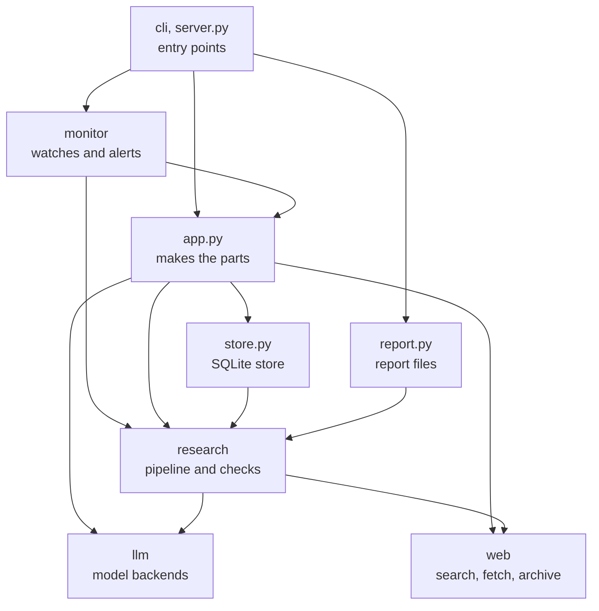
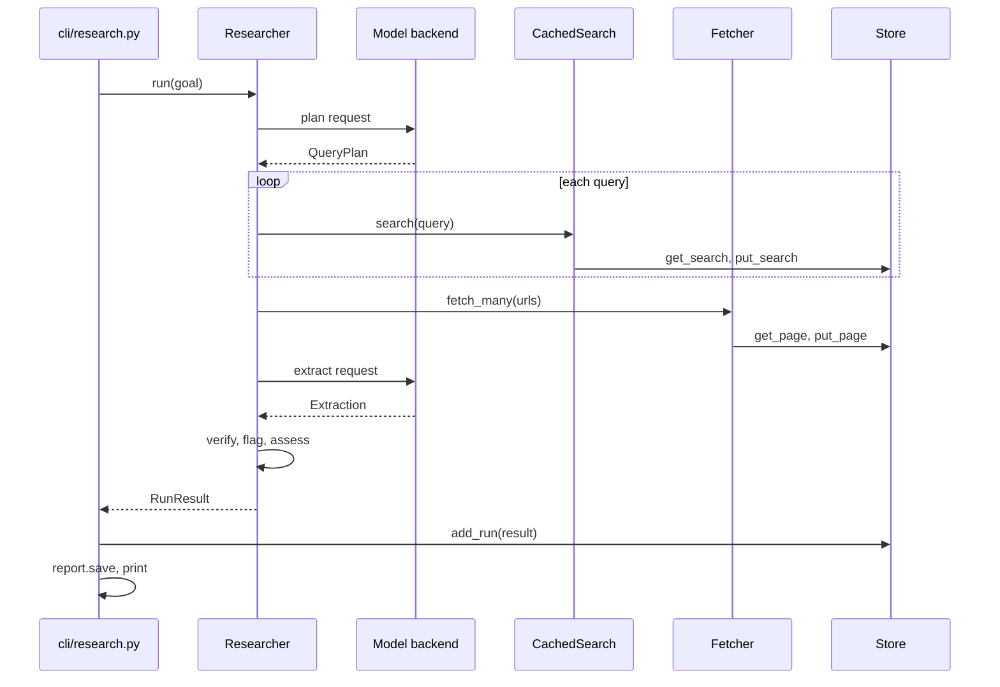
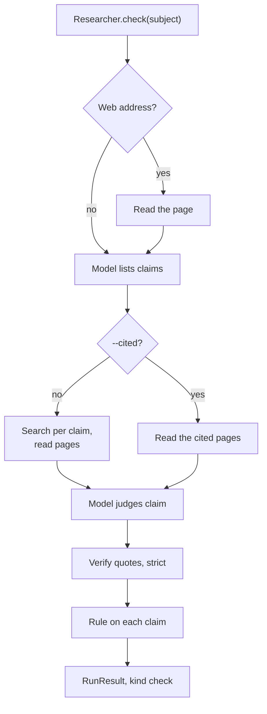
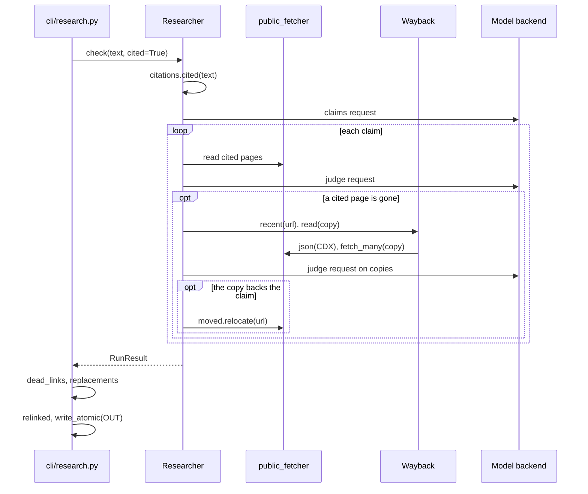
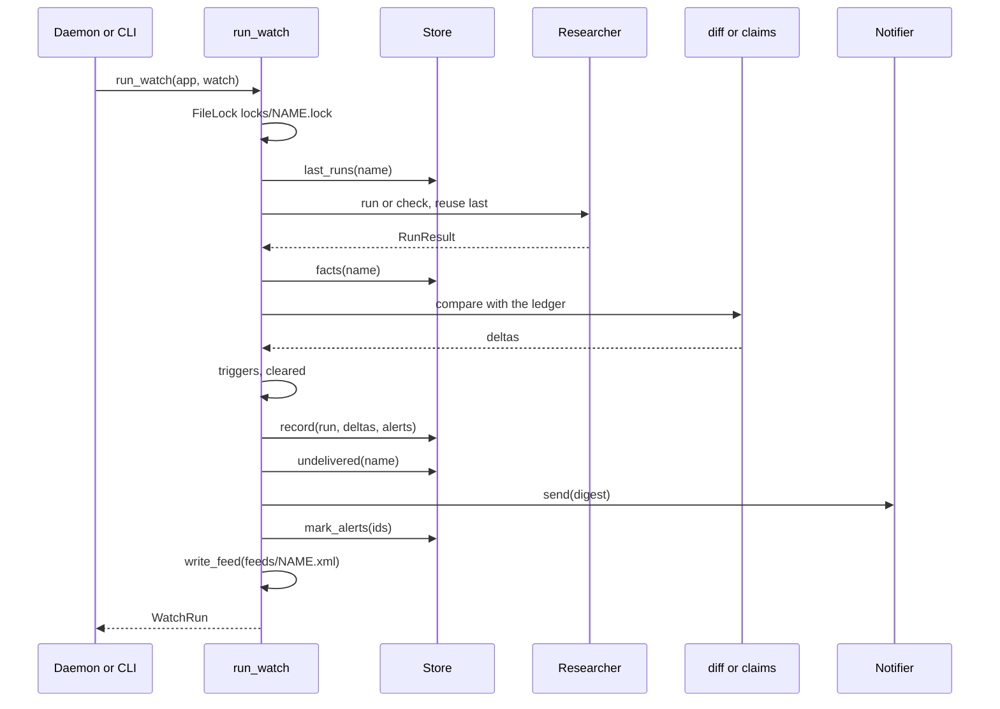
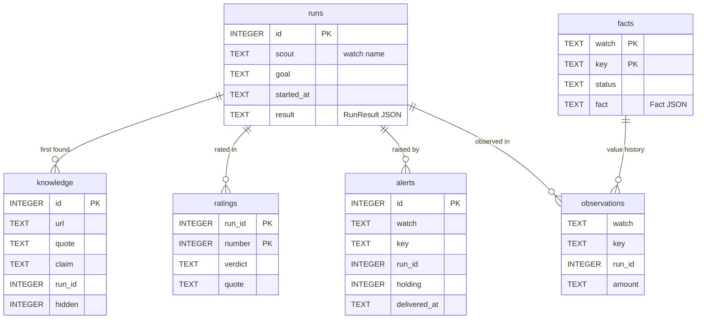
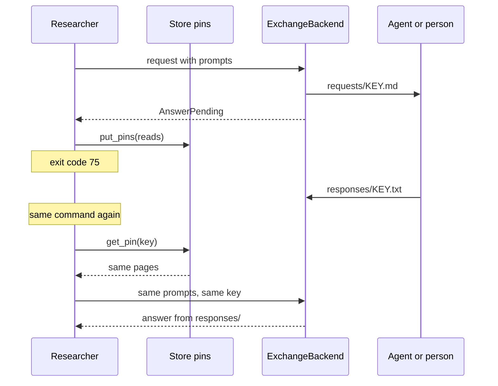

# Architecture

This page is for a developer who wants to change Scout: the packages, the data flow of each
command, the stored data, the rules to keep, and the tests.

The diagram shows the main packages and modules. An arrow points from a module to the package
that it imports. `cli` and `server.py` import the same parts, so they share one box.



All packages also use the base modules: `settings.py`, `errors.py`, `files.py`, `textutil.py`
and `clock.py`. The diagram leaves out these imports:

- `monitor/runner.py`, `monitor/feed.py` and `monitor/trends.py` import the `AlertRecord` and
  `Observation` row types from `store.py`. They get the store itself from `App`.
- `store.py` imports the `Change`, `Delta`, `Fact` and `Trigger` types from `monitor/diff.py`
  and `monitor/rules.py`. This import goes against the layers.
- `web/moved.py` imports `span_of()` from `research/verify.py`. This import also goes against
  the layers.
- `cli/daemon.py` imports `server.py` only when `scout mcp` starts, because `mcp` is an
  optional extra.

## Package layout

Scout uses the src layout: the package is `src/scout/`. The `scout` command calls
`scout.cli:main` (`[project.scripts]` in `pyproject.toml`). `python -m scout` runs
`src/scout/__main__.py`, which calls the same function. Hatchling reads the version from
`__version__` in `src/scout/__init__.py`.

### Top-level modules

| Module | Job |
|---|---|
| `__init__.py` | Holds `__version__` (now `2.0.0.dev0`). |
| `__main__.py` | Runs `scout.cli.main` for `python -m scout`. |
| `app.py` | `App` builds the parts from `Settings`: the store, the fetchers, the search caches, the archive and the model backend. The CLI, the daemon and the MCP server share it. |
| `server.py` | The MCP server, `build(app)`, with the tools `research`, `fact_check`, `recall`, `report`, `watch_add`, `watch_list`, `watch_run`, `watch_trend` and `watch_changes`. It needs the `mcp` extra. |
| `store.py` | `Store`: the SQLite database. It holds the caches, the runs, the memory of findings, ratings, sites, the watch ledgers, alerts and pins. |
| `report.py` | Renders a `RunResult` as Markdown, HTML (the annotated page), JSON and vault notes. `save()` writes the report files. |
| `settings.py` | `Settings` and `load_settings()`: environment variables and the `.env` file. `Settings` also gives the paths in the data folder. |
| `textutil.py` | Text normalization: `clean()` for storage and display, `fold()` for comparison, `shingles()`, `shorten()`, `looks_like_junk()` and `rate_unit()`. |
| `files.py` | `write_atomic()` and `FileLock`: whole-file writes, and a lock across processes. |
| `clock.py` | `utcnow()`, the default clock. Tests give a fake clock in its place. |
| `errors.py` | `ScoutError` and its subclasses: the failures that Scout expects. |
| `evaluate.py` | Eval cases and scores for `scout eval`: `EvalCase`, `EvalScore`, `score()`, `regressions()` and `RecordedReplies`. |

### cli

| Module | Job |
|---|---|
| `cli/__init__.py` | The `main` click group. It adds every command, sets UTF-8 output streams and sets up logging. |
| `cli/_common.py` | What every command shares: the `out` and `err` consoles, `ScoutGroup`, `linked()` and the logging setup. `ScoutGroup` turns a `ScoutError` into a one-line message and exit code 1, and `AnswerPending` into exit code 75. |
| `cli/research.py` | `run`, `factcheck`, `ask`, `rate`, `ratings`, `sites`, `check`, `models`, `history`, `show`, `replay`, `export`, `eval run` and `eval export`. |
| `cli/watch.py` | `watch add`, `list`, `show`, `remove`, `pause`, `resume`, `run`, `changes`, `trend`, `feed`, and `pack list`, `pack add`. |
| `cli/daemon.py` | `daemon`, `logs`, `prune`, `mcp`, `service install` and `service uninstall`. |

### llm

| Module | Job |
|---|---|
| `llm/__init__.py` | `make_backend()` makes the backend that `SCOUT_LLM` names: `openai`, `exchange:DIR`, `replay:DIR` or `record:DIR`. `model_server()` finds the server behind a wrapper. |
| `llm/base.py` | The `Backend` protocol, `Message`, `CompletionRequest` and `Completion`. |
| `llm/openai_compat.py` | `OpenAICompatBackend`: chat completions on an OpenAI-compatible server (LM Studio, Ollama, llama.cpp, vLLM). It turns server errors into `LLMError` subclasses. |
| `llm/exchange.py` | `ExchangeBackend`: files as a model API, in the modes `answer`, `replay` and `record`. The request key is a hash of the model, the messages, the schema and the temperature. |
| `llm/routing.py` | `RoutedBackend` sends each request to the backend for its purpose. `make_backend()` uses it to send the `plan` step to `SCOUT_PLANNER_MODEL`. |
| `llm/structured.py` | `generate()` gets a reply that a pydantic model validates, with one repair request. The modes are `json_schema` and `prompt`. |
| `llm/probe.py` | `probe()` finds the context window, the reasoning levels and the structured mode of a model (`Capabilities`). |

### research

| Module | Job |
|---|---|
| `research/__init__.py` | The package docstring only. |
| `research/pipeline.py` | `Researcher`: a research run (`run()`, `run_deep()`), a fact-check or a cite-check (`check()`), and a new analysis of stored pages (`reanalyze()`). Also `ResearchOptions`, the pins and `source_budget()`. |
| `research/plan.py` | `model_plan()` (the model writes 2 to 4 searches) and `heuristic_plan()` (keywords, for `--no-plan` or an unusable plan). |
| `research/rank.py` | BM25: `tokenize()`, `coverage()` of the goal by search hits, and `pack()`, which fills a character budget with the most relevant chunks of the pages. |
| `research/prompts.py` | Every text that Scout sends to the model. `source_block()` fences page text. |
| `research/schema.py` | The pydantic models that the model must return: `QueryPlan`, `Extraction`, `ModelFinding`, `FollowUp`, `Synthesis`, `ClaimToCheck`, `ClaimList`, `AllClaims`, `ModelEvidence` and `Judgment`. |
| `research/verify.py` | `verify()` checks each quote on the full page text, with its numbers. `assess()` gives the confidence from the evidence. |
| `research/values.py` | Prices in findings (`attach_amounts()`), findings from schema.org offers (`offer_findings()`), and outlier and accessory flags (`flag_values()`). |
| `research/results.py` | The result types: `RunResult`, `Source`, `Finding`, `ClaimCheck`, `Plan`, `Confidence`, and the enums `Verdict`, `Flag` and `Ruling`. |
| `research/factcheck.py` | The fact-check rules, with no web access and no model: which claims a text makes (`anchored()`), evidence verified with `strict=True` (`weigh()`), rulings and labels (`assemble()`, `summarize()`), audit parts, and the limits (`MAX_CLAIMS`, `CLAIM_LIMIT`, `AUDIT_LIMIT`, `ARCHIVE_LIMIT` and others). |
| `research/citations.py` | `cited()` turns each citation of a text into a marker `[n]` and gives the address of each n. `relinked()` replaces dead addresses in a text, for `--fix`. |
| `research/deadlinks.py` | `dead_links()` lists the dead cited pages of a cite-check, with the archived copy or the new address to cite. `replacements()` gives the input of `relinked()`. |
| `research/reputation.py` | `SiteRecord`: what Scout learned about a site. A site that failed 3 times in a row is skipped for 7 days. Its `standing` changes the rank of its search hits a little. |

### web

| Module | Job |
|---|---|
| `web/__init__.py` | The package docstring only. |
| `web/search.py` | The search backends `DDGSBackend` and `SearxngBackend` (`make_search_backend()`), `CachedSearch` in front of them, and `merge_hits()`. |
| `web/fetch.py` | `Fetcher` downloads pages in parallel (`fetch_many()`, with a deadline), with the page cache and conditional requests. It returns a `Document` with a `FetchStatus`. It has the public-only mode, and `json()` for APIs. |
| `web/extract.py` | Bytes to text: `extract_html()` (trafilatura), `extract_pdf()` (pypdf) and `extract_plain_text()`, with dates and schema.org `Offer`s. `EXTRACTOR_VERSION` is now 5. |
| `web/render.py` | `PlaywrightRenderer` reads pages that build their text with JavaScript (`SCOUT_RENDER=playwright`). |
| `web/domains.py` | `hostname()`, `registrable_domain()`, `canonical_url()`, `private_address()`, `is_ad_link()` and `DEFAULT_SKIP_DOMAINS`. |
| `web/soft404.py` | `screened()` makes a page that answers but is gone `NOT_FOUND`, with a probe of a made-up address on the same site. `error_page()` finds an error template. |
| `web/archive.py` | `Wayback` asks the Wayback Machine CDX index for copies and reads them. `working()` finds the newest copy that is not an error page. |
| `web/moved.py` | `relocate()` finds where a dead cited page moved, proven by its text (`same_page()`). |
| `web/fragments.py` | Links that open a page at a quote (text fragments, `#:~:text=`): `directive()` and `link()`. |

### monitor

| Module | Job |
|---|---|
| `monitor/__init__.py` | The package docstring only. |
| `monitor/watches.py` | `Watch` (one watch, validated when it is made), `WatchBook` (the `watches.yaml` file, edited under a lock) and `trigger()` (the APScheduler trigger of a schedule). |
| `monitor/runner.py` | `run_watch()` does one run of a watch: research or check, compare, raise alerts, deliver them, write the feed. `digest()` writes the notification text. |
| `monitor/diff.py` | `diff()` finds what changed since the last run, judged on the page text. Also `Fact`, `Delta` and `Change`. |
| `monitor/claims.py` | Claim watches and citation watches: rulings and labels that change only when a page changed (`compare()`, `pages()`, `left()`). |
| `monitor/rules.py` | Alert rules in plain words: `parse_rule()`, `Rule`, `Trigger`, `triggers()` and `cleared()`. No model decides an alert. |
| `monitor/notify.py` | `AppriseNotifier` sends a notification to Apprise URLs (the `notify` extra). |
| `monitor/feed.py` | `atom()` and `write_feed()`: the Atom feed of the alerts of a watch. |
| `monitor/trends.py` | Value history: `series()`, `sparkline()` and `write_csv()`. |
| `monitor/packs.py` | `Pack` and `available()`: watch templates from `src/scout/packs/` and from `<data dir>/packs/`. |
| `monitor/daemon.py` | `Daemon`: APScheduler with one worker. It reads `watches.yaml` again when the file changes, tries a failed run again after 30 minutes, and prunes the store once a day. |
| `monitor/service.py` | Starts the daemon at login: a systemd user unit on Linux, a LaunchAgent on macOS, a script in the Startup folder on Windows. |

### packs

| File | Job |
|---|---|
| `packs/__init__.py` | Makes the folder a package, so that `monitor/packs.py` finds the YAML files with `importlib.resources`. |
| `packs/news.yaml`, `packs/price.yaml`, `packs/release.yaml`, `packs/restock.yaml` | The packs that ship with Scout. |

## Data flow

### The App object

Each command that needs the store, the web or the model makes one `App(settings, llm=...)` and
closes it at the end. `App` makes these parts:

| Attribute | What it is |
|---|---|
| `store` | The `Store` on `<data dir>/scout.db`. |
| `fetcher` | A `Fetcher` for `scout run`, a plain fact-check and a cite-check with `--allow-private`. A cached page is fresh for 3600 seconds. |
| `search` | A `CachedSearch` that reuses results for 3600 seconds. |
| `watch_fetcher`, `watch_search` | The same caches with fresher limits, for watches: 300 seconds for pages, 600 seconds for searches. |
| `public_fetcher` | A `Fetcher` with `public_only=True` and no renderer. Pages are fresh for 300 seconds. |
| `archive` | `Wayback` on `public_fetcher`, or `None` when `SCOUT_ARCHIVE=off`. |
| `backend` | The model backend, made on first use by `make_backend()`. `scout history` and `scout show` need no model. |

`App.researcher()` makes a `Researcher`. Its arguments select the parts:

- `fresh=True` uses `watch_fetcher` and `watch_search`.
- `public_only=True` uses `public_fetcher`.
- `scope` names who runs it (a watch), so that runs of one goal keep their pins apart.
- `archive=True` gives the archive to a cite-check.

Before that, `App.capabilities()` gets the model's `Capabilities` from the `models` table. If
there are none, or they are older than 24 hours, `probe()` asks the server again. After a run,
`App.learn_from()` stores a structured mode that fell back to `prompt` during the run.

### Research run

`scout run GOAL` follows this sequence.



1. `run()` in `cli/research.py` makes an `App` and calls `app.researcher()`.
2. `Researcher.run()` cleans the goal and calls `_run()` inside `_pinned()` (see
   [Pinned reads](#pinned-reads)).
3. `_plan()` starts from `heuristic_plan()`. Unless `--no-plan` is set, `model_plan()` asks the
   model (purpose `plan`). An unusable plan falls back to the heuristic plan, with a warning.
   `--kind` and `--recency` override the plan.
4. `_read()` calls `_find()`: one search for each query, then `merge_hits()`. `_select()` keeps
   the hits about the goal, at most 2 for each site, and uses the site records.
5. `Fetcher.fetch_many()` reads the pages in parallel (4 workers, a 45-second deadline).
   `_sources()` numbers them as `Source` objects. An unreadable page keeps its search snippet
   (`snippet_only`).
6. `_analyze()` calls `_extract()`. `pack()` fills the budget of `source_budget()` with the most
   relevant chunks. The model returns an `Extraction` (purpose `extract`).
7. `verify()` checks the quotes of at most `MAX_FINDINGS` (12) findings. For a price goal,
   `offer_findings()` adds the schema.org prices. Then `_flag_stale()`, `attach_amounts()`,
   `flag_values()` and `assess()` run.
8. `_finish()` in the CLI calls `app.learn_from()`, `store.add_run()` and `report.save()`, and
   prints the Markdown report. `--no-save` skips the store and the files.

`--deep` calls `run_deep()`. After each round, the model names up to 3 follow-up searches
(purpose `follow_up`). `_deepen()` reads only pages that the run did not read yet. At the end,
the model writes the answer again from the trusted findings (purpose `answer`). The run stops
after `--rounds` rounds (at most `MAX_ROUNDS`, which is 5), when the model has no gaps, or when
a round adds no trusted finding.

### Fact-check

`scout factcheck` calls `Researcher.check()`. The flowchart shows the two paths: a plain
fact-check searches the web, a cite-check reads only the cited pages.



1. The run key of a check (see [Pinned reads](#pinned-reads)) uses the SHA-256 hash of the
   text.
2. `_subject()` reads a web address (one word that starts with `http://` or `https://`) once,
   and pins it as `subject`. `soft404.screened()` screens it. The page title goes before the
   text. The sites of the page (`registrable_domain()`) are never evidence: they go into
   `avoid`.
3. `_claims()` sends `claims_messages()` (purpose `claims`) and gets a `ClaimList`.
   `factcheck.anchored()` keeps only the claims that the text makes, with their numbers. If the
   list is unusable, `factcheck.sentences()` makes one claim for each sentence.
4. For each claim, `_check_claim()` calls `_read()` with the query of the claim and `avoid`.
   `_judge()` sends `judge_messages()` (purpose `judge`) and gets a `Judgment`.
5. `factcheck.weigh()` verifies each quote of the judgment with `verify(..., strict=True)`.
6. `factcheck.assemble()` numbers the findings and makes one `ClaimCheck` for each claim.
   `factcheck.summarize()` writes the answer and the confidence.
7. The `RunResult` has `plan.kind == "check"` (`CHECK_KIND`). `report.save()` also writes the
   annotated page (`.html`) for this kind.

The defaults: `MAX_CLAIMS` (6) claims, at most `CLAIM_LIMIT` (12), and `PAGES_PER_CLAIM` (3)
pages for each claim.

### Cite-check, --archive and --fix

`scout factcheck --cited` follows this sequence. The `opt` blocks run only with `--archive`
(which `--fix` and `--find-moved` turn on).



1. A cite-check uses `public_fetcher` unless `--allow-private` is set. It searches nothing:
   `plan.queries` is empty.
2. `_subject(links=True)` reads a web address with its links and footnotes. A read with links
   does not use the page cache.
3. `citations.cited(text, own=avoid)` turns each citation into a marker `[n]` and gives
   `pages`, the address of each n. With no citation, `check()` raises a `ScoutError`.
4. `_claims(cited=True)` lists the claims. `factcheck.citing()` keeps the claims whose sentence
   cites a page.
5. With `--all`, `_audit_claims()` lists the claims part by part (`factcheck.parts()`), up to
   `AUDIT_LIMIT` (300). An audit is resumable: see [Pinned reads](#pinned-reads).
6. `_check_cited()` calls `_read_cited()`. It reads the cited pages 12 at a time, each batch
   with its own deadline, through `soft404.screened()`. A claim is judged on at most
   `MAX_CITED_PAGES` (5) pages.
7. With an archive, `_on_copies()` takes each cited page that `factcheck.gone()` calls gone.
   `_copy()` calls `_lookup()`, which calls `working()` from `web/archive.py`. `working()` asks
   `Wayback.recent()` for the newest copies and reads them with `Wayback.read()`.
   `soft404.error_page()` rejects an archived error page.
8. The copy becomes a `Source` with `copy_of = n`. A run looks up at most `ARCHIVE_LIMIT` (30)
   pages. If the checked page says when it was written, the copy must be from that day or
   earlier.
9. The model judges the claim again on the copies. The result goes into `ClaimCheck.archived`
   and never changes the label.
10. For a copy that backs the claim, `_moved()` calls `moved.relocate()`. It tries the same
    path on the host that the dead address redirects to. With `--find-moved`, it also searches
    that host's site and the old site for the words of the quote, as the copy writes them.
11. `factcheck.found_again()` verifies the quote again on the live page. That page becomes a
    `Source` with `moved_from = n`.
12. The CLI calls `deadlinks.dead_links()`, `deadlinks.replacements()` and
    `citations.relinked()`.
13. With `--fix OUT`, `_writable()` tests OUT before the check starts. After the check,
    `_write_fixed()` writes OUT with `write_atomic()`. If the text had a byte order mark, OUT
    keeps it. If OUT is the checked file and it changed during the check, the fixes go into its
    new text.

### Watch run

A watch run follows this sequence. The daemon, `scout watch run NAME` and the MCP tool
`watch_run` call `run_watch()`.



1. `run_watch()` takes `FileLock` on `<data dir>/locks/<name>.lock` with `wait=False`. A second
   run of the same watch stops with an error.
2. `store.last_runs()` gets the last `EARLIER_RUNS` (5) runs. `continued()` decides if the last
   run asked the same question. If not, the run starts a new baseline and `store.retire()` sets
   the old facts aside.
3. The run calls `app.researcher(fresh=True, scope="watch:<name>")`. A citation watch is always
   public-only. The MCP tool makes every watch run public-only.
4. A research watch calls `run(goal, plan=previous.plan, reuse=previous)`. It repeats the same
   searches. If the same pages read the same, the old analysis is kept and the model is not
   asked.
5. A claim watch calls `check(goal, reuse=previous)`. A citation watch calls
   `check(goal, reuse=previous, cited=True, audit=True)`.
6. A research watch compares with `diff.diff()`. A claim or citation watch uses
   `claims.compare()`, `claims.pages()` and `claims.left()`.
7. `rules.triggers()` and `rules.cleared()` decide the alerts. The default rules are `new` and
   `changed` for a research watch, `changed` for a claim watch, and `changed` and `dead` for a
   citation watch.
8. For a citation watch with an archive, `_copies()` looks up each cited page that died in this
   run. `_remedied()` makes the `dead` alert lead to the copy.
9. `store.record()` writes the run, the ledger changes and the alerts in one transaction.
10. `deliver()` sends all alerts that are not delivered yet in one notification. A failed
    delivery is tried again by later runs for 3 days, or two intervals if that is longer.
11. With `stop_when_alerted`, `WatchBook.update()` pauses the watch.
12. `write_feed()` writes the 50 newest alerts (`FEED_ENTRIES`) to `feeds/<name>.xml`.

The `Daemon` runs one watch at a time (one worker thread). Every 30 seconds, it reads
`watches.yaml` again if the modification time of the file changed. If a run fails with a
`ScoutError` or `AnswerPending`, the daemon tries it again 30 minutes later. It does not try
again after a `ConfigError`. A `daemon.lock` file allows one daemon at a time.

### MCP server

`server.build(app)` makes an `MCPServer` with its tools. The `research`, `fact_check` and
`watch_run` tools use `public_only=True`. `fact_check` has no audit, and it checks at most
`CLAIM_LIMIT` (12) claims. `watch_run` refuses the first run of a citation watch. `research`
and `fact_check` store their runs with `store.add_run()`, but they write no report files.

## Key types

Most value types are frozen dataclasses. The types that the store keeps (`RunResult` and its
parts, `Document`, `SearchHit`, `Fact`) have `to_dict()` and `from_dict()`, and the store keeps
them as JSON. `Watch` uses the same two methods for `watches.yaml`.

| Type | Module | What it holds |
|---|---|---|
| `RunResult` | `research/results.py` | One run: goal, start and end times, model, `Plan`, `sources`, `answer`, `findings`, `Confidence`, `warnings`, `carried_over` and `rounds`. A check also has `claims`, `checked_text`, `cited`, `audit`, `skipped`, `unread` and `cites` (the address of each `[n]`). |
| `Source` | `research/results.py` | A page that the run read, with the number (`index`) that the model sees. `snippet_only` is true when the page was unreadable. `content_hash` names its snapshot. `copy_of` marks an archived copy, `moved_from` a new address. |
| `Finding` | `research/results.py` | A claim with its quote, source number, `Verdict`, value, amount, currency, `Flag`, note and `anchor`. `trusted` is true when it is verified and has no flag. |
| `ClaimCheck` | `research/results.py` | One claim of a check: the finding numbers in `supports`, `refutes` and `set_aside`, the pages it was judged on, `kept`, and `archived` (the same claim judged on archived copies). `ruling` comes from the sides of its trusted evidence. |
| `Plan`, `Confidence` | `research/results.py` | The queries, kind, recency and planner of a run. The confidence level and its reason. |
| `Verdict`, `Flag`, `Ruling` | `research/results.py` | `verified` or `unverified`. `outlier`, `accessory`, `doubted` or `stale`. `supported`, `refuted`, `disputed` or `unclear`. |
| `Document` | `web/fetch.py` | One download: `FetchStatus`, final address, text, title, dates, offers, ETag, `content_hash` and `extractor`. |
| `SearchHit` | `web/search.py` | One search result: address, title, snippet, rank and query. |
| `Watch` | `monitor/watches.py` | One entry of `watches.yaml`: `name`, `goal`, `every` or `cron`, `kind`, `recency`, `region`, `max_results`, `alerts`, `notify`, `stop_when_alerted`, `paused`, `check` and `cited`. |
| `Fact`, `Delta`, `Change` | `monitor/diff.py` | A trusted finding that a watch remembers, and how it changed in a run: `new`, `noticed`, `changed`, `same` or `gone`. |
| `Rule`, `Trigger` | `monitor/rules.py` | A parsed alert rule, and a rule that fired on a delta, with its reason. |
| `WatchRun` | `monitor/runner.py` | What one watch run did: run id, result, deltas, alerts, deliveries, model requests. |
| `DeadLink` | `research/deadlinks.py` | A dead cited page: its state, archived copy, new address and the link to cite. |
| `Knowledge`, `Rating`, `AlertRecord`, `RunSummary`, `Observation` | `store.py` | Rows of the `knowledge`, `ratings`, `alerts`, `runs` and `observations` tables. |
| `Capabilities` | `llm/probe.py` | The context window, structured mode and reasoning options of a model. |
| `EvalCase`, `EvalScore` | `evaluate.py` | An eval case with the pages it read, and the score of a model on it. |

A stored run does not keep the full text of its pages. The `snapshots` table holds each page
version by `content_hash`. A search snippet is short, and the run keeps it.

## Where data is stored

### The data folder

The data folder is `SCOUT_DATA_DIR` (default `~/.scout`).

| Path | What it holds | Written by |
|---|---|---|
| `scout.db` | The SQLite store | `Store` |
| `watches.yaml` | The watches | `WatchBook.save()`, under a lock on `watches.yaml.lock` |
| `feeds/<watch>.xml` | The Atom feed of a watch | `write_feed()` |
| `locks/<watch>.lock` | A lock: one run of a watch at a time | `run_watch()` |
| `daemon.lock` | A lock: one daemon at a time | `scout daemon` |
| `logs/scout.log` | The daemon log, rotated at 1 MB, with 3 backups | `cli/daemon.py` |
| `packs/*.yaml` | Your own packs | You |
| `reports/` | Report files (the default of `SCOUT_OUTPUT_DIR`) | `report.save()` |

With `SCOUT_LLM=exchange:DIR`, the exchange folder holds `DIR/requests/<key>.md` (written by
Scout) and `DIR/responses/<key>.txt` (written by whoever answers).

### The SQLite store

`Store` keeps one connection behind a lock. A file database uses WAL mode and a busy timeout of
5000 ms. A write of more than one statement runs in one `BEGIN IMMEDIATE` transaction. The
diagram shows the tables of the run history and the watches. The schema declares no foreign
keys: the links are by value. `runs.scout` holds the watch name of a watch run, and `NULL` for
other runs.



| Table | What it holds | Written by |
|---|---|---|
| `pages` | The latest download of each address, as `Document` JSON | `put_page()`, from `Fetcher` |
| `snapshots` | Each readable page version once, by `content_hash` | `put_page()` |
| `searches` | Search hits by cache key (backend, news or web, region, recency, count, query) | `put_search()`, from `CachedSearch` |
| `models` | `Capabilities` for each server, model and context override | `App.capabilities()` |
| `runs` | Each run: summary columns, and the full `RunResult` JSON in `result` | `add_run()`, `record()` |
| `knowledge` | Each trusted finding once for each page and quote: the memory of `scout ask`. `hidden` is 1 while a rating says it is wrong. | `add_run()`, `record()`, `put_rating()` |
| `knowledge_index` | An FTS5 index on `claim`, `quote` and `goal` of `knowledge`. Two triggers keep it current. | SQLite triggers |
| `ratings` | The verdicts of `scout rate`, with the finding as it was | `put_rating()` |
| `sites` | Counters for each site: reads, failures, failures in a row, findings, verified, rated bad | `put_page()`, `add_run()`, `put_rating()` |
| `facts` | The ledger of each watch: one `Fact` JSON for each key, `active` or `gone` | `record()`, `retire()` |
| `observations` | The value history of watch facts that have an amount | `record()` |
| `alerts` | The alerts and their delivery state. A unique index allows one alert with `holding = 1` for each watch and key. | `record()`, `mark_alerts()` |
| `pins` | What a run read before it stopped to wait, by run key and pin key | `put_pins()`, from `Researcher` |

`_MIGRATIONS` is an ordered tuple of SQL scripts (now 9). `PRAGMA user_version` records how
many ran. `_migrate()` runs only the scripts after that number. To change the schema:

1. Add a new script at the end of `_MIGRATIONS`.
2. Do not edit a script that is in the tuple: a database that ran it does not run it again.

### Caches

| Cache | Fresh for | `prune()` removes it after |
|---|---|---|
| `pages` | 3600 s for runs; 300 s for watches and `public_fetcher`; 600 s after a timeout, a server error or a network error | 90 days |
| `snapshots` | Not a cache: each version stays for replays | 90 days, but the newest version of each address and each version that a run of the last 90 days read stay |
| `searches` | 3600 s for runs, 600 s for watches | 7 days |
| `models` | 24 hours | Never |
| `pins` | 1 day (`PIN_TTL`) | 7 days |

A stale page is downloaded again with `If-None-Match` and `If-Modified-Since`. A page that an
older `EXTRACTOR_VERSION` read is downloaded again. An empty search result is not cached. The
daemon runs `prune()` once a day, and `scout prune` runs it on demand.

### Report files

`report.save()` writes `<YYYY-MM-DD_HHMMSS>_<slug>.md` and `.json` to the reports folder. For a
fact-check or a cite-check, it also writes the annotated page as `.html`. The JSON adds
`scout_version`, `run_id` and, for a cite-check with dead pages, `dead_links`.

## Rules to keep

These rules go through the whole code. A change that breaks one of them can give a wrong result
or let a page attack the user.

### Quotes are verified on the page

`verify()` in `research/verify.py` gives every model finding its `Verdict`:

- It folds the quote and the page text with `fold()`. A quote of fewer than 12 characters
  (`MIN_QUOTE_CHARS`) is unverified. A long quote is checked by its first 400 characters.
- `locate()` finds the quote exactly. Else, `rapidfuzz` `partial_ratio` must be 90 or more, and
  every number of the quote must be in the matched text.
- Each number of the claim and its value (2 digits or more) must be in the quote, the source
  title or the source dates.
- With `strict=True`, the quote alone must state the numbers, single digits and number words
  included. Fact-checks, archived copies and moved pages use it.
- A quote found on another source is attributed to that source.
- The model can take trust away (`doubt` gives `Flag.DOUBTED`), but it cannot give trust.
- `span_of()` and `fragments.directive()` find where the quote is, for links that open the
  page at the quote.

The only other source of `Verdict.VERIFIED` is `offer_findings()`: prices that a page publishes
as schema.org data, read with no model. Do not set `Verdict.VERIFIED` anywhere else.

### Public-only fetcher

`FetchConfig(public_only=True)` makes a `Fetcher` read only the public internet:

1. `fetch()` refuses an ambiguous address (a backslash, a space or a control character) and a
   host that `private_address()` resolves to an address that is not global.
2. Each session mounts `_PublicAdapter`. Its connections (`_PublicPeer._new_conn()`) check the
   peer address of the socket before they send a byte. An IPv4-mapped IPv6 address is unwrapped
   first.
3. A `response` hook (`_refuse_private_hop()`) checks each redirect target before it is
   followed.
4. `session.trust_env` is `False`, so no proxy from the environment hides the host.
5. A cached page whose final address is private is not used again.
6. A refused page gets the status `REFUSED` and does not go into the cache.

`App.public_fetcher` has this mode and no renderer. The MCP tools, cite-checks without
`--allow-private`, citation watches and the archive use it. `_refuse_private()` in
`research/pipeline.py` refuses a checked web address on a private network.
`factcheck.archivable()` sends only pages with a public name to the archive.

> [!WARNING]
> A `Fetcher` without `public_only` reads private addresses: `scout run`, a plain fact-check
> and `--allow-private` use one. Use `public_only=True` for any address that a web page or an
> assistant can choose.

### Pinned reads

A run that waits for an exchange answer keeps what it read, so that the next run builds the same
prompts. The diagram shows the cycle with `SCOUT_LLM=exchange:DIR`.



- `Researcher._pinned()` makes the run key: the JSON of the goal (or the hash of the checked
  text), the mode, the pin scope and `public_only`. A resumable run adds the model name.
- Each read goes into `self._reads` under a pin key: `started`, `read:<hash>`, `subject`,
  `cited:<hash>`, `listed:<hash>`, `judged:<hash>`, `archived:<hash>` and `moved:<hash>`.
- On `AnswerPending`, `put_pins()` stores them. The next run gets them with `_pin()` while they
  are younger than `PIN_TTL` (1 day). `ExchangeBackend` then finds the answer under the same
  request key.
- A run that ends without an error drops its pins. A run that stops for another error drops
  them too.
- An audit (`--all`) is resumable. `_keep()` stores what it read and judged before each part and
  each claim. After an `LLMError`, an interrupt or a crash, the audit keeps its pins, and the
  same command continues where it stopped.
- The start time is pinned as `started`, so a prompt that gives today's date does not change.
- Relevance and site records decide which pages a run reads, never their numbers.

To add a new web read or lookup to the pipeline:

1. Read it from `self._pin(key)` first.
2. If there is no pin, do the read.
3. Put the result into `self._reads[key]`.

### Page text is fenced in prompts

- `prompts.source_block()` puts each source in a `<source id="..." title="..." site="...">`
  block. `_attribute()` replaces double quotation marks and line breaks in the attributes.
- `_defused(data, tag)` breaks each end tag in the data (`</source` becomes `</ source`),
  so a page cannot close its own fence.
- The checked text goes in `<text>`, a claim in `<claim>` and a page title in `<title>`, each
  through `_defused()`.
- Each system prompt tells the model that sources are untrusted data and that it must ignore
  instructions in them.

Put any new web text or user text through `source_block()` or `_defused()` with its own tag.

### Web text is escaped in output

| Output | What keeps web text inert |
|---|---|
| Markdown reports | `_md()` escapes the backslash, square brackets, angle brackets, `*`, `_` and the backtick. `_cell()` also escapes the table bar. `_md_link()` links only `http://` and `https://` addresses and percent-encodes the characters that end a link. |
| HTML reports | `html.escape()` on web and model text. `_html_link()` makes a link only for `http://` and `https://` addresses, so a page cannot plant a `javascript:` link. |
| Notifications | `digest()` writes plain text, sent with Apprise `NotifyFormat.TEXT`. `_inert()` turns angle brackets and square brackets into look-alike characters, so a chat service sees no mention or link. Addresses are percent-quoted. |
| Feeds | ElementTree escapes the XML. `_NOT_XML` removes the characters that XML forbids. An entry gets a link only for an `http://` or `https://` address. |
| Terminal | `rich.markup.escape()` on web text. `linked()` percent-encodes the characters that can end the markup tag or the terminal link sequence. `clean()` removes control characters. |

### Files are written whole

- `write_atomic()` writes a temporary file in the same folder, then calls `os.replace()`. A
  reader sees the old file or the new one. On Windows, it tries the replace up to 20 times while
  another process holds the file.
- `WatchBook.save()` (under a `FileLock`), `write_feed()` and the `--fix` output use it.
- `FileLock` uses `msvcrt.locking()` on Windows and `fcntl.flock()` on other systems. The watch
  runs, the daemon and the watches file use it.

> [!NOTE]
> Report files, `scout export`, `scout ratings --export`, eval files, exchange files and service
> files are written with `Path.write_text()` or `open("w")`, not with `write_atomic()`.

### Expected errors

- Raise a subclass of `ScoutError` for a failure that the user can fix. `ScoutGroup` prints it
  on one line and exits with code 1. Any other exception that reaches the CLI is a bug.
- `AnswerPending` exits with code 75 (`EXIT_ANSWER_PENDING`).
- `fetch_many()` turns an exception on one page into an `UNSUPPORTED` document. One bad page
  never stops a run.

### Time

`Researcher`, `Fetcher`, `CachedSearch` and `Daemon` take a `clock` callable. The default is
`clock.utcnow` (or `datetime.now(UTC)`), and tests give a `Clock`. The store keeps times as UTC
ISO 8601 text.

## Tests

### Run the tests

```bash
pip install -e ".[dev,notify,mcp]"
ruff check src tests && ruff format --check src tests
pytest                 # offline; `pytest -m live` also hits the network
```

The suite needs no network and no model: fakes stand in for the web, the search engine, the
archive and the model. CI runs it, with the lint, on Linux and Windows under Python 3.11, 3.12
and 3.14.

`pyproject.toml` sets `addopts = "-m 'not live'"` and `faulthandler_timeout = 120`.

### Fakes and fixtures

| Name | Where | What it stands in for |
|---|---|---|
| `ScriptedBackend` | `tests/helpers.py` | The model. Replies come from queues for each purpose (`{"plan": [...], "extract": [...]}`) or in call order. A queued dict goes out as JSON text, and a queued exception is raised. `requests` records each request. |
| `FakeSearch` | `tests/helpers.py` | The search engine: it answers from a table `{query: [(url, title, snippet)]}` and records `calls`. |
| `FakeFetcher` | `tests/helpers.py` | The web: it serves prepared pages (text or a `Document`). An unknown address is `BLOCKED`. It records `fetched` and `linked`, and can write to a cache. It has `fetch_many()` only. |
| `FakeArchive` | `tests/helpers.py` | The Wayback Machine: copies for each address, read through a `FakeFetcher`. `down` makes each lookup fail. It records `asked`. |
| `FakeResearcher` | `tests/helpers.py` | `App.researcher()` in CLI and server tests: it returns a prepared `RunResult` or raises a prepared error. |
| `Clock` | `tests/helpers.py` | A clock that you move with `advance(seconds)`. |
| `make_pdf()` | `tests/helpers.py` | A small valid PDF of one page. |
| `SAMPLE_RESULT`, `CHECK_RESULT`, `CITE_RESULT`, `AUDIT_RESULT` | `tests/helpers.py` | Prepared results: a price run, a fact-check, a cite-check and an audit. |
| `no_archive` | `tests/conftest.py` | Applies to every test. It replaces `scout.app.make_archive`, so no test asks the real Wayback Machine. |
| `clock` | `tests/conftest.py` | A `Clock` at `NOW` (2026-09-25 12:00 UTC). |
| `workspace` | `tests/conftest.py` | An isolated Scout: its own `.env` file (through `SCOUT_ENV_FILE`), data folder and `exchange:` folder. The current directory is the `tmp_path` of the test. |

Other tools in the suite:

- `responses` (in the `dev` extra) mocks HTTP for the fetcher, the search backends, the archive
  and the model server.
- `Store(":memory:")` gives a store in memory.
- click's `CliRunner` runs commands.
- `pytest.importorskip()` skips the tests of an extra that is not installed (`apprise`, `mcp`,
  `playwright`).

### Live tests

`tests/test_live.py` sets `pytestmark = pytest.mark.live`. Its tests use the real DDGS search
and real pages, and Playwright when it is installed. Run them with `pytest -m live`.

### Add a test

1. Put the test in `tests/test_<module>.py`.
2. Name it `test_<what it shows>`, as a short sentence.
3. Build the part under test with the fakes from `tests/helpers.py`.
4. Use `Store(":memory:")` when the test needs a store.
5. For a command, use the `workspace` fixture and `CliRunner().invoke(main, [...])`.
6. Replace `App.researcher` with `FakeResearcher` through `monkeypatch.setattr()` when the
   command must not run a real pipeline.
7. For code that sends HTTP requests, use `@responses.activate`.
8. Mark a test that needs the real network with `pytest.mark.live`.
9. Run `pytest` and the two `ruff` commands.

This start of a test from `tests/test_pipeline.py` shows a research run on fakes:

```python
def researcher(backend, *, search=None, pages=None, **options) -> Researcher:
    return Researcher(
        search=search or FakeSearch(SEARCH),
        fetcher=FakeFetcher(PAGES if pages is None else pages),
        backend=backend,
        options=ResearchOptions(**options),
        clock=Clock(),
    )


def test_a_full_run_plans_filters_reads_extracts_and_verifies():
    backend = ScriptedBackend({"plan": [PLAN], "extract": [EXTRACTION]})
    search = FakeSearch(SEARCH)
    result = researcher(backend, search=search).run(GOAL)

    assert backend.purposes() == ["plan", "extract"]
```

## Continuous integration

`.github/workflows/ci.yml` runs on each push and pull request.

| Item | Value |
|---|---|
| Systems | `ubuntu-latest`, `windows-latest` |
| Python | 3.11, 3.12, 3.14 |
| `fail-fast` | `false`: every combination runs to its end |
| Install | `python -m pip install -e ".[dev,notify,mcp]"` |
| Lint | `ruff check src tests`, then `ruff format --check src tests` |
| Test | `python -m pytest -q` |

## Code conventions

- The src layout, built with hatchling. `requires-python = ">=3.11"`.
- Ruff: `line-length = 100`, `target-version = "py311"`, and the rule sets `E`, `F`, `W`, `I`,
  `B`, `UP`, `SIM`, `C4`, `RUF` and `PT`. `ruff format` sets the layout.
- `.py` files are ASCII only. `tests/test_repo.py` fails on any other character. Write other
  characters as `\N{...}` escapes, for example `"\N{EM DASH}"` or `"\N{NO-BREAK SPACE}"`.
- Each module with functions or classes starts with `from __future__ import annotations`.
- Value types are `@dataclass(frozen=True, slots=True)`. Enums are `StrEnum`. Small results
  are `NamedTuple`.
- The interfaces between parts are `typing.Protocol` classes: `Backend`, `SearchBackend`,
  `SearchCache`, `PageCache`, `Archive`, `Renderer`, `Notifier`, `Pins` and `SiteBook`. `Store`
  implements `PageCache`, `SearchCache`, `Pins` and `SiteBook`. `Researcher` takes the concrete
  `Fetcher` type, and tests give it a `FakeFetcher` with the same `fetch_many()`.
- Comments are few. A docstring or a comment tells why, in plain words.
- Each module that logs uses `log = logging.getLogger(__name__)`.

## Related

- [How it works](how-it-works.md)
- [Research](research.md)
- [Fact-check](fact-check.md)
- [Citations](citations.md)
- [Dead links](dead-links.md)
- [Watches](watches.md)
- [MCP](mcp.md)
- [Models](models.md)
- [Configuration](configuration.md)
- [Privacy](privacy.md)
- [The README](../README.md)
