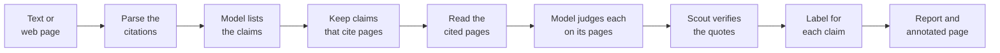
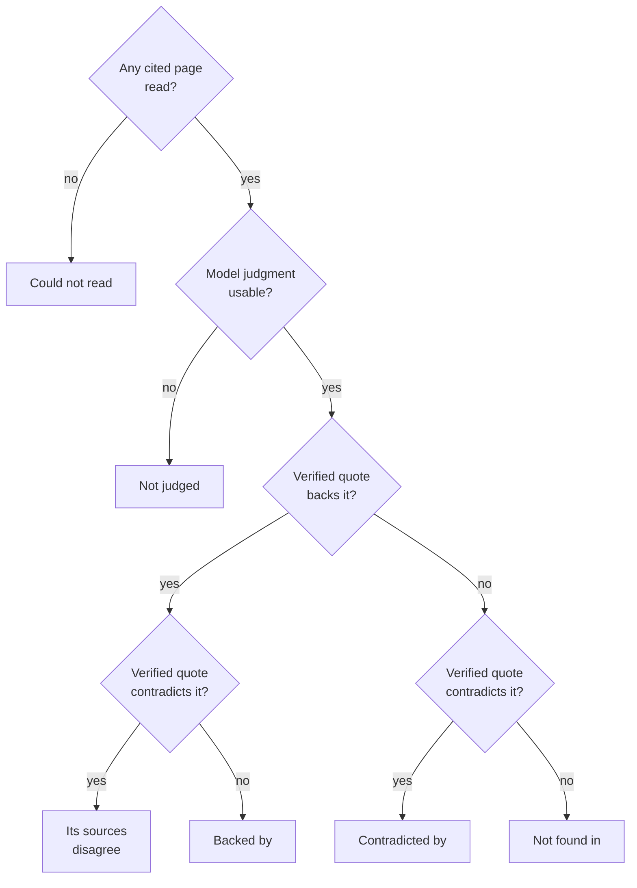
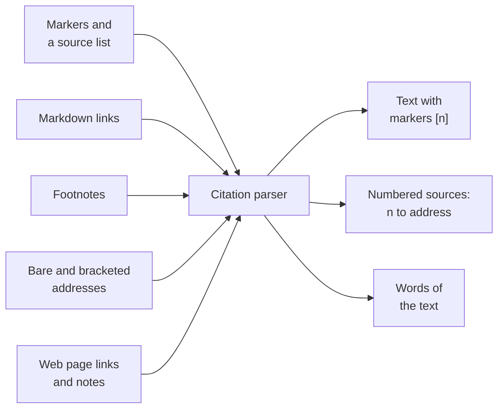
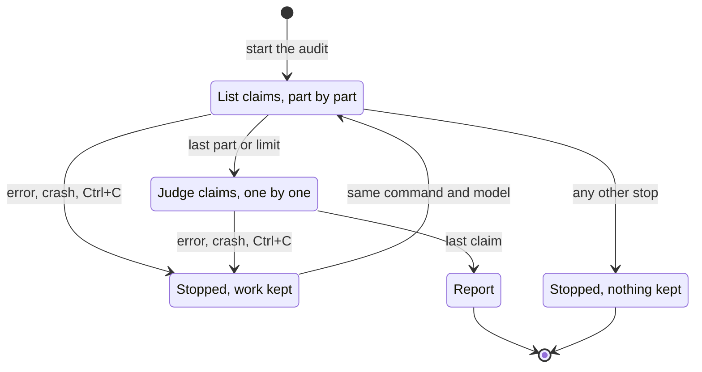

# Check citations

`scout factcheck --cited` checks that the pages a text cites say what the text says, and
`--all` audits every cited sentence of a text.



The diagram shows the steps of a cite-check. Each claim is judged only on the pages that its
own sentence cites.

## Check the citations of a text

```bash
scout factcheck --cited -f answer.md       # an AI answer, a post or a doc, with its sources
pbpaste | scout factcheck --cited -f -
scout factcheck --cited https://en.wikipedia.org/wiki/Python_Software_Foundation --claims 3
```

AI answers, articles, Wikipedia and docs cite their sources, and readers take a `[3]` as proof.
`--cited` asks whether the cited page really says it:

- Scout reads the pages that the text cites.
- Scout judges each claim only on the pages that its own sentence cites.
- The rules of a fact-check apply. The quote must be on the page, and a confirming quote states
  every number of the claim. See [Fact-check](fact-check.md#which-quotes-count).
- Nothing is searched. Scout downloads only the cited pages.

### Options

| Option | Default | What it does |
|---|---|---|
| `--claims N` | 6 | The most claims to check (1 to 12). Not with `--all`. |
| `--all` | off | Check every cited sentence. See [Audit every citation](#audit-every-citation). |
| `--allow-private` | off | Also read addresses on private networks. See [Private addresses](#private-addresses). |
| `--archive`, `--find-moved`, `--fix OUT` | off | Use archived copies of dead cited pages. See [Dead links](dead-links.md). |
| `--llm SPEC`, `--json`, `--no-save` | | As in a [fact-check](fact-check.md#options) |

`-n`/`--pages` does not apply to `--cited`: each claim is judged on the pages that its sentence
cites.

## Example

The text:

```
Python 3.13 was released on October 7, 2023.[1] It removed the global interpreter lock by default.[2]
Its JIT makes it 40% faster than 3.12 ([realpython.com](https://realpython.com/python313-new-features/)).
It runs on iOS as a tier 3 platform.[4]

Sources
[1] https://www.python.org/downloads/release/python-3130/
[2] https://docs.python.org/3/whatsnew/3.13.html
[4] https://example.org/gone
```

The verdict:

```
Verdict — medium confidence (2 of 4 cited claims settled by the pages they cite; 1 cited page could not be read)
Of 4 cited claims: 2 contradicted, 1 not found, 1 unreadable.

1. Contradicted by [1] (1 site): Python 3.13 was released on October 7, 2023.
   - refutes (finding 1): "Python 3.13.0 was released on October 7, 2024." (source 1, python.org, 2024-10-07)
2. Contradicted by [2] (1 site): Python 3.13 removed the global interpreter lock by default.
   - refutes (finding 2): "The free-threaded mode is experimental and the GIL remains enabled by default." (source 2, docs.python.org)
3. Not found in [3]: Python 3.13's JIT makes it 40% faster than Python 3.12.
   - no quote on the page it cites states or contradicts it
4. Could not read [4]: Python 3.13 runs on iOS as a tier 3 platform.
   - could not read [4] example.org (not found: HTTP 404)
```

The Markdown link to `realpython.com` has no number in the text. It takes `[3]`, the lowest
number still free (see [Numbering](#numbering)).

## Labels

| Label | Report heading | When |
|---|---|---|
| backed | `Backed by [n]` | Verified quotes on the cited pages back the claim. The heading names those pages. |
| contradicted | `Contradicted by [n]` | Verified quotes on the cited pages contradict the claim. The heading names those pages. |
| disputed | `Its sources disagree (…)` | Verified quotes are on both sides. |
| not found | `Not found in [n]` | Scout read the pages, and no quote states or contradicts the claim. |
| unreadable | `Could not read [n]` | Scout could not read any of the pages (dead, blocked or refused). This costs no model request. |
| not judged | `Not judged on [n]` | The model's judgment was unusable. This says nothing about the page. |



The diagram shows how Scout gives a claim its label from the cited pages.

- **One page settles a claim.** Confidence counts the claims that their cited pages settle. It
  does not count the sites that agree.
- Confidence is high only when every claim is backed or contradicted, and no cited sentence went
  unchecked. It is medium when at least one claim is settled, and low when none is.
- In the report, `[n]` is always the text's citation. Quotes are numbered "finding 1",
  "finding 2" for `scout rate`.

## Citation styles

Scout reads these citation styles:

| Style | Examples |
|---|---|
| Numbered markers, with a list of sources | `[1]`, `[1, 2]` or `[1-3]`, with `[1] https://…`, `[1]: https://…` or `1. Title https://…` |
| Markdown links | `[text](https://…)`, `[text][label]`, Copilot's `2024.[1](https://…)` |
| Footnotes | `[^1]` with `[^1]: … https://…` |
| Addresses | Bare, `<…>` or `[…]` addresses |



The diagram shows how Scout turns every citation style into markers `[n]` and numbered sources.
What is not a citation stays as words of the text.

Rules:

- **A numbered list** (`1. …`) lists sources only when both are true:
  - The text cites its numbers.
  - It is under a heading such as "Sources", "References" or "Works cited", or it ends the text
    with an address on every line.

  A numbered list of the text's own keeps its links as citations.
- **A linked number** is words of the text: `has [95](…) moons` keeps the 95. It is a citation
  only where a marker would stand.
- **Images, code, e-mail and relative links** are words of the text, not citations.
- **A number with two addresses**: Scout reads the first, and a warning says so.

## Numbering

- Source n is the text's `[n]`.
- Scout keeps each number that the text gives.
- Any other citation takes the lowest number still free.
- An address cited twice keeps one number.
- The checked text, and the annotated page, show every citation as `[n]`.

## A claim cites what its sentence cites

- A marker after the full stop belongs to the sentence before it: `2024.[1]`, `rise."[1]`,
  `(… 2024.)[1]`.
- One fact stated twice and cited to two pages is two claims.
- Scout sets aside claims in sentences that cite no web page, with a note. Plain
  `scout factcheck` checks them against independent pages. See [Fact-check](fact-check.md).

## Web pages

A web page cites what the links in its main text lead to.

| On the page | What Scout does |
|---|---|
| An in-page footnote (a `[3]` that leads to its note) | Keeps its number. It cites the note's first titled web address, or its DOI. |
| A short note ("Lee 2012, p. 5") | Follows it one step to its full entry |
| A note with no web address (a book) | `[3]` cites nothing. |
| A link to a heading, a section, a figure or a table | Reads it as words. That part of the page stays in the text. |
| A note that says something of its own (an aside, not a reference) | Keeps it in the text. Its links cite for its own sentences. |
| A link or address on the page's own site (menus, tags, other articles, any subdomain) | Reads it as words, not as a citation |
| A link to another user's site on the same hosting platform | Reads it as a citation: `someone.substack.com` cites `other.substack.com`. |

A footnote is a link marked as one (raised, or in footnote markup, Substack's included), or a
link that leads to a numbered note.

More rules for web pages:

- A PDF or a plain-text page cites only the addresses that its text spells out.
- Scout reads the page afresh, never from the cache.
- A page that shows its text only through JavaScript cannot be cite-checked. With
  `--allow-private` and `SCOUT_RENDER`, Scout renders it.
- To count the links to the page's own site as citations, save the text and use `-f`.

## Long texts and the context window

- A page cited alone can fill the model's context window. When even that is too short, Scout
  sends the passages closest to the claim, and a note says so.
- A sentence that cites more than 5 pages is judged on the first 5, with a note.
- `--claims` is at most 12, but an article can cite a hundred pages. When the claims checked
  cite only some of the text's pages, a note says how many, and points to `--all`.

## Private addresses

**Private addresses are refused.** A text can cite anything, so Scout does not read a page, or a
cited address, on a private network (`localhost`, `192.168.…`, `169.254.169.254`). A cited
one shows *could not read … (refused)*.

`--allow-private` reads them, for intranet docs.

> [!WARNING]
> `--allow-private` also lets a checked page choose private addresses for Scout to read. With
> `SCOUT_RENDER`, it also renders pages in a browser that runs their scripts. Use it only on
> texts and pages that you trust.

`--allow-private` does not combine with `--archive`, because `--archive` would send intranet
addresses to the archive. `--fix` and `--find-moved` imply `--archive`, so they do not combine
with it either.

## Dead pages

A cited page that is gone leaves its claim *could not read*, at no model request. Scout can judge
the claim on an archived copy of the page, find where the page moved, and write a fixed text. See
[Dead links](dead-links.md).

## The annotated page

A cite-check writes an annotated page, as a fact-check does. See
[Fact-check](fact-check.md#the-annotated-page). The colours show labels:

| Colour | Label |
|---|---|
| Green | backed |
| Red | contradicted |
| Amber | disputed |
| Grey | not found, unreadable or not judged |

In an audit, a dotted underline marks a cited sentence that is *not checked* (no claim in it was
checked), or *not read* (the audit stopped at its limit before it).

## Audit every citation

```bash
scout factcheck --cited --all https://en.wikipedia.org/wiki/Python_Software_Foundation
scout factcheck --cited --all -f deep-research-report.md
```

A cite-check checks a few claims, from as much of the text as fits the model's context window.
`--all` checks every cited sentence, however long the text. Examples: a Wikipedia article, a
sourced post, or an AI "deep research" report with dozens of sources.

1. Scout gives the model the text a part at a time: a few cited sentences in each request. The
   model lists the claims of each part.
2. Scout judges each claim on the pages that its own sentence cites, up to 300 claims.
3. Each claim costs one model request. The status line counts them (`claim 14 of 19`).
4. The verdict ends with what the audit covered:

```
Of 19 cited claims: 13 backed, 1 contradicted, 4 not found, 1 unreadable. Audit: 15 of 17 cited sentences checked, as 19 claims; in 2 no claim was checked (listed under Not checked).
```

`--all` applies to `--cited` only, and `--claims` does not apply to `--all`.

### What the audit covers

- **A cited sentence** is one that states something. "OCLC 1027550705 [17]" or an infobox's
  "Website [14]" is not a cited sentence.
- **The back matter of a web page** is not audited. It starts at a "References", "Notes",
  "Further reading" or "External links" heading past the first quarter of the page. A note says
  so. A fully checked Wikipedia article can then read "all N cited sentences checked".
- **Not checked**: a cited sentence in which no claim was checked. The model passed over it, or
  its passage was too long for the model's context window (a note names it). The report lists
  these sentences under **Not checked** (`skipped` in `--json`, beside `"audit": true`). The
  annotated page underlines them with dots.
- Confidence is never high while a cited sentence went unchecked.

### Limits

At 300 claims, or 300 cited sentences listed, the audit stops and says which limit it reached:

```
Audit: stopped at its limit of 300 claims; 270 of 290 cited sentences up to there checked, as 300 claims; 248 cited sentences after it were not read.
```

The annotated page also underlines the cited sentences that the audit never read.

### Stop and resume

**You can stop an audit at any time.** After a model error, a crash or Ctrl+C, Scout keeps what
the audit read and judged for a day. After a model error or Ctrl+C, Scout prints:

```
The audit keeps what it read and judged for a day: run the same command to continue where it stopped.
```

To continue the audit, run the same command again. The audit continues where it stopped. It asks
nothing again for the parts and claims already done, and it reads no page twice.



The diagram shows the states of an audit, and how the same command continues a stopped audit.

> [!CAUTION]
> Another model does not continue a stopped audit: it starts afresh, so every ruling in a
> report is the named model's. An audit stopped for any other reason (for example, the page could
> not be read) keeps nothing, and the next run reads again.

A claim's judge request is the same in an audit and in a cite-check. Answers given through the
exchange backend, or recorded with `record:`, serve both. See [Models](models.md).

## Related

- [Fact-check](fact-check.md): rulings, quotes, confidence and the annotated page
- [Dead links](dead-links.md): `--archive`, `--find-moved` and `--fix`
- [How it works](how-it-works.md): verification, rulings and labels
- [Watches](watches.md): citation watches audit a text again on a schedule
- [MCP](mcp.md): cite-checks from an AI assistant
- [Models](models.md): the exchange and record backends
- [Privacy](privacy.md): private networks and what leaves your machine
- [Configuration](configuration.md): `SCOUT_RENDER` and other variables
