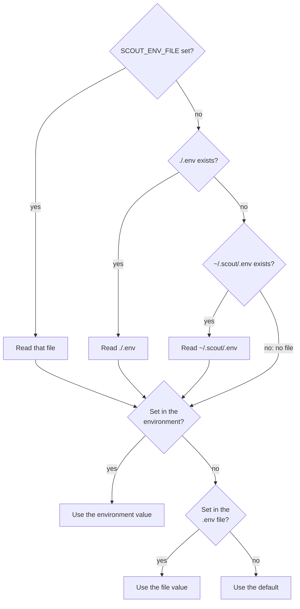
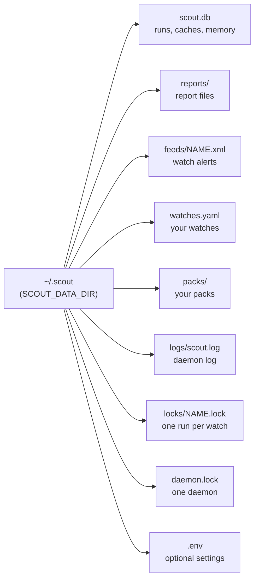

# Configuration

Scout reads its settings from environment variables and from one `.env` file. This page lists
every setting, the optional extras and the files in the data folder.



The diagram shows where Scout gets the value of a setting: first it finds the `.env` file, then
it uses the environment, the file or the default, in that order.

## Where Scout reads settings

- An environment variable overrides the same line in the `.env` file.
- Scout reads one `.env` file: the first that it finds in this list.
  1. The file that `$SCOUT_ENV_FILE` names. If that file does not exist, Scout stops with
     `SCOUT_ENV_FILE points to a missing file: PATH`.
  2. `./.env`, in the folder where you run Scout.
  3. `~/.scout/.env`, in your home folder. This path does not change when you set
     `SCOUT_DATA_DIR`.
- `SCOUT_ENV_FILE` itself is read only from the environment.
- A relative path in `SCOUT_DATA_DIR` or `SCOUT_OUTPUT_DIR` is relative to the folder of the
  `.env` file. So the result does not change with the folder where you start Scout. When there
  is no `.env` file, the path is relative to the current folder.
- The folder in `SCOUT_LLM` (for example `exchange:./answers`) is different: it is always
  relative to the current folder. See [Models](models.md).
- An empty value gives the default. An empty environment variable also hides the value in the
  `.env` file.
- A value that is not valid stops Scout, for example
  `SCOUT_MAX_RESULTS='0' is not valid: must be greater than zero`.
- `scout check` shows the `.env` file that Scout read, and the main settings.

`.env.example`, in the repository, is an example of every setting, with comments. Copy it to
`.env` (in the folder where you run Scout) or to `~/.scout/.env`.

## Set up a first configuration

1. Install Scout (Python 3.11 or later) with the extras that you need:

   ```bash
   pip install -e ".[notify,mcp]"
   ```

2. Copy the example file: `cp .env.example .env`. To use the same settings in every folder, copy
   it to `~/.scout/.env`.
3. Start your model server.
4. Set `LM_STUDIO_BASE_URL` to the address of the server.
5. Run `scout models` to list the model ids.
6. Set `LM_STUDIO_MODEL` to one of these ids.
7. If the server requires a token, set `LM_STUDIO_API_KEY`.
8. If the server is not LM Studio, set `SCOUT_CONTEXT_TOKENS` to the context window of the
   model.
9. Optional: set `SCOUT_SEARCH`, `SCOUT_REGION` and `SCOUT_DATA_DIR`.
10. Run `scout check`. Make sure that the `settings file` line names your `.env` file.

[Models](models.md) has the full procedure for LM Studio.

## Variables

### Model

| Variable | Default | Meaning |
|---|---|---|
| `SCOUT_LLM` | `openai` | The backend: `openai`, `exchange:DIR`, `record:DIR` or `replay:DIR`. See [Models](models.md). |
| `LM_STUDIO_BASE_URL` | `http://localhost:1234/v1` | The server URL |
| `LM_STUDIO_MODEL` | (none) | The model id (`scout models`). Necessary for `openai` and `record:DIR`. |
| `LM_STUDIO_API_KEY` | (none) | A token, if the server requires one |
| `SCOUT_PLANNER_MODEL` | the main model | A smaller model for the plan step (the searches) |
| `SCOUT_MODEL_TTL` | (none: LM Studio's own setting) | Seconds that a model loaded on demand stays loaded when idle (LM Studio) |
| `SCOUT_LLM_TIMEOUT` | `300` | Seconds for one model reply |
| `SCOUT_CONTEXT_TOKENS` | from the server | A context window that overrides what the server reports |

### Search and pages

| Variable | Default | Meaning |
|---|---|---|
| `SCOUT_SEARCH` | `ddgs` | `ddgs` (a metasearch, with nothing to set up), or `searxng:URL` for your own SearXNG instance, for example `searxng:http://localhost:8080`. The JSON format must be enabled in its `settings.yml`. |
| `SCOUT_RENDER` | off | `playwright` reads pages that show their text only after JavaScript runs, in a headless browser. It needs the `render` extra, then `playwright install chromium`. Empty or `off`: no browser. |
| `SCOUT_MAX_RESULTS` | `6` | Pages to read in each run. `scout run -n` overrides it for one run. |
| `SCOUT_MAX_PAGE_CHARS` | `6000` | The most characters of one page that go to the model. Scout selects the most relevant parts. |
| `SCOUT_REGION` | `us-en` | The search region, as country-language: `in-en`, `uk-en`, `de-de`; `wt-wt` for no region. It also sets the language that page downloads ask for (`Accept-Language`). |
| `SCOUT_REQUEST_TIMEOUT` | `12` | Seconds for one page download. It is also the time limit of a search. A page in the headless browser gets two times this value. |
| `SCOUT_FETCH_RETRIES` | `1` | Extra attempts after a transient failure: a server error (5xx), a timeout or a network error. `0` gives no extra attempt. |
| `SCOUT_USER_AGENT` | desktop Chrome's | The User-Agent that Scout sends with page downloads |
| `SCOUT_ARCHIVE` | `wayback` | Where Scout looks for copies of dead cited pages (`--archive`, `--fix`, citation watches): `wayback` (web.archive.org) or `off`, which sends nothing |

The default User-Agent is:

```
Mozilla/5.0 (Windows NT 10.0; Win64; x64) AppleWebKit/537.36 (KHTML, like Gecko) Chrome/124.0.0.0 Safari/537.36
```

### Storage

| Variable | Default | Meaning |
|---|---|---|
| `SCOUT_DATA_DIR` | `~/.scout` | The database, the caches, the watches, the feeds and the logs |
| `SCOUT_OUTPUT_DIR` | `<data dir>/reports` | The report files |
| `SCOUT_ENV_FILE` | (none) | The `.env` file to read, before `./.env` and `~/.scout/.env`. Environment only. |

### Rules for values

| Variables | Rule |
|---|---|
| `SCOUT_MODEL_TTL`, `SCOUT_CONTEXT_TOKENS`, `SCOUT_MAX_RESULTS`, `SCOUT_MAX_PAGE_CHARS` | A whole number, greater than zero |
| `SCOUT_LLM_TIMEOUT`, `SCOUT_REQUEST_TIMEOUT` | A number of seconds, greater than zero (decimals are permitted) |
| `SCOUT_FETCH_RETRIES` | A whole number, 0 or more |
| `SCOUT_SEARCH` | `ddgs`, or `searxng:` followed by an `http://` or `https://` address |
| `SCOUT_RENDER` | Empty, `off` or `playwright` |
| `SCOUT_ARCHIVE` | `wayback` or `off` |
| `SCOUT_LLM` | `openai`, `exchange:DIR`, `record:DIR` or `replay:DIR` |

Another value stops Scout with an error, for example
`SCOUT_ARCHIVE must be wayback or off, not 'x'`.

> [!NOTE]
> With `SCOUT_ARCHIVE=off`, `--archive`, `--fix` and `--find-moved` stop with
> `archive lookups are off (SCOUT_ARCHIVE=off)`.

## Optional extras

The basic install has everything for research, fact-checks, cite-checks and watches. Extras add
optional parts.

| Extra | Installs | Necessary for |
|---|---|---|
| `notify` | Apprise (`apprise>=1.9,<2`) | Watch notifications (`--notify`) |
| `mcp` | The MCP package (`mcp>=2.0`) | `scout mcp`, the server for AI assistants |
| `render` | Playwright (`playwright>=1.49`) | `SCOUT_RENDER=playwright` |
| `dev` | `pytest`, `responses`, `ruff` | Development: the tests and the lint |

```bash
pip install -e ".[notify,mcp]"                    # notifications and MCP
pip install -e ".[render]"                        # then:
playwright install chromium
pip install -e ".[dev,notify,mcp]"                # development
```

Without the extra, the command stops and tells you what to install:

| Extra | Message |
|---|---|
| `notify` | `notifications need Apprise: pip install 'scout[notify]'` |
| `mcp` | `the MCP server needs the mcp package: pip install 'scout[mcp]'` |
| `render` | `rendering pages needs Playwright: pip install 'scout[render]', then playwright install chromium` |

## The data folder

The data folder is `~/.scout` by default. `SCOUT_DATA_DIR` moves it.



The diagram shows the files and folders that Scout keeps in the data folder.

| Path | What it holds |
|---|---|
| `scout.db` | One SQLite database. It holds the runs and checks, the page and search caches, every page version that a run read, the facts and alerts of each watch, the memory (`scout ask`), the ratings, what Scout learned about sites (`scout sites`), what each model can do (`scout check`), and what a stopped run read, so that it can continue. |
| `reports/` | A Markdown file and a JSON file for each run, named `<date>_<time>_<slug>`. A check also gets its annotated page (`.html`). `SCOUT_OUTPUT_DIR` moves this folder. `--no-save` writes no report files. |
| `feeds/NAME.xml` | The Atom feed of a watch's alerts. Each run of the watch writes it again. `scout watch feed NAME` shows it. |
| `watches.yaml` | Your watches (`scout watch add`). The daemon reads it again when it changes. |
| `packs/` | Your own packs, as YAML files. A pack here adds a pack, or replaces the pack with the same name. |
| `logs/scout.log` | The daemon's log. `scout logs` shows its end. |
| `daemon.lock` | Makes sure that only one daemon runs |
| `locks/NAME.lock` | Makes sure that a watch has only one run at a time |
| `.env` | Optional settings. Scout reads `~/.scout/.env` from your home folder, also when `SCOUT_DATA_DIR` is another folder. |

### Remove old cache entries: scout prune

```bash
scout prune
```

`scout prune` removes old entries from `scout.db`. The daemon does this every day.

| Entry | Removed after |
|---|---|
| A cached search | 7 days |
| What a stopped run read | 7 days |
| A cached page | 90 days |
| A page version | 90 days, but only if it is not the newest version of its page, and no run of the last 90 days read it |

Runs, checks, watches, the memory and the ratings stay. A run of the last 90 days keeps its page
versions, so you can replay it (`scout replay`).

## Related

- [Models](models.md): the backends, `scout check` and `scout models`
- [Privacy](privacy.md): what leaves your machine
- [Watches](watches.md): notifications, feeds, packs and the daemon
- [Research](research.md): reports, export and the memory
- [MCP](mcp.md): `scout mcp`
- [Architecture](architecture.md): the store and the tests
