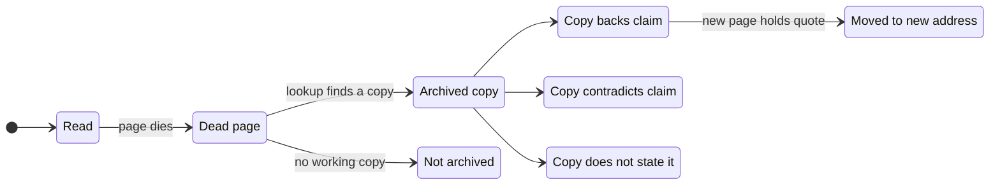
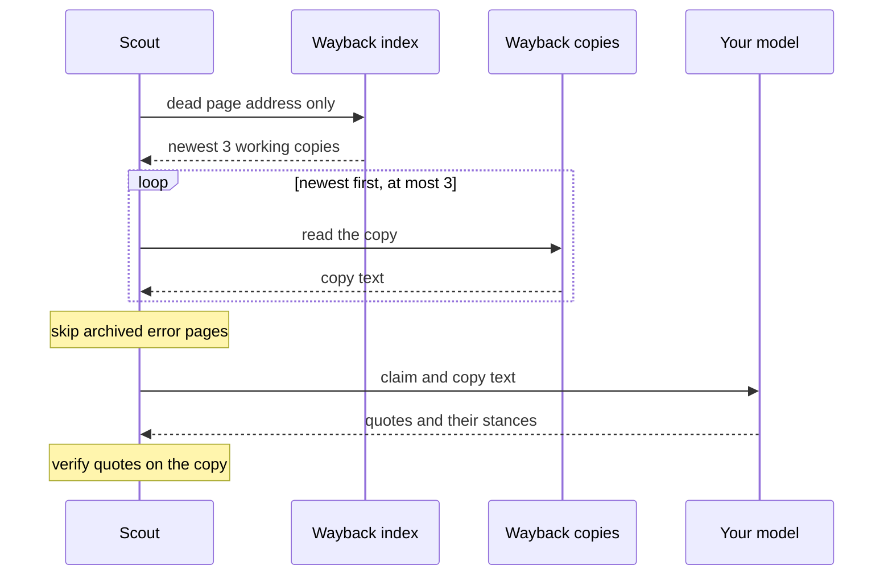
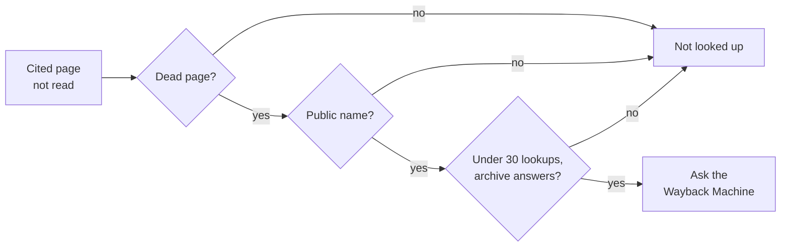
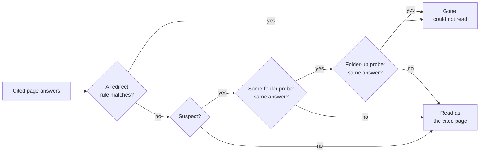
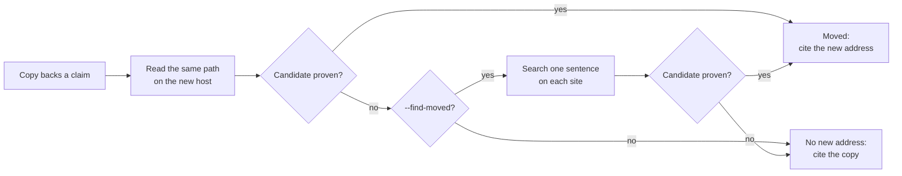
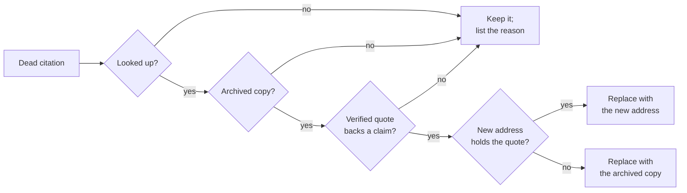
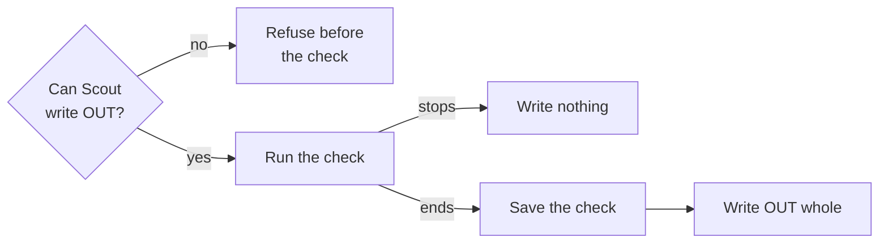

# Dead links

This page tells how Scout finds dead pages, judges claims on their archived copies, finds moved
pages and fixes dead citations with proof.

A link checker only says that a link is dead. Scout also shows what the dead page said. It
replaces a dead link only with an archived copy or a new address that holds the quote, verified
word for word.

The diagram shows the life of a cited page in a cite-check with `--archive`.



| Option | What it does |
|---|---|
| `--archive` | Looks up each dead page on the Wayback Machine and judges its claims on the archived copy. Lists the copies to cite instead. |
| `--find-moved` | Also searches (`SCOUT_SEARCH`) for the place where a dead page moved. Implies `--archive`. |
| `--fix OUT` | Writes the text to OUT, with each dead citation replaced by a copy or a new address that holds the quote. Implies `--archive`. |

The three options apply to `scout factcheck --cited` only. `--archive` does not combine with
`--allow-private`: it would send intranet addresses to the archive.

## When a page is dead

A cited page is dead when Scout cannot read it because the page, or its site, is gone.

| Cause | Dead page |
|---|---|
| Not found (HTTP 404 or 410): `not found: HTTP 404` | Yes |
| Another client error (another 4xx status, a redirect loop) | Yes |
| A site that no longer resolves | Yes |
| A page that [answers but is gone](#gone-though-it-answers) | Yes |
| A timeout, or a server error (5xx) | No |
| A site that blocks scripts (HTTP 401, 403, 429, …) | No |
| A site that Scout skips (a paywall on its skip list) | No |
| A private address that Scout refuses | No |

A cause marked "No" says nothing of the page itself. Scout never looks up such a page in the
archive.

A dead page gives no evidence. If no page that a claim cites can be read, the claim is *could
not read*, at no model request.

Without `--archive`, a cite-check whose claims cite dead pages says how many are gone. The note
names `--archive` and, for a text, `--fix FILE`.

### The Dead links section

With `--archive`, the report ends its claims with a **Dead links** section. A summary line comes
first. Then there is one item for each dead page:

- the citation number and the address,
- why Scout could not read the page,
- what its archived copy said, and what to do (see
  [What the Dead links list says](#what-the-dead-links-list-says)).

The section is in the Markdown report, the annotated page, `scout show` and `scout export`. In
`--json` it is `dead_links`. Use it to act by hand, on a web page as on a text.

## Archived copies

```bash
scout factcheck --cited --archive -f answer.md
scout factcheck --cited --all --archive https://en.wikipedia.org/wiki/Python_Software_Foundation
```

With `--archive`, Scout looks up the newest working copy of each dead page on the Wayback
Machine. Scout reads the copy and judges the claim on it by the same rules as a live page:

- The quote must be on the copy.
- A confirming quote states every number of the claim.

The quote's link opens the copy at the quote.

```
4. Could not read [4]: Python 3.13 runs on iOS as a tier 3 platform.
   - could not read [4] example.org (not found: HTTP 404)
   - archived copy of [4] (2024-11-02): backed
     - confirms (finding 3): "Python 3.13 runs on iOS as a tier 3 platform." (archived copy of [4], example.org, archived 2024-11-02)
```

The sequence shows one lookup. Only the address of the dead page goes to the archive. The claim
and the copy go only to your model.



### Which copy Scout judges

- A working copy is a copy that the archive took while the page was served whole (HTTP 200).
  Scout takes the newest one. The nearest copy by date is often an archived error page.
- When the checked page gives the date it was written, Scout takes the newest copy from before
  that date. That copy is what its author read, not what the address held later.
- When the newest working copy is itself an error page, Scout takes the newest of the last three
  that is not. See [Error pages in the archive](#error-pages-in-the-archive).

### The label stays

An archived copy shows what the page said when it was archived, not what it says now. So:

- The claim keeps the label *could not read*.
- The confidence does not change.
- The annotated page keeps its colour.

Scout shows the result on the copy beside the label: on the card and in the tooltip of the
annotated page, and in the verdict:

```
1 of 1 unreadable claims was judged on archived copies of the pages it cites: 1 backed.
```

In `--json`, that result is `claims[].archived`, and the copy is a source with `copy_of` (the
citation number of the dead page).

### Which pages Scout looks up

The diagram shows which cited pages Scout looks up in the archive.



- Scout looks up every dead page that a checked claim cites, also beside a page that it could
  read ("… in 2019.[2][4]"). The claim is judged once more, on the copies of its dead pages only,
  at one judge request.
- That claim's label still comes from the pages that Scout could read. The verdict's count of
  unreadable claims judged on copies does not include it.
- Scout looks up only dead pages. A skip (a paywall on its skip list), a block of scripts, a
  timeout or an error says nothing of the page. Scout never looks up such a page, and never reads
  it through the archive.
- No copy (`no archived copy of [4]`), or a copy that Scout cannot read, costs no model request.
- A cited address on archive.org is a copy already. Scout does not look it up.

### Limits

- A run looks up at most 30 cited pages, each one once. A lookup may take a minute.
- If the archive does not answer, or does not serve a copy (HTTP 429), Scout looks up no other
  page in that run. A note says so.
- Scout keeps nothing of a failed lookup, so the next run asks again.
- Memory (`scout ask`) never learns from a copy.
- A resumed audit judges the very same copies.
- With `SCOUT_ARCHIVE=off`, Scout looks up nothing. `--archive`, `--find-moved` and `--fix` then
  stop with `archive lookups are off (SCOUT_ARCHIVE=off)`.

### What goes to the archive

> [!WARNING]
> `--archive` (and `--find-moved` and `--fix`, which imply it) sends the address of each dead page
> to web.archive.org. It never sends the claim or the text. To send nothing, set
> `SCOUT_ARCHIVE=off`.

Scout never sends these addresses to the archive:

- a refused (private) address,
- an address with no public name (`http://jira/`, `wiki.corp`, `*.internal`, an IP address).
  Off its network, such an address fails to resolve like a dead site.

## Gone though it answers

Link checkers call a link alive when it answers HTTP 200. But the commonest link rot answers
with HTTP 200 too:

- an article that its site sends to the home page after a redesign,
- a "Page not found" template served with HTTP 200,
- an expired domain that shows a domain-sale page.

Read as the cited page, such a page gives the sentence the wrong label *not found in [2]*. So
Scout calls the page gone:

- Its claim is *could not read*, at no model request.
- `--archive` looks it up by the cited address, never by the page it lands on.
- It is listed under Dead links, and `--fix` fixes it.

```
2. Could not read [2]: The depot opened in 1899.
   - could not read [2] news.example.com (not found: redirects to its site's home page, https://news.example.com/)
   - archived copy of [2] (2021-05-14): backed
```

The diagram shows how Scout decides that a page that answers is gone. No model is asked.



### Where a redirect lands

Where a redirect lands is enough to call a page gone.

| The redirect lands on | From | Reason in the report |
|---|---|---|
| Its own site's home page: `/`, `/index.html`, `/en/`, `/en-us/home`, or a home page with a query that only tracks the reader (`?_ga=…`) | An address that is not a home page | `redirects to its site's home page, URL` |
| Another site's home page | A page deep in its old site (`/2019/05/depot`, `/news/depot.html`) | `redirects to the home page of HOST, URL` |
| An error page: `page-not-found`, `error.html`, a last segment `404` (or `410`) at the root or under an error folder, an `aspxerrorpath` or status query | An address that is not one | `redirects to an error page, URL` |
| A domain-sale or parking site | An address that is not one | `redirects to a domain-sale page, URL` |

In other places, a last segment `404` or `410` is a number (bill 410), not an error page. A
`?p=404` query is not an error page either.

A short link (t.co, bit.ly, doi.org, …) may lead to a home page on purpose. For a short link,
only error pages and domain-sale pages count.

### Suspects and made-up addresses

The words on a page never rule alone. They only make the page a suspect. These pages are
suspects:

- a page whose title or first lines say it is not there ("Page not found", "404", "This domain
  is for sale"),
- a page that its own site redirected to an unrelated path,
- a section (`/firefox`, `/blog`) sent to another site's home page.

Scout compares a suspect with made-up addresses:

1. Scout asks the site for a made-up address in the same folder
   (`/2019/scout-3f9a1c2e7b4d.html`). It asks once for each folder.
2. If the page is in a folder, Scout asks for a made-up address one folder up.
3. Scout calls the page gone only when the site answers each made-up address the same way as the
   page.

| The site answers the made-up addresses | Reason in the report |
|---|---|
| With a redirect to the place where it sent the page | `redirects where the site sends any unknown address, URL` |
| With the same text as the page | `shows what its site shows for any unknown address, "Page not found"` |

Some sites send any title to the article that its folder names (`/332678802/any-title`). NPR,
the Federal Register and Steam do this. Because of the second address, Scout does not call such a
page dead.

An article about 404 errors stays read when its site answers the made-up address with a real
404. Any page whose probe fails also stays read.

Checked live, mozilla.org/firefox (now firefox.com), github.com/blog and pypi.python.org/pypi
stay read. A page redirected home after a redesign is gone.

> [!NOTE]
> For a suspect, Scout downloads one or two made-up addresses from the page's own site.

### What stays read

Scout reads these pages as the cited page:

- A redirect within the page's own path (`/a` to `/a/index.html`, `/dp/B0X/ref=x` to
  `/dp/B0X`).
- A redirect to a login, subscription or consent page, or to any page told where to send the
  reader next (`/?next=…`).
- A redirect to the same path on another domain.
- A page too short to read. It is unreadable already.

### The checked page, JSON and the cache

- A checked address (the web page that you give to `scout factcheck`) that is gone this way is
  refused: `could not read URL: redirects to its site's home page, …`.
- In `--json`, the page's `status` is `not_found`, and its `error` is the reason, as in
  `dead_links[].why`.
- The page cache keeps every page as served. `scout run` and claim watches read search results
  as before.

### Error pages in the archive

The archive's newest whole copy of a dead page can itself be an error page. This is a template
or a parking page that the archive took after the page died. Scout then judges the newest of the
last three copies that is not an error page. When all three are error pages, Scout judges the
newest.

## Moved, not dead

Sites that change their domain or software drop the old addresses, or send them all to the new
home page. The pages live on elsewhere. When a dead page's archived copy backs a claim, Scout
also looks for the place where the page moved.

The diagram shows where Scout looks for a moved page.



1. **The same path on the new host.** Scout reads the old path on the host that the old address
   now redirects to. `wpcentral.com/x`, sent to `windowscentral.com/`, is looked for at
   `windowscentral.com/x`. This costs one download.
2. **A search, with `--find-moved`** (which implies `--archive`). Scout searches
   (`SCOUT_SEARCH`) for one sentence of the copy, on the new host's site, then on the page's own
   site: `"At MIX we said that more than half a million Silverlight developers are now Windows
   Phone" site:windows.com`.

The sentence is the quote that backed the claim, as the copy writes it, at most 16 words. A
quote of fewer than 6 words is not searched for. Scout reads at most 3 results from each site.
A page whose site no longer resolves is not looked for.

```
1. Could not read [1]: The back button no longer closes apps; it suspends them.
   - could not read [1] wpcentral.com (not found: redirects where the site sends any unknown address, https://www.windowscentral.com/)
   - archived copy of [1] (2014-10-19): backed; [1] moved to <https://www.windowscentral.com/windows-phone-81-features>
     - confirms (finding 1): "Back button no longer closes apps, instead it suspends them." (archived copy of [1], wpcentral.com, archived 2014-10-19)
     - confirms (finding 2): "Back button no longer closes apps, instead it suspends them." ([1] at its new address, windowscentral.com)
...
## Dead links

1 cited page is gone: 1 moved, and its new address still states what the text cites it for.

- [1] <http://www.wpcentral.com/windows-phone-81-features> (not found: …): moved to <https://www.windowscentral.com/windows-phone-81-features>, which still states claim 1 word for word, as its archived copy of 2014-10-19 did: "Back button no longer closes apps, instead it suspends them." Cite it instead.
  <https://www.windowscentral.com/windows-phone-81-features#:~:text=Back%20button%20no%20longer,instead%20it%20suspends%20them.>
```

### When a candidate is the page

Scout never takes a candidate on its address, slug or title. The diagram shows the checks. A
candidate must pass all of them. A candidate that fails one check is not the page.


- It holds most of what the copy held: at least half of the copy's three-word runs.
- Much of it is the copy's text: at least a quarter of its own three-word runs come from the
  copy. An index page that carries the post among others is not the page.
- It is not itself [gone though it answers](#gone-though-it-answers).
- It is not on the checked page's own site.
- It holds the quote that backed the claim on the copy, verified on it word for word, every
  number included.

A claim that the new page does not state that way is named (`It does not state claim 3 word for
word`). A claim that the copy contradicts is named too.

### The label stays for a moved page

- The claim keeps the label *could not read [1]*. The text's link is still dead until you fix
  it.
- When you check the fixed text, Scout judges the new page as any cited page.
- The verdict adds `1 dead cited page lives on at a new address.`
- In `--json`, the new page is a source with `moved_from`. `dead_links[].state` is `moved`, and
  `dead_links[].moved` is its new address.

### No model request

- The quote's stance is the model's judgment of the copy, and the same words are on the new
  page. So the model is not asked again.
- A resumed audit searches and reads nothing again.

### What the search engine gets

> [!WARNING]
> With `--find-moved`, the search engine gets one sentence of the archived copy and a `site:`
> filter. It never gets your text or the claim. Without `--find-moved`, Scout searches nothing.

- Without `--find-moved`, a check that cites an archived copy says so. The note says that
  `--find-moved` can search the page's site to find where it moved.
- A search that fails is noted. Scout searches for no later page in that run.

## Fix dead citations

Link checkers only say that a link is dead. "Replace with Wayback" bots swap in the nearest copy,
unchecked. That copy is often an archived error page, a parked domain, or a later page that no
longer says what the sentence cites it for.

```bash
scout factcheck --cited --all --fix post.fixed.md -f post.md
```

`--fix OUT` (which implies `--archive`) writes the text to OUT. Each dead citation is replaced by
its archived copy, opened at the quote. This occurs only when a quote verified word for word on
the copy backs a claim that the text cites the page for. When the page
[moved](#moved-not-dead) and its new address still holds that quote, the new address replaces
it.

The diagram shows what `--fix` does with one dead citation.



Take this text, `post.md`:

```
Google turned PageSpeed Service off on August 3rd, 2015.[1] It was shut down in 2014.[1]
Python 3.13 came out on October 7, 2024 ([release notes](https://www.python.org/downloads/release/python-3130/)).
Python's FAQ answers 27 questions ([FAQ](https://www.python.org/scout-no-such-page)).

[1]: https://developers.google.com/speed/pagespeed/service
```

The check ends with this Dead links section:

```
## Dead links

2 cited pages are gone: 1 can be replaced by its archived copy, which backs a claim the text cites it for; 1 needs another source.

- [1] <https://developers.google.com/speed/pagespeed/service> (not found: HTTP 404): replace with its archived copy of 2023-01-20, which backs claim 1: "PageSpeed Service was turned off on August 3rd, 2015." It contradicts claim 2: correct that sentence.
  <https://web.archive.org/web/20230120234050/https://developers.google.com/speed/pagespeed/service#:~:text=PageSpeed%20Service%20was%20turned,on%20August%203rd%2C%202015.>
- [3] <https://www.python.org/scout-no-such-page> (not found: HTTP 404): not archived; cite another source (claim 4)
```

`diff post.md post.fixed.md` then shows one changed line:

```diff
-[1]: https://developers.google.com/speed/pagespeed/service
+[1]: https://web.archive.org/web/20230120234050/https://developers.google.com/speed/pagespeed/service#:~:text=PageSpeed%20Service%20was%20turned,on%20August%203rd%2C%202015.
```

The copy of [1] backs claim 1, so `[1]` now cites the copy. The copy contradicts claim 2, so the
list flags that sentence. [3] has no archived copy: it stays, and the list asks for another
source.

### A replacement needs proof

- A copy (or a new address) that also contradicts another sentence that cites the page is still
  used, because the text chose that source. The list flags the sentence to correct.
- A claim that the copy does not state is named: `It does not state claim 3: check that sentence
  or cite another source`.
- A copy that only contradicts, says nothing of the claims, or could not be judged is never
  linked. The list says why.

### What the Dead links list says

Each item of the Dead links list gives one of these states. The state is also
`dead_links[].state` in `--json`. URL, DATE, QUOTE, N and WHY stand for the real values. N can
be more than one claim (`claims 1, 2 and 4`).

| State | The list says | `--fix` |
|---|---|---|
| `moved` | `moved to URL, which still states claim N word for word, as its archived copy of DATE did: "QUOTE." Cite it instead.` | Cites the new address |
| `replace` | `replace with its archived copy of DATE, which backs claim N: "QUOTE"` | Cites the copy |
| `contradicted` | `its archived copy of DATE contradicts claim N: "QUOTE"; correct the sentence or cite another source` | Keeps the address |
| `not found` | `its archived copy of DATE does not state claim N; cite another source` | Keeps the address |
| `copy unreadable` | `its archived copy of DATE could not be read (WHY)` | Keeps the address |
| `not archived` | `not archived; cite another source (claim N)` | Keeps the address |
| `not judged` | `its archived copy of DATE could not be judged (the model's reply was unusable)` | Keeps the address |
| `not looked up` | `not looked up (WHY)` | Keeps the address |

A `moved` or `replace` item can add these sentences:

- `It contradicts claim N: correct that sentence.` (for `moved`: `Its archived copy contradicts
  claim N: …`)
- `It does not state claim N: check that sentence or cite another source.` (for `moved`: `It
  does not state claim N word for word: …`)

A page is not looked up for one of these reasons (WHY):

| Reason | Cause |
|---|---|
| `the Wayback Machine did not answer (…)` | The archive did not answer, or did not serve a copy, in this run |
| `at most 30 cited pages are looked up in a run` | The run looked up 30 pages already |
| `no public name` | The address has no public name |
| `it is an archived copy already` | The address is on archive.org |

### Every spelling of an address

- Scout replaces an address everywhere the text cites it, in every spelling: a trailing slash,
  a `utm_` query, an invisible soft hyphen.
- A reference such as `[1]: url` serves several sentences. The list says which claims the copy
  backs.
- Addresses in code or images stay as they were. Every other byte also stays as it was.

### How OUT is written

The diagram shows when Scout writes OUT.



- OUT keeps the text's line endings.
- A file that started with a byte order mark is written as UTF-8 with one.
- OUT is written whole or not at all, after the check is saved. If OUT cannot be written, the
  error names the run that holds the check.
- If Scout can tell that it cannot write OUT, it refuses OUT before the check starts. OUT cannot
  be `-`: `--fix needs a file to write (it may be the -f file itself)`.
- OUT may be the `-f` file itself. Scout keeps what was saved to that file while the check ran.
  The fixes go into the file as it is then.
- `--no-save` still writes OUT.

> [!CAUTION]
> Nothing is written when the check stops (a model error, Ctrl+C, an answer awaited). Run the
> same command again. An audit continues where it stopped.

### The note after the check

After the check, a note says how many citations Scout replaced:

```
Fixed text: post.fixed.md (3 dead citations replaced: 2 by their new addresses, 1 by its archived copy)
```

| Case | The part in brackets says |
|---|---|
| Scout replaced some citations, but not all | `…; N left: see Dead links` |
| Scout looked up no dead page (for example, the archive did not answer) | `unchanged: the dead cited page was not looked up; run the same command later` |
| No archived copy backs a claim | `unchanged: the dead cited page has no archived copy that backs its claims; see Dead links` |
| No checked claim cites a dead page | `no checked claim cites a dead page: unchanged` |

If the archive did not answer, run the command again later.

### Limits of `--fix`

- Without `--all`, Scout fixes only the pages that the checked claims cite. A note points to
  `--all`.
- Scout looks up at most 30 pages in a run. The list shows the rest as not looked up.
- Scout cannot rewrite a web page. For a web page, `--archive` lists the copies to cite instead.

## JSON fields

| Field | Meaning |
|---|---|
| `dead_links[]` | One item for each dead page: `n`, `url`, `why`, `state`, `copy`, `taken`, `moved`, `link`, `quote`, `claims`, `backs`, `contradicts`, `note` |
| `dead_links[].why` | Why Scout could not read the page: `not found: HTTP 404` |
| `dead_links[].state` | The state in [What the Dead links list says](#what-the-dead-links-list-says) |
| `dead_links[].link` | The address to cite instead, opened at the quote: the new address, else the copy |
| `claims[].archived` | The claim's result on the archived copies of its dead pages |
| `sources[].copy_of` | On an archived copy: the citation number of the dead page |
| `sources[].moved_from` | On a new address: the citation number of the dead page that moved there |
| `sources[].status`, `sources[].error` | For a page gone though it answers: `not_found`, and the reason |
| `fixed` | With `--fix`: `path` (OUT) and `replaced` (the citation numbers that Scout replaced) |

## Related

- [Citations](citations.md): cite-checks, labels, `--all` audits and private addresses.
- [How it works](how-it-works.md): the core rule (no quote, no claim) and verification.
- [Watches](watches.md): citation watches alert when a cited page dies, with its archived copy.
- [MCP](mcp.md): `fact_check` with `archive`, `find_moved` and `fix`.
- [Privacy](privacy.md): what leaves your machine.
- [Configuration](configuration.md): `SCOUT_ARCHIVE` and `SCOUT_SEARCH`.
- [The README](../README.md).
