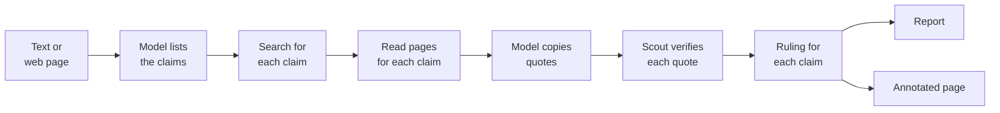
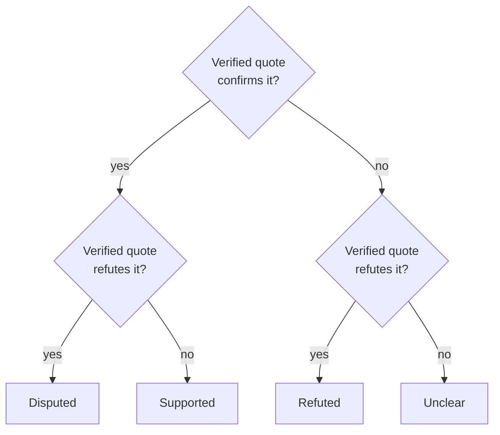
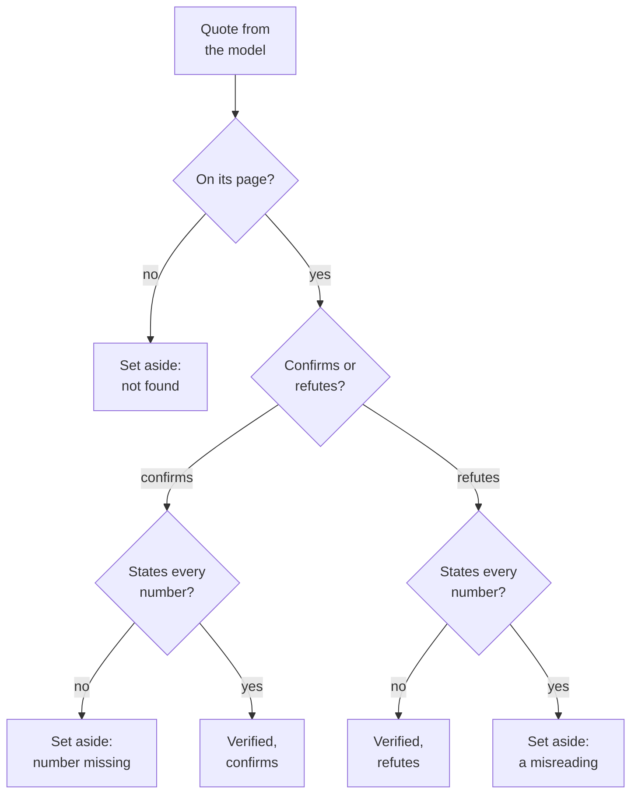
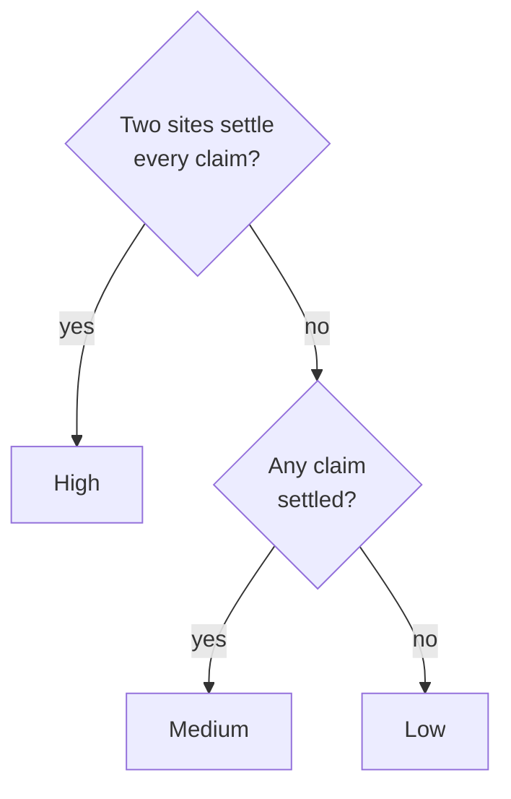
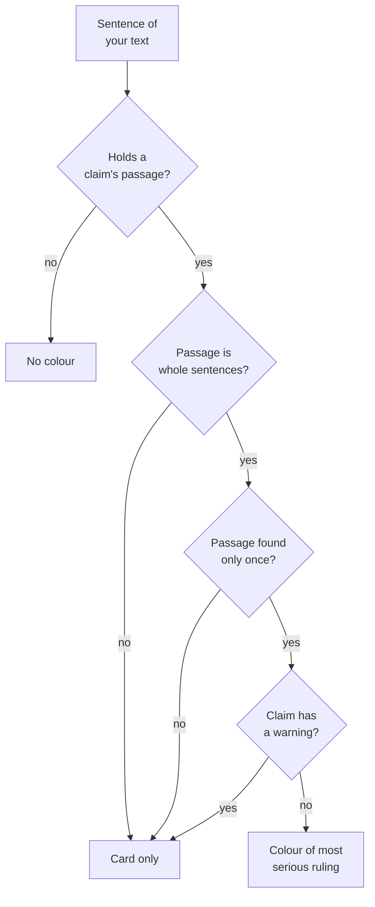

# Fact-check

`scout factcheck` checks each claim in a text or a web page against independent pages, and
gives each claim a ruling from verified quotes.



The diagram shows the steps of a fact-check, from your text to the report and the annotated
page.

## Check a text

```bash
scout factcheck "Python 3.13 was released on October 7, 2023. It added a JIT compiler."
scout factcheck https://example.com/article   # the claims a page makes
pbpaste | scout factcheck -f -                # or -f answer.txt
```

| Input | How to give it |
|---|---|
| A text | Put the text in quotes, as the argument. |
| A web page | Put its address as the argument. Scout checks the claims that the page makes. |
| A file | Use `-f FILE`. |
| Standard input | Use `-f -`. |

Give the text or `-f`, not both.

### Options

| Option | Default | What it does |
|---|---|---|
| `--claims N` | 6 | The most claims to check (1 to 12) |
| `-n N`, `--pages N` | 3 | The pages to read for each claim (1 to 10) |
| `--llm SPEC` | `SCOUT_LLM` | Another model backend for this command only, for example `exchange:./answers` |
| `--json` | off | Print the result as JSON |
| `--no-save` | off | Do not keep the check, and do not write report files |
| `--cited` | off | Check the pages that the text cites, not independent pages. See [Citations](citations.md). |

`scout factcheck --help` shows all the options. `scout -v factcheck …` shows progress, and `-vv`
shows debug output.

### File encodings

`-f` reads these encodings:

- UTF-8, with or without a BOM
- UTF-16 with a BOM (PowerShell's `>` and Notepad's "Unicode" write this)

For other encodings, save the file as UTF-8. Scout does not guess an encoding, because a letter
read incorrectly can change what is checked. It stops with
`could not read FILE as text: save it as UTF-8`.

> [!WARNING]
> A fact-check sends each claim to the search engine (`SCOUT_SEARCH`) as a query. Your full text
> goes only to your model. See [Privacy](privacy.md).

## What Scout does

1. The model lists the checkable claims in the text: at most 6 by default (`--claims`).
2. Scout searches for each claim.
3. Scout reads a few pages for each claim (`-n`/`--pages`, default 3).
4. The model copies the sentences that settle the claim. These are the quotes.
5. Scout verifies each quote against its page.
6. Scout gives each claim a ruling: **supported**, **refuted**, **disputed** (verified quotes on
   both sides) or **unclear**.

## The report

This is the report for the text "Python 3.13 was released on October 7, 2023. It removed the
global interpreter lock by default. It includes an experimental JIT compiler.":

```
Verdict — medium confidence (2 of 3 claims settled, 1 by two or more sites)
Of 3 claims: 1 supported, 1 refuted, 1 unclear.

1. Refuted (1 site): Python 3.13 was released on October 7, 2023.
   In the text: "Python 3.13 was released on October 7, 2023."
   - refutes [1]: "3.13.0 final: Monday, 2024-10-07" (source 3, peps.python.org)
   - set aside [5]: "Release date: Oct. 7, 2024" (source 1) — the quote does not contain 2023
   The sources give October 7, 2024.
2. Unclear: Python 3.13 removed the global interpreter lock by default.
   In the text: "It removed the global interpreter lock by default."
   - set aside [7]: "In Python 3.13 the GIL was removed from the default build." (source 4) — quote not found in the source
3. Supported (2 sites): Python 3.13 includes an experimental JIT compiler.
   In the text: "It includes an experimental JIT compiler."
   - confirms [2]: "Python 3.13 ships an experimental JIT compiler" (source 5, realpython.com)
   - confirms [3]: "Python 3.13 adds an experimental just-in-time compiler" (source 6, docs.python.org)
```

| Line | What it tells |
|---|---|
| `Verdict — medium confidence (…)` | The [confidence](#confidence), and the reason for it |
| `Of 3 claims: …` | How many claims got each ruling |
| `1. Refuted (1 site): …` | The ruling, how many sites settle it, and the claim |
| `In the text: "…"` | The passage of your text that makes the claim |
| `refutes [1]: "…" (source 3, peps.python.org)` | A verified quote, its finding number, its source and its site |
| `confirms [2]: "…"` | A verified quote that confirms the claim |
| `set aside [5]: "…" — …` | A quote that does not count, and the reason |
| `The sources give October 7, 2024.` | The model's note. The report shows it only when a verified quote backs it. |

The ruling comes from the verified quotes alone, never from the model's verdict. Whether a quote
confirms or refutes is the model's reading. The report shows that reading beside the quote, so
you can judge it.

## Rulings

| Ruling | When |
|---|---|
| supported | Verified quotes confirm the claim, and no verified quote refutes it. |
| refuted | Verified quotes refute the claim, and no verified quote confirms it. |
| disputed | Verified quotes are on both sides. |
| unclear | No verified quote settles the claim. |



The diagram shows how the verified quotes of a claim decide its ruling.

## Which claims are checked

**Only claims that the text makes are checked.** The model can reword a claim, so Scout compares
each claim with the text:

| Rule | Example |
|---|---|
| The claim's passage must be in the text word for word. | |
| The passage must not cut a word or a number. | "grew 3" is not in "grew 35%" |
| Each number of the claim must be in its passage. | |
| A version or a name can come from before the passage, where an "it" refers back. | "Python 3.13", "Windows 7" |
| A number cannot come from a list's numbering. | |
| A claim cannot trade its passage's year for an earlier one. | |

Scout sets aside a claim that breaks a rule. The Notes of the report show
`set aside a claim the text does not make: "…" (…)`, with the reason.

**Numbers that no claim carries.** A passage can state numbers that no claim carries. The claim's
card lists them as `Not checked: …, which the passage also states`. A date or a version counts as
one value, and a time of day is not a claim.

**Negations.** A claim can word a negation differently from its sentence. Examples: the model
dropped a "not", or quoted "It is not true that …" without its start. Scout still checks the
claim, but the claim carries a warning:
`The claim words a negation differently from the text: compare them.` Its sentence is never
coloured on the [annotated page](#the-annotated-page).

## Which quotes count

A quote counts only when Scout finds it on its page. Numbers have more rules:

- **A confirming quote must itself state every number of the claim**, single digits included.
  "two" counts as 2.
- The page's title and date do not count. A page that says 2024 never confirms a claim of 2023.
- A "refuting" quote that states every number of the claim is set aside as a misreading. The
  reason shown is `it states every number of the claim, so it does not refute it`.

This lets you check every ruling by eye from the quote shown.



The diagram shows which quotes Scout keeps as verified quotes, and which it sets aside.

## Confidence

| Confidence | When |
|---|---|
| high | Quotes from two or more sites settle every claim. |
| medium | Verified quotes settle at least one claim. |
| low | No claim is settled. |

A settled claim is supported or refuted. A disputed claim is not settled. The verdict line gives
the reason, for example `(2 of 3 claims settled, 1 by two or more sites)`.



The diagram shows how Scout sets the confidence of a fact-check.

**Sites count by domain.** `docs.python.org` and `python.org` are one site. On a hosting
platform, each user's site is its own site (`someone.github.io`, `someone.substack.com`). The
report gives the count after the ruling: `Supported (2 sites)`.

## Check a web page

When you check a web address, nothing from its site is read as evidence. This includes any
subdomain, and the site that the address redirects to. Independent pages take those places.

In a cite-check of a web address, the page's links to its own site are words, not citations. To
count them, save the text and use `-f`. See [Citations](citations.md).

## Storage, memory and ratings

- A check is stored like a run. Use `scout history`, `scout show` and `scout export`.
- You can rate its findings: `scout rate RUN N good|bad`. N is the `[n]` number of the finding in
  the report.
- Memory (`scout ask`) learns what the pages state, never the claim under test.
- Checks do not change the sites' quote records (`scout sites`).
- Scout reads pages in search order, so a finished check that you ask again builds the same
  prompts. With the exchange backend or a recorded answer, it costs no model time. See
  [Models](models.md).

A saved check writes three files to the reports folder (`~/.scout/reports/` by default):

| File | Content |
|---|---|
| `<date>_<time>_<name>.md` | The report in Markdown |
| `<date>_<time>_<name>.json` | The report in JSON |
| `<date>_<time>_<name>.html` | The [annotated page](#the-annotated-page) |

Scout prints `Saved …` and `Annotated page: ….html`. With `--json`, the result lists the saved
files under `saved`. With `--no-save`, Scout keeps nothing and writes no files.

## The annotated page

Every saved check also writes an **annotated page** (`Annotated page: ….html`). It shows your
text, with each claim's sentence coloured by its ruling.

| Colour | Ruling | Order |
|---|---|---|
| Red | refuted | 1 (most serious) |
| Amber | disputed | 2 |
| Grey | unclear | 3 |
| Green | supported | 4 |

A sentence that holds several claims takes the most serious ruling. So green means that every
claim in the sentence held up.

A colour covers what the claims in a sentence say, not every word of the sentence.

### When a sentence is coloured

Scout colours a sentence only when the sentence surely belongs to the claim:

- The claim's passage is whole sentences.
- Scout finds the passage only once in the text.
- The claim has no warning.

The other claims are shown on their cards only.



The diagram shows how a sentence of your text gets its colour.

### Use the page

| Action | Result |
|---|---|
| Hover over a sentence | The page shows each claim, and a quote that decided it (a refuting quote first). |
| Tap a sentence or its badge | The page opens the claim's card. |

A badge is the small claim number after the sentence where a claim's passage ends. The card shows
every quote, with its page and date, and the reason why any quote was set aside.

The annotated page is one HTML file, with no scripts or external assets. It is readable in light
and dark mode. You can send it to anyone.

To write the page again, run:

```bash
scout export FOLDER --run ID --format html
```

A cite-check and an audit also write an annotated page, with labels in place of rulings. See
[Citations](citations.md#the-annotated-page).

## Related

- [How it works](how-it-works.md): verification, rulings and labels
- [Citations](citations.md): check the pages that a text cites (`--cited`)
- [Dead links](dead-links.md): cited pages that are gone
- [Research](research.md): `scout run`, reports, export, memory and ratings
- [Watches](watches.md): claim watches check a text again on a schedule
- [Models](models.md): the exchange and record backends
- [Privacy](privacy.md): what leaves your machine
