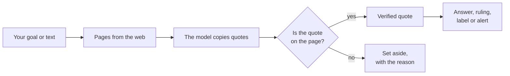
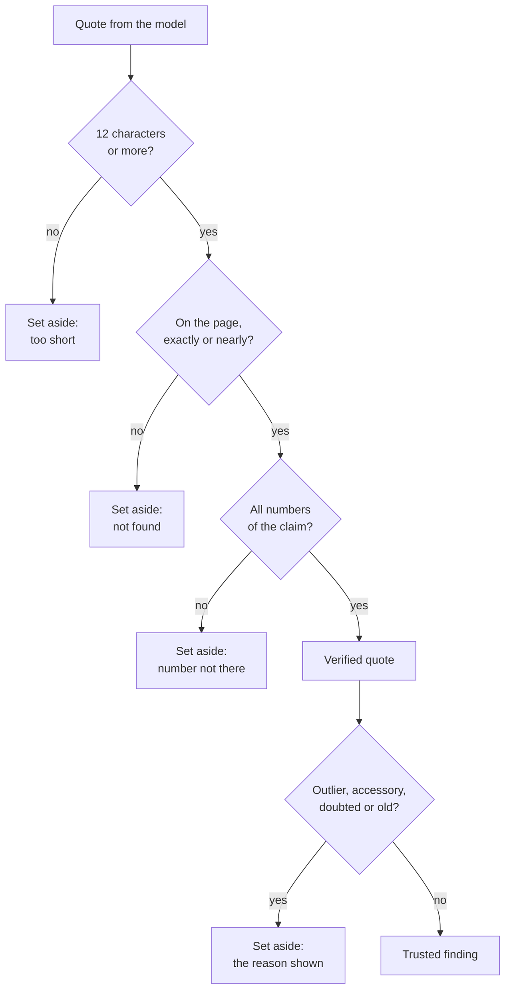
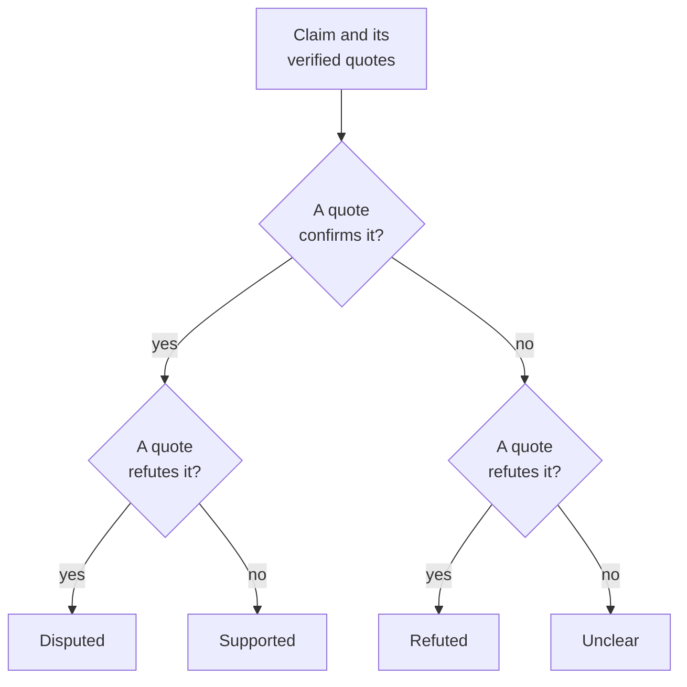
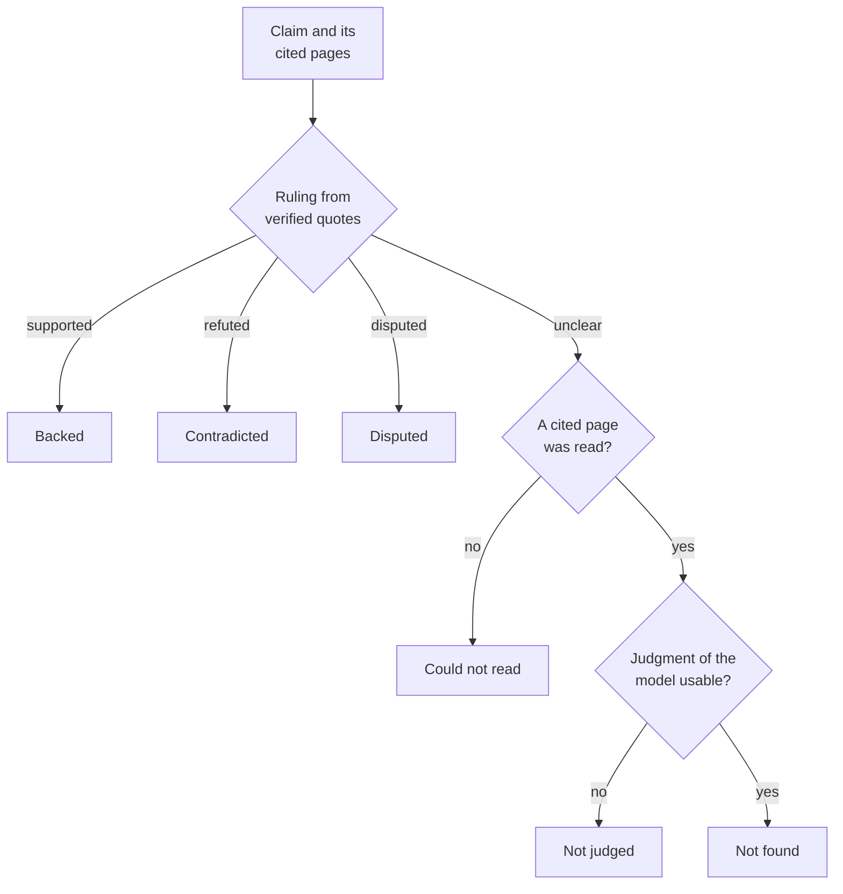
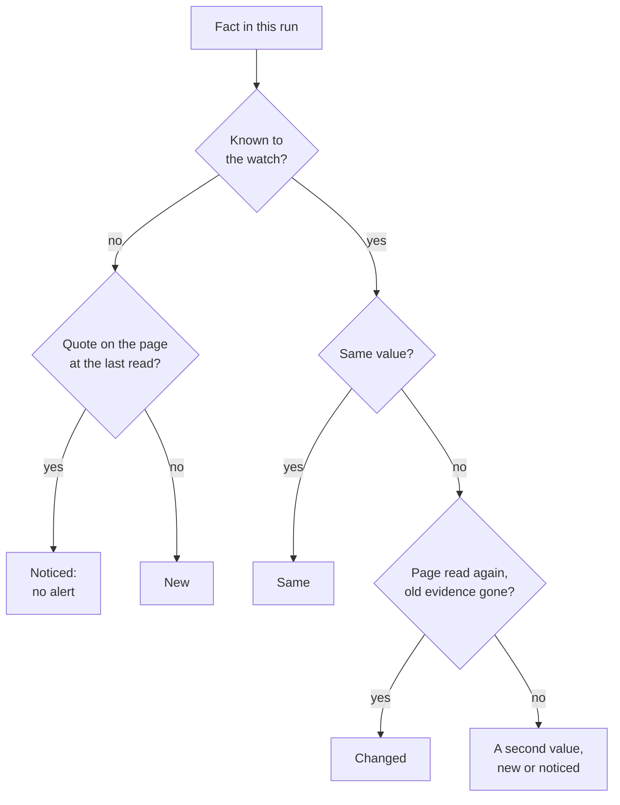
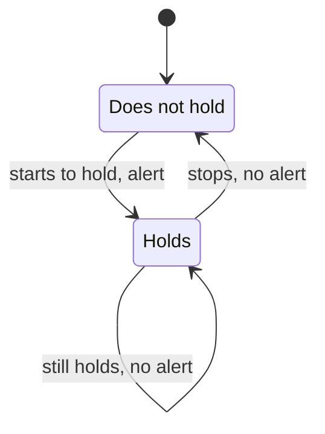

# How Scout works

This page gives the core ideas of Scout. Read it before you start to use Scout.

Every result that Scout gives rests on a quote that Scout found on a page. The diagram shows the
path from your goal or text to a result.

## The core rule: no quote, no claim

The model reads the pages and extracts findings. A finding has a claim, a quote that the model
copied from a page, and the number of that page. Scout then looks for the quote on the page
itself. A claim whose quote is not on the page, or whose numbers differ from the page, never
counts.

- **Exactly or nearly.** Scout compares the quote with the full text of the page. A near match is
  accepted, because typography differs between the page and the copy of the model (spaces,
  punctuation, a dropped word).
- **Never a different number.** A near match with a different number is not a match. "sells for
  $1,849" does not match "sells for $1,999".
- **Every number of the claim.** The quote must state each number of the claim. In a research
  run, Scout compares numbers of two or more digits, and a number can also be in the title or the
  date of the page. In a fact-check, the quote alone must state each number, single digits
  included ("two" counts as 2).
- **A version is one number.** 3.13.0 is one number, and it is the same as 3.13.
- **Long enough to check.** A quote of fewer than 12 characters is set aside.

If the quote is on a different source of the same run, Scout gives the finding to that source,
with the note `quote is from source N`. If a page could not be read, Scout can verify a quote on
the search result snippet of the page. That finding gets the note `quoted from the search result:
the page itself could not be read`.

The diagram shows the decision for one quote.

### Reasons to set a finding aside

A verified quote is necessary, but it is not always enough. Scout also sets a finding aside for
the reasons in this table. The report lists the finding under "Not used", with the reason.

| Reason | When | Note in the report |
|---|---|---|
| Quote not on the page | Scout cannot find the quote on the page | `quote not found in the source` |
| Number not in the quote | The quote does not state a number of the claim | `the quote does not contain 2023` |
| Quote too short | The quote has fewer than 12 characters | `quote too short to check` |
| Price far from the others | A price is below half, or more than 2.5 times, the median of the other prices in the same currency. Scout compares prices only when it has 3 or more in one currency. Rates ("per hour") are not compared. | `far from the typical price of …` |
| Accessory price | The finding is about an accessory (a cable, a cooler, a mount, …) that the goal does not name | `an accessory's price, not the product's` |
| The model doubts it | The model saw on the page why the fact can be wrong | `doubtful: …` |
| Old news | For a news or release goal: the page date is older than twice the period asked (for a week, more than 14 days) | `from a page dated …, older than the … asked` |

The model can take trust away from a fact, but it cannot give trust. A finding with a verified
quote that Scout did not set aside is a **trusted finding**. Memory and watches use only trusted
findings, and the confidence level of a run counts them.

## The research pipeline

`scout run` researches a goal in eight stages, from the plan to the report.

| Stage | What it does |
|---|---|
| Plan | The model turns the goal into 2 to 4 search queries, a kind (price, news, release, general) and how recent sources must be. A keyword heuristic takes over if the model cannot. |
| Search | The search engine (ddgs or SearXNG) finds results for each query. |
| Select | Scout drops results that are not about the goal. It ranks sites by what earlier runs learned. |
| Fetch | Scout downloads the pages and reads HTML, PDF and schema.org data. |
| Pack | The passages most relevant to the goal fill the context window of the model. |
| Extract | The model writes an answer and findings, each with a quote. Page text is fenced as untrusted data. |
| Verify | Scout finds each quote on its page, with its numbers, and sets findings aside for the reasons above. |
| Report | Scout shows the answer, the findings with their quotes and pages, and the sources. |

[Research](research.md) gives the details of each stage, `--deep`, the reports and the options.

## Rulings and labels come from verified quotes

A fact-check and a cite-check do not use the verdict of the model. A ruling or a label comes from
the verified quotes alone. The model only reads each quote and says if it confirms or refutes the
claim. Scout shows this beside the quote, so you can judge it. The note of the model on a claim
is shown only when a verified quote backs it.

### Fact-check rulings

`scout factcheck` checks each claim against independent pages. The ruling comes from the sides
that the verified quotes are on, as the diagram shows.

A quote that confirms a claim must itself state every number of the claim. A page that says 2024
never confirms a claim of 2023. [Fact-check](fact-check.md) has the details.

### Cite-check labels

`scout factcheck --cited` checks each claim only against the pages that its own sentence cites.
The label comes from the verified quotes on those cited pages, as the diagram shows.

| Label | Meaning |
|---|---|
| backed | Verified quotes on the cited pages confirm the claim. |
| contradicted | Verified quotes on the cited pages refute the claim. |
| disputed | The cited pages disagree: verified quotes are on both sides. |
| not found | The pages were read, and no quote states or contradicts the claim. |
| could not read (unreadable) | None of the cited pages could be read (dead, blocked or refused). This costs no model request. |
| not judged | The judgment of the model was unusable. This says nothing of the page. |

The report names the cited pages in the label: "Contradicted by [1]", "Not found in [3]", "Could
not read [4]". [Check citations](citations.md) has the details. [Dead links](dead-links.md) tells
what Scout does with a dead page.

## Quote links

Scout knows where on the page it found each quote. So the link beside a quote opens the page with
that passage highlighted. These links are in reports, the annotated page, alerts, feeds and MCP
results. Anyone who gets your report can check a ruling, and does not have to trust Scout.

The link ends in a text fragment (`#:~:text=...`). The browser keeps the fragment to itself: the
site never learns what was quoted. [Research](research.md#quote-links) tells how Scout makes the
link and which browsers highlight the quote.

## Dead links fixed with proof

Link checkers only say that a link is dead. Archive bots put in a snapshot that nobody checked.
Scout replaces a dead citation only with an archived copy, or with the page at its new address.
The quote that the sentence relies on must be verified on that page, word for word.
[Dead links](dead-links.md) has the details.

## Changes judged by evidence

A watch runs a goal, the claims of a text or the citations of a text again on a schedule. The
model can report different things on different runs while the pages stay the same. So Scout never
takes a change from the output of the model alone. It checks each change against the page text.

- **Noticed, not new.** The model reports a fact for the first time, but its quote was already on
  the page last time. That fact is *noticed*, not *new*. A noticed fact sends no alert.
- **Changed.** A value counts as changed only when its old evidence left the page that Scout read
  again. If the old value is still on the page, the page shows two values. The new value is then a
  fact of its own. This is also true when Scout could not read the page again.
- **One bad fetch changes nothing.** A page that could not be read proves nothing: its facts still
  count. In claim watches and citation watches, a quote leaves only after a second read
  without it (at once if that read verified another quote).

The diagram shows how a watch sorts a fact that the model reported in a run.

A known fact that the model did not report is *gone* only when Scout read its page again and its
evidence is not on it.

### Alerts exactly once

- **Events** ("changed", "new", "drop 5%") alert once for each change.
- **Conditions** ("price below 1800 USD", "in stock") alert when they start to hold, and again only
  after they stopped.
- The next run sends again the alerts that could not be delivered.

The diagram shows the states of a condition over runs.

[Watches](watches.md) has the alert rules, notifications and feeds.

## Cheap to watch

When no page changed since the last run, Scout does not ask the model at all.

- **Research watch:** later runs repeat the searches of the first run, so the results stay
  comparable. When a run reads the same pages with the same content, Scout keeps the findings of
  the last run. The report has the note "no page changed since the last run; its findings were
  kept".
- **Claim watch:** a claim whose pages read exactly as last time keeps its evidence.
- **Citation watch:** a run in which no cited page changed reads the pages and asks the model
  nothing.

So a day on which nothing changed costs no GPU time.

## Learns as it goes

Scout keeps what each run teaches it, and you can correct it.

- **Memory.** Scout remembers every trusted finding, once for each page and quote. `scout ask`
  answers from memory in milliseconds, with no web and no model. Memory learns what the pages
  state, never the claim under test, and it never learns from an archived copy.
- **Site standing.** Scout learns which sites block it and whose quotes fail. A site that failed 3
  times in a row is skipped for a week. Sites whose quotes verify well rank a little higher,
  and sites whose findings you rated wrong rank a little lower. `scout sites` shows what Scout
  learned.
- **Ratings.** `scout rate` takes your corrections into memory, site standing and test cases.

[Research](research.md#memory-and-feedback) has the commands and what a bad rating does.

## What Scout stores

Scout keeps all its data in one folder, `~/.scout`. Set `SCOUT_DATA_DIR` to use another folder.

| Path | What it holds |
|---|---|
| `scout.db` | One SQLite database: every run and check, the caches of searches and pages, page versions, the history and alerts of watches, memory, ratings and site records |
| `reports/` | Each run as Markdown and JSON, and the annotated page (HTML) of each fact-check. Set `SCOUT_OUTPUT_DIR` to use another folder. |
| `feeds/NAME.xml` | The Atom feed of the alerts of watch NAME |
| `watches.yaml` | Your watches |
| `logs/scout.log` | The log of the daemon (`scout logs`) |
| `packs/` | Your own packs (YAML recipes for watches) |
| `.env` | Settings, if there is no `$SCOUT_ENV_FILE` and no `./.env` |

`scout prune` drops old cached searches and page versions. The daemon does it daily.

Your text goes only to your model. [Privacy](privacy.md) lists what leaves your machine.

## Related

- [Research](research.md): `scout run`, `--deep`, reports, export, quote links, memory and feedback
- [Fact-check](fact-check.md): claims, rulings, confidence, the annotated page
- [Check citations](citations.md): cite-checks, labels, `--all` audits
- [Dead links](dead-links.md): archived copies, moved pages, `--fix`
- [Watches](watches.md): alert rules, notifications, feeds, claim and citation watches
- [Privacy](privacy.md): what leaves your machine, untrusted pages, private networks
- [Configuration](configuration.md): environment variables and the data folder
