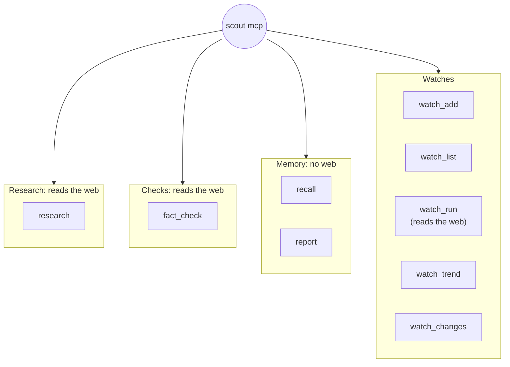
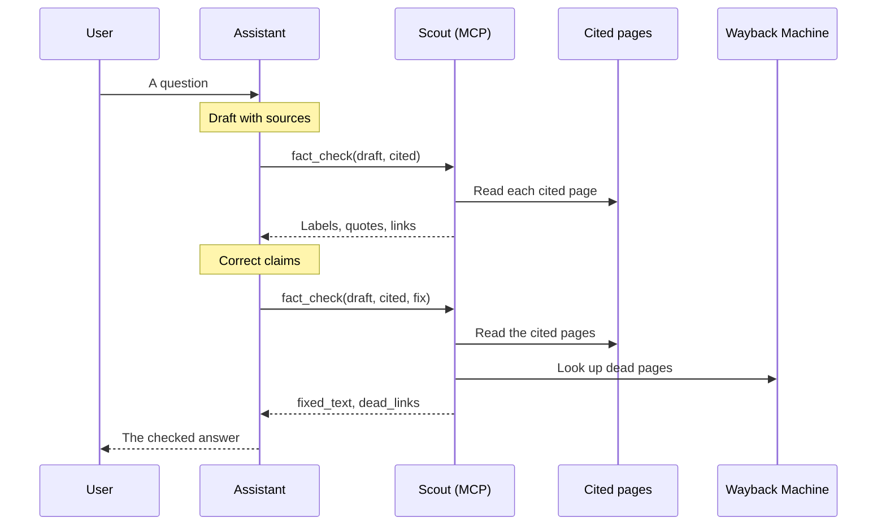

# MCP

`scout mcp` gives an AI assistant research, fact-checks, cite-checks and watches as MCP tools.

Every result carries the quotes and pages behind it. So an assistant can check its own draft, or
the sources that its answer cites, before it sends the answer.

The diagram shows the tools by area, and which tools read the web.



## Set up

The MCP server is the `mcp` extra: `pip install -e ".[mcp]"`.

For Claude Code, run:

```bash
claude mcp add scout -- scout mcp                      # Claude Code
```

For Claude Desktop, add this to `claude_desktop_config.json`:

```json
{ "mcpServers": { "scout": { "command": "scout", "args": ["mcp"] } } }
```

`scout mcp` serves the tools over stdio.

## The tools

| Tool | What it does |
|---|---|
| `research` | Research a goal (optionally `deep`): an answer with verified findings and their quotes |
| `fact_check` | Check a text or a web page claim by claim. With `cited`, check that the pages it cites say what it says (each claim gets a `label` and its `cites`). With `archive` as well, a claim that cites dead pages gets its reading on their archived copies (`archived`); `dead_links` lists each dead page as `--json` does, and `archived.moved` gives the new address of each page that moved. With `find_moved`, Scout also searches for those pages. With `fix`, for a text, `fixed_text` is that text with each dead citation whose copy backs it replaced, so an assistant can repair its own draft |
| `recall` | What earlier runs verified about a question, with no web access |
| `report` | The full Markdown report of a stored run |
| `watch_add`, `watch_list`, `watch_run` | Watches: a research goal, a claim watch (`check`) or a citation watch (`cited`). The run of a claim watch lists the ruling of each claim, what it was, the quote behind it and what was noticed. The run of a citation watch gives its label tally, only the claims that are new or changed with the pages they cite, the cited pages that went dead (each with its newest archived copy and `archive` state) or came back, and how many claims left the text. Scout refuses the first run of a citation watch, which audits every cited sentence: run it with `scout watch run NAME`, or let the daemon do it |
| `watch_trend`, `watch_changes` | The numbers of a watch over time, and its alerts |

The server tells the assistant to try `recall` first: it answers at once from what Scout already
verified. `research` reads the web now and can take a few minutes.

### Quotes and links

A quote in a result is an object with these fields:

| Field | Meaning |
|---|---|
| `quote` | The words copied from the page, verified on it |
| `url` | The page |
| `site` | The site of the page |
| `date` | The date of the page, if Scout knows it |
| `link` | The page, opened with the quote highlighted |

`link` is the link to give a reader. It equals `url` when Scout could not place the quote on the
page. See [Research](research.md) for how quote links work.

## research

Research a goal on the web now: an answer, and verified findings with their quotes.

| Parameter | Type | Default | Meaning |
|---|---|---|---|
| `goal` | text | (required) | The question |
| `max_results` | integer | 6 | Pages to read (1 to 20) |
| `recency` | `day`, `week`, `month`, `year` or `any` | none | How recent sources must be |
| `deep` | true or false | false | Search again (up to 3 rounds) where the findings leave gaps |

| It returns | Meaning |
|---|---|
| `run_id` | The stored run (use it with `report`) |
| `answer` | The answer |
| `confidence`, `confidence_reason` | How sure the answer is, and why |
| `findings` | Each verified finding: `claim`, with its [quote fields](#quotes-and-links) |
| `set_aside` | The findings that Scout could not verify: `claim` and `why` |
| `warnings` | Notes about the run |

## fact_check

Check a text (a draft answer, an article, or a web address) claim by claim against independent
pages. See [Fact-check](fact-check.md) and [Citations](citations.md).

| Parameter | Type | Default | Meaning |
|---|---|---|---|
| `text` | text | (required) | The text, or a web address |
| `max_claims` | integer | 6 | How many claims to check (1 to 12) |
| `cited` | true or false | false | Check that the pages the text cites (its links, footnotes or numbered sources) state what it says. Nothing is searched. |
| `archive` | true or false | false | With `cited`: also judge a claim that cites a dead page on the newest archived copies of its dead pages |
| `find_moved` | true or false | false | With `cited`: also search for the page that a dead page moved to. It turns on `archive`. |
| `fix` | true or false | false | With `cited`, for a text: return `fixed_text`. It turns on `archive`. |

- Without `cited`, Scout reads 3 pages per claim.
- Scout refuses `archive`, `find_moved` or `fix` without `cited`, for example:
  `fix applies to cited checks`.
- Scout refuses `fix` for a web address: `fix rewrites a text: pass the text itself`.

| It returns | Meaning |
|---|---|
| `run_id` | The stored check |
| `summary` | The verdict |
| `confidence`, `confidence_reason` | How sure the verdict is, and why |
| `claims` | Each claim (see the next table) |
| `warnings` | Notes about the check |
| `cited` | `true` for a cite-check |
| `dead_links` | Each dead cited page, as `--json` has it (only when there are dead pages and `archive` is on) |
| `fixed_text` | With `fix`: the text with each dead citation whose archived copy backs it replaced by that copy, or by the page it moved to |

Each item of `claims` has these fields:

| Field | Meaning |
|---|---|
| `claim` | The claim |
| `in_text` | Its passage in the text |
| `ruling` | `supported`, `refuted`, `disputed` or `unclear` |
| `note` | The note of the model |
| `supports`, `refutes` | The quotes on each side, each with its [quote fields](#quotes-and-links). A ruling rests only on quotes that Scout found word for word on a page. |
| `set_aside` | Quotes that the model offered but that are not on the page: `quote` and `why` |
| `unchecked` | Numbers that the text states but that no claim covered |
| `label` | With `cited`: what its pages said: `backed`, `contradicted`, `disputed`, `not found`, `unreadable` (or `not judged`) |
| `cites` | With `cited`: each page it cites: `n` (its citation number), `url`, `read` (true if Scout could read it) |
| `problems` | With `cited`: why a page could not be read, and other notes |
| `archived` | With `archive`: the reading on the archived copies, or null (see below) |

`archived` gives the reading of a claim on the archived copies of its dead pages. It never
changes the `label` of the claim.

| Field of `archived` | Meaning |
|---|---|
| `label` | The label on the copies |
| `copies` | Each copy: `of` (the citation number of the dead page), `url`, `taken` (its date), `read` |
| `moved` | Each dead page that moved: `of` (its citation number) and `url` (the new address) |
| `supports`, `refutes`, `set_aside`, `problems` | As for the claim, on the copies. The links open the copies at the quotes. |

Each item of `dead_links` has: `n`, `url`, `why` (why Scout could not read it), `state`, `copy`,
`taken`, `moved`, `link`, `quote`, `claims`, `backs`, `contradicts` and `note`. `state` says
what to do: `replace` gives the copy to cite in place of the page, and `moved` the live page to
cite. The other states are `contradicted`, `not judged`, `not found`, `copy unreadable`,
`not archived` and `not looked up`. See [Dead links](dead-links.md).

How `archive`, `find_moved` and `fix` work:

- A dead page whose copy backs a claim is also looked for at the same path on the site it now
  redirects to.
- With `find_moved`, Scout also searches for it on that site and on its own site, with one
  sentence of the copy. `moved` then gives the live page that still holds the quote. Its link is
  then the one to cite.
- With `fix`, an assistant can repair its own draft.

The diagram shows an assistant that checks its own draft, and repairs its dead citations.



## recall

What earlier research verified about a question: findings with quotes, with no web access.

| Parameter | Type | Default | Meaning |
|---|---|---|---|
| `question` | text | (required) | The question |
| `limit` | integer | 8 | How many findings to return (1 to 50) |

It returns `facts`: each with `claim`, `quote`, `url`, `link`, `goal` (the goal of the run that
found it), `run_id`, `first_seen` and `last_seen`.

## report

The full Markdown report of an earlier run.

| Parameter | Type | Meaning |
|---|---|---|
| `run_id` | integer | The run, as `run_id` in a result gives it |

It returns the report as Markdown. For an unknown run: `no run with id N`.

## Watches

See [Watches](watches.md) for what each kind of watch does.

### watch_add

Add a watch.

| Parameter | Type | Default | Meaning |
|---|---|---|---|
| `name` | text | (required) | 1 to 40 lowercase letters, digits and dashes |
| `goal` | text | (required) | The question, the text of claims, or a web address or text with citations |
| `every` | text | `"1d"` | How often it runs: `"6h"`, `"1d"` |
| `alerts` | list of text | the defaults of its kind | The alert rules |
| `check` | true or false | false | A claim watch: `goal` is a short text of claims. Rules: `changed`, `supported`, `refuted`. |
| `cited` | true or false | false | A citation watch: `goal` is a web address or a text with citations. Rules: `changed`, `backed`, `contradicted`, `dead`. |

The rules of a research watch are `new`, `changed`, `price below 1800 USD`, `drop 5%`,
`mentions "text"` and `in stock` (see [Alert rules](watches.md#alert-rules)).

`watch_add` takes no cron schedule, notification URL, kind, recency, region or page count. Use
`scout watch add`, or edit the watch in `~/.scout/watches.yaml`.

It returns the watch, as `watch_list` shows it.

### watch_list

The watches, with their schedules, alert rules and last runs. It takes no parameters. It
returns `watches`, each with these fields:

| Field | Meaning |
|---|---|
| `name` | The name |
| `goal` | The label: the goal, or the first 120 characters of a long text |
| `schedule` | `every 1d`, or `cron EXPR` |
| `alerts` | Its rules, or the defaults of its kind |
| `check`, `cited` | The kind of watch |
| `paused` | True if it is paused |
| `last_run` | The time of its last run, or null |

### watch_run

Run a watch now: what changed since its last run, and which alerts that raised. It takes `name`.

| It returns | Meaning |
|---|---|
| `run_id` | The stored run |
| `first_run` | True on the baseline |
| `model_asked` | True if the run asked the model |
| `changes` | How many findings (for a claim watch or a citation watch: rulings) are `new`, `noticed`, `changed`, `same` or `gone` |
| `alerts` | The alerts that the run raised |

For a claim watch, `claims` gives each claim:

| Field | Meaning |
|---|---|
| `claim` | The claim |
| `ruling`, `was` | Its ruling, as page-proven evidence has it, and its ruling before |
| `change` | `new`, `changed`, `noticed` or `same` |
| `quote`, `url`, `link` | The quote behind the ruling |
| `gone` | True if that quote left its page |
| `noticed` | The quotes that the model noticed and that are still on their pages: `stance`, `quote`, `url`, `link`. Never alerted on. |

For a citation watch, the result gives only what moved, since an audit can hold hundreds of
claims:

| Field | Meaning |
|---|---|
| `labels` | How many claims have each label |
| `claims` | Only the claims that are new or changed: `claim`, `label`, `was`, `change`, `quote`, `url`, `link`, `cites` (the addresses it cites), `gone` |
| `pages` | The cited pages that went dead, came back, or were read at last (see the next table) |
| `left` | How many claims left the text |

| Field of `pages` | Meaning |
|---|---|
| `url` | The cited page |
| `state` | `dead`, `back` (read before it died), or `read` (at last) |
| `was`, `why` | Its state before, and why Scout cannot read it now |
| `archive` | For a dead page: `archived`, `not archived`, or `not looked up` (the archive did not answer, or more pages died than a run looks up): worth a new try later |
| `archived` | The newest archived copy: `taken`, `url`, `link` (opened at the quote), `holds` (true if it still holds the quote), `read` |

Scout refuses the first run of a citation watch. The first run audits every cited sentence, and
that takes far longer than an assistant waits. Scout also refuses a run that starts a new
baseline. The error says:

```
citation watch NAME has not run yet: its first run audits every cited sentence, which takes far longer than an assistant waits; run `scout watch run NAME` or let `scout daemon` run it
```

### watch_trend

How the prices and other numbers that a watch follows moved, run by run. It takes `name`. It
returns `series`: each with `value`, `in` (the unit), `first`, `last`, `low`, `high`,
`change_percent` and `points` (each a time and an amount).

### watch_changes

The alerts of a watch, newest first, each with the page and quote it rests on.

| Parameter | Type | Default | Meaning |
|---|---|---|---|
| `name` | text | (required) | The watch |
| `limit` | integer | 20 | How many alerts (1 to 200) |

It returns `alerts`: each with `when`, `alert`, `url`, `link`, `quote` and `delivered`.

## Limits

> [!NOTE]
> Over MCP, Scout reads only the public internet. Scout refuses an address on a private network.
> See [Privacy](privacy.md).

- `fact_check` checks at most 12 claims. An audit (`--all`) runs far longer than an assistant
  waits on a tool. For an audit, run `scout factcheck --cited --all`.
- For the same reason, Scout refuses the first run of a citation watch.
- With the exchange backend, a tool can wait for an answer. The tool then says:
  `waiting for the model's answer: write it to PATH, then call again` (see
  [Models](models.md)).

## Related

- [Research](research.md): `scout run`, reports and quote links
- [Fact-check](fact-check.md): rulings and confidence
- [Citations](citations.md): cite-checks and labels
- [Dead links](dead-links.md): archived copies, moved pages and `--fix`
- [Watches](watches.md): the kinds of watch and their alert rules
- [Privacy](privacy.md): what leaves your machine
