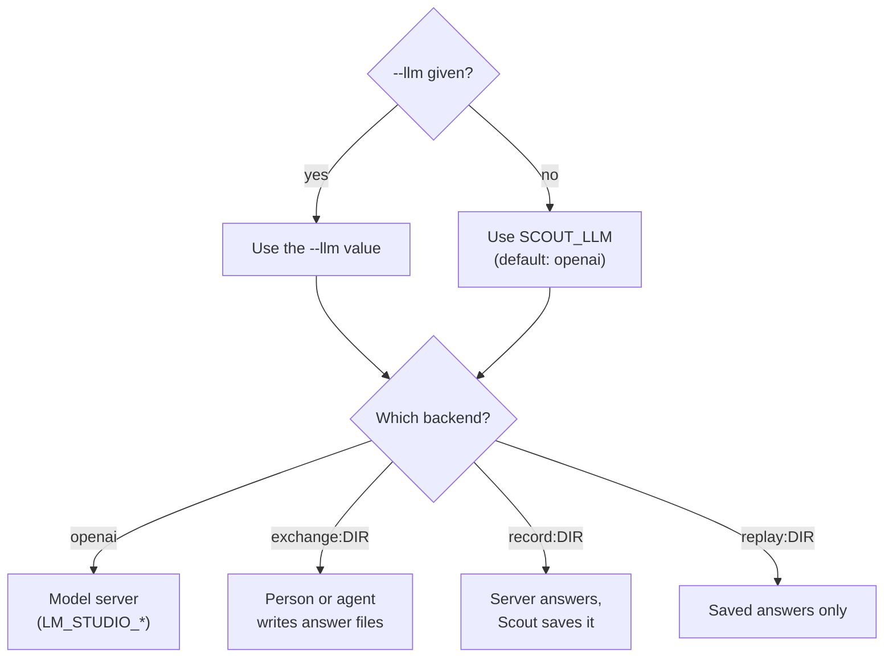
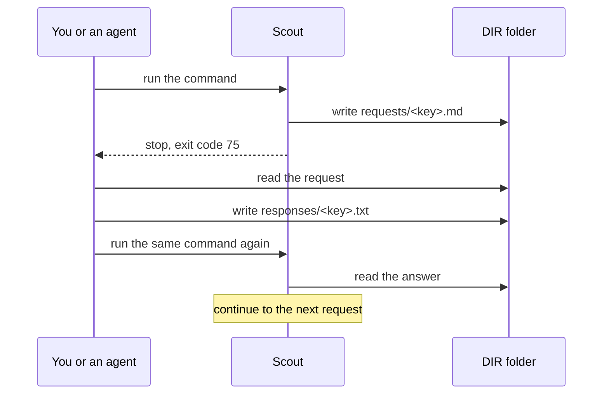
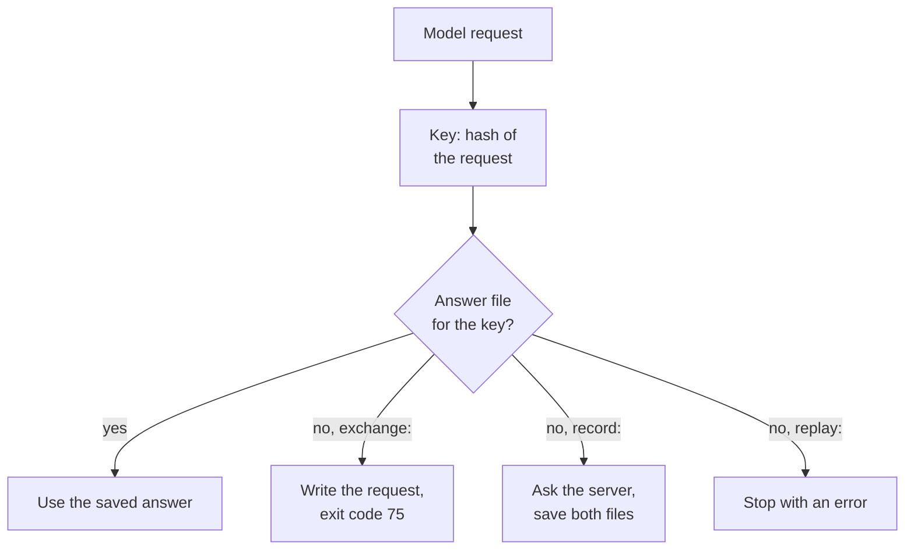
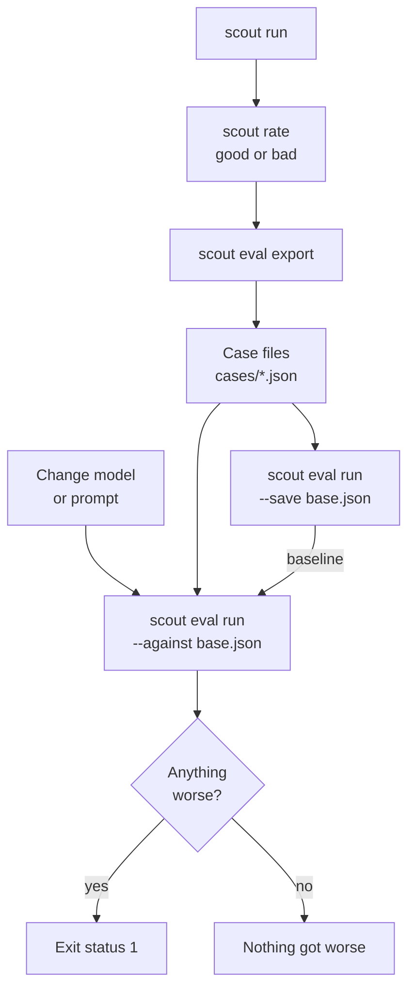

# Models

Scout uses a language model to plan searches, list claims, copy quotes and judge claims. This
page tells how to connect a model, how to test it, and how to compare models and prompts.



The diagram shows how Scout selects the backend that answers each model request.

## Backends

`SCOUT_LLM` selects who answers. `--llm` overrides it for one command.

| `SCOUT_LLM` | Who answers | Use it for |
|---|---|---|
| `openai` (default) | An OpenAI-compatible server: LM Studio, Ollama, llama.cpp or vLLM. The `LM_STUDIO_*` settings configure it. | Daily work with your local model |
| `exchange:DIR` | A person, or an agent such as Claude Code. Scout writes each request to `DIR/requests/<key>.md`. The answer goes to `DIR/responses/<key>.txt`. | An agent as the model, with no model server |
| `record:DIR` | The model server. Scout saves every exchange in DIR. | A record of a real session |
| `replay:DIR` | Only the answers saved in DIR. Scout asks no server. | Offline tests (see [Record and replay](#record-and-replay)) |

### Use another backend for one command

`--llm` overrides `SCOUT_LLM` for one command. These commands take it: `scout run`,
`scout factcheck`, `scout watch run`, `scout replay` and `scout eval run`.

```bash
scout factcheck --cited -f answer.md --llm exchange:./answers
scout replay RUN --llm record:./answers
```

Rules for the value:

- `exchange:`, `record:` and `replay:` need a folder. Without one, Scout stops with
  `SCOUT_LLM='exchange:' needs a folder, e.g. exchange:./exchange`.
- A relative folder is relative to the folder where you run the command. This is also true when
  the value comes from the `.env` file.
- Any other value stops Scout with `unknown SCOUT_LLM value …`.

## The openai backend

The `openai` backend sends chat requests to a server with an OpenAI-compatible API: LM Studio,
Ollama, llama.cpp or vLLM.

| Variable | What it does |
|---|---|
| `LM_STUDIO_BASE_URL` | The server address (default `http://localhost:1234/v1`). Scout sends requests to `/chat/completions` and gets the model list from `/models` under this address. |
| `LM_STUDIO_MODEL` | The model id. `scout models` lists the ids. |
| `LM_STUDIO_API_KEY` | A token, if the server requires one |
| `SCOUT_PLANNER_MODEL` | A smaller model for the plan step (default: the main model) |
| `SCOUT_MODEL_TTL` | Seconds that LM Studio keeps a model loaded on demand |
| `SCOUT_LLM_TIMEOUT` | Seconds to wait for one reply (default 300) |
| `SCOUT_CONTEXT_TOKENS` | A context window that overrides what the server reports |

[Configuration](configuration.md) gives every setting, with its default.

- **A planner model.** With `SCOUT_PLANNER_MODEL`, a small model plans the searches, and the main
  model reads the pages. Only the plan step goes to the planner model. Results name the main
  model, because it reads the pages.
- **Unload when idle.** With `SCOUT_MODEL_TTL`, Scout tells LM Studio to unload a model that it
  loaded on demand after that number of idle seconds. A daemon that runs every few hours then
  leaves your GPU free between runs. With no value, LM Studio's own setting applies.
- **The context window.** LM Studio tells Scout the context window of the loaded model. Other
  servers do not. Then Scout assumes 8192 tokens, and `scout check` shows the note
  `context not reported; assuming 8192 tokens`. On those servers, set `SCOUT_CONTEXT_TOKENS` to
  the real value. 8192 tokens is the context length that LM Studio (0.4.16 and later) gives a
  model that it loads on demand.
- **Reasoning text.** Some chat templates (DeepSeek, Qwen) leave the model's reasoning in the
  reply, in `<think>` blocks. Scout removes these blocks.
- **Errors.** Scout stops with `cannot reach the model server at URL` when the server does not
  answer. It stops with `no reply from URL within 300s` when a reply takes longer than
  `SCOUT_LLM_TIMEOUT`.

> [!WARNING]
> Your text and the page text go to the server at `LM_STUDIO_BASE_URL`. If that server is not
> on your machine, your text leaves your machine. Keep the server on localhost or on a private
> network. Do not expose it to the internet. See [Privacy](privacy.md).

### Use Scout with LM Studio

1. Start the server in LM Studio.
2. Copy the example settings file: `cp .env.example .env`.
3. In `.env`, set `LM_STUDIO_BASE_URL` to the server address. Scout's default is
   `http://localhost:1234/v1`.
4. Run `scout models` to list the model ids that the server offers.
5. In `.env`, set `LM_STUDIO_MODEL` to one of these ids.
6. If "Require Authentication" is on in LM Studio, create a token under Developer > Server
   Settings.
7. Set `LM_STUDIO_API_KEY` to that token.
8. Optional: set `SCOUT_PLANNER_MODEL` to a smaller model, and `SCOUT_MODEL_TTL` to a number of
   seconds.
9. Run `scout check`. Make sure that it shows your model and its context window.
10. Run a goal:

    ```bash
    scout run "What are the new features in Python 3.13?"
    ```

For Ollama, llama.cpp or vLLM, do the same steps with the address of that server. Also set
`SCOUT_CONTEXT_TOKENS`, because these servers do not report the context window.
`SCOUT_MODEL_TTL` applies to LM Studio only.

## Test the server: scout check

```bash
scout check
```

`scout check` does these steps:

1. It shows the settings that Scout uses.
2. It asks the server for the model's real context window and its reasoning levels.
3. It sends one small request with schema-constrained output, and checks the reply.
4. It remembers the result for a day (24 hours).

| Line | What it shows |
|---|---|
| settings file | The `.env` file that Scout read, or `none (environment only)` |
| model backend | `SCOUT_LLM` |
| server | `LM_STUDIO_BASE_URL` |
| model | `LM_STUDIO_MODEL`, and the idle time from `SCOUT_MODEL_TTL` |
| planning model | `SCOUT_PLANNER_MODEL`, or `the same` |
| API key | `set` or `not set` (never the key itself) |
| search | `SCOUT_SEARCH` |
| JavaScript pages | `SCOUT_RENDER`, or `not rendered` |
| archived copies | `SCOUT_ARCHIVE` |
| data folder | `SCOUT_DATA_DIR` |
| reports folder | `SCOUT_OUTPUT_DIR` |
| the model | `loaded`, `not loaded (loads on first use)` or `unknown` |
| context window | The tokens that Scout plans for |
| structured mode | `json_schema` or `prompt` (see below) |
| reasoning | The reasoning levels that the server reports, or `none reported` |

The last line is a note, for example where the context window came from.

| Structured mode | What it means |
|---|---|
| `json_schema` | The server limits the reply to the JSON schema. It is fast and reliable where it works. |
| `prompt` | The schema goes into the prompt. Scout parses the reply and makes sure that it agrees with the schema. This is the safe default. |

- Models of the gpt-oss family always use `prompt` mode. LM Studio is known to garble their
  schema-constrained output.
- If a reply is not valid, Scout asks the model one time to correct it.
- Other commands use the result of `scout check` for a day. After a day, they ask the server
  again for the context window and the reasoning levels. They do not test schema-constrained
  output, so they use `prompt` mode until the next `scout check`.
- A run in which `json_schema` output fails changes to `prompt` mode, and Scout remembers this.
- When the server reports reasoning levels, Scout asks for `low` in the plan step and for
  `medium` in the other steps, if the model has these levels.
- With `exchange:DIR` or `replay:DIR`, `scout check` asks no server. It shows 32768 tokens (or
  `SCOUT_CONTEXT_TOKENS`), `prompt` mode and the note `answered through exchange files`.

> [!NOTE]
> Run `scout check` again after you change the model, the server or `SCOUT_CONTEXT_TOKENS`.
> Only `scout check` tests schema-constrained output.

## List the models: scout models

```bash
scout models
```

`scout models` lists the model ids that the server offers. A dot marks the model in
`LM_STUDIO_MODEL`. It needs `SCOUT_LLM=openai`. With another backend, it stops with
`` `models` needs SCOUT_LLM=openai (a model server) ``.

> [!NOTE]
> `scout models` needs a value in `LM_STUDIO_MODEL`. Any value is sufficient. With no value, it
> stops with ``LM_STUDIO_MODEL is not set; run `scout models` to see what the server offers``.
> `.env.example` has an example value, so `scout models` works after you copy that file.

## The exchange backend

With `exchange:DIR`, files are the model API. Scout writes each request to a file. A person, or
an agent such as Claude Code, writes the reply to another file. You need no model server and no
GPU.



The diagram shows one round: Scout stops at a request that has no answer, and continues when
the answer is there.

### The files

| File | Written by | What it holds |
|---|---|---|
| `DIR/requests/<key>.md` | Scout | The request: the step, the model name, the temperature and the answer file. Then each message, under a line such as `===== SYSTEM =====` or `===== USER =====`. |
| `DIR/responses/<key>.txt` | The person or the agent | The reply, as the model would write it, and nothing else |

- **The key** is 16 hexadecimal characters. It is a hash of the model name, the messages, the
  schema and the temperature. The same request always gets the same key, and so the same answer
  file. With `exchange:DIR`, the model name is `exchange`.
- When Scout writes a request, it also makes the folder `DIR/responses/`, ready for the answer.
- The request file tells the answerer: "Write the model's reply, and nothing else, to the answer
  file. Use only the information in the messages below."
- **Most requests want JSON.** The system message then ends with the JSON schema and the
  instruction "Reply with a single JSON object and nothing else (no prose, no code fences)."
  Scout reads the first JSON object in the reply. If the reply is not valid, Scout asks one time
  to correct it. That is a new request, which holds the bad reply and the problem.
- Scout assumes a context window of 32768 tokens for an agent. `SCOUT_CONTEXT_TOKENS` changes
  this.

### Exit code 75: run again to continue

- When a request has no answer file, the command stops with exit code 75. It shows
  `Waiting for the model's answer:`, the path of the request file, and
  `Write the reply to the answer file it names, then run the same command again.`
- Run the same command again to continue. Each time, Scout uses the answers that are there and
  stops at the next request that has no answer. A command that needs many model requests needs
  many rounds.
- The searches and pages that the command read are kept while it waits. So it continues with
  the same prompts, however long the answer takes, up to a day. A run that still waits after a
  day reads the web again.
- The same request gets the same answer file. So a finished check that you ask again costs no
  model time. A claim's judge request in an audit is the same as in a cite-check, so one answer
  (given through `exchange:DIR`, or recorded with `record:DIR`) serves both.
- An audit (`--all`) and the first run of a citation watch also continue where they stopped.
  See [Citations](citations.md) and [Watches](watches.md).
- In the daemon, a watch that waits for an answer goes into the log, and the daemon tries it
  again after 30 minutes.
- Over MCP, the tool returns the error
  `waiting for the model's answer: write it to PATH, then call again`.

### Answer with an agent through the exchange backend

Give these steps to the agent (for example Claude Code). The agent can run the command itself.

1. Select a folder for the exchange, for example `./answers`.
2. Run the command with `--llm exchange:./answers`:

   ```bash
   scout factcheck --cited -f answer.md --llm exchange:./answers
   ```

3. If the exit code is 75, open the request file that the command names.
4. Read the messages. Use only the information in them.
5. Write the reply, and nothing else, to the answer file that the request names
   (`responses/<key>.txt`).
6. Run the same command again.
7. Do steps 3 to 6 again until the exit code is not 75.

To use the exchange backend for all commands, set `SCOUT_LLM=exchange:./answers`.

## Record and replay

`record:DIR` and `replay:DIR` use the same files as `exchange:DIR`. `record:DIR` keeps a record of
a real session with the model server. `replay:DIR` answers only from saved answer files, with no
server.



The diagram shows what each backend does with a model request.

- **`record:DIR`** uses the model server, with all the `openai` settings (the planner model
  too). Scout saves each request and its answer in DIR. If DIR already has the answer to a
  request, Scout uses it and does not ask the server.
- **`replay:DIR`** answers only from the answer files in DIR. It asks no server. A request with
  no answer file stops the command with `no recorded answer for the STEP request KEY`.
- A request that changes in any way (other pages, another model name, another context window)
  gets another key. `replay:DIR` then has no answer for it.

> [!CAUTION]
> In this version, `replay:DIR` does not find the answers that `record:DIR` saved. The key holds
> the model name: `record:DIR` uses the name in `LM_STUDIO_MODEL`, and `replay:DIR` uses the
> name `exchange`. `replay:DIR` finds the answers of an `exchange:DIR` session. To use recorded
> answers again, run `record:DIR` again with the same model and settings. Scout then uses each
> saved answer to the same request, and asks the server only for the other requests.

## Test models and prompts



The diagram shows the loop that finds regressions: a run becomes a test case, the case scores a
model, and later scores are compared with a saved baseline.

### Replay a run: scout replay

```bash
scout replay RUN
scout replay RUN --llm exchange:./answers
```

`scout replay RUN` analyzes a stored run's exact pages again, with any model, and compares. It
does no search and downloads no page.

| Option | What it does |
|---|---|
| `--llm TEXT` | The model to analyze with, for example `record:./answers` |
| `--json` | Print the new result as JSON |
| `--no-save` | Do not keep the replay as a new run |

- It shows a table with the model, the findings, the trusted findings and the confidence, for
  the run and for the replay. Then it shows the report of the replay.
- The replay is kept as a new run, unless `--no-save`. Its findings do not go into the memory
  (`scout ask`).
- Scout keeps each version of a page that a run read. If a version is gone, the replay says
  `N page(s) of it are no longer stored`.
- A fact-check cannot be replayed. Scout stops with
  `run N is a fact-check: check the text again with scout factcheck`.

### Make a test case: scout eval export

```bash
scout eval export RUN case.json
```

`scout eval export RUN case.json` turns a run into a test case, with the exact pages that it
read. The run's ratings become what the case expects:

| Rating (`scout rate RUN N`) | In the case | Meaning |
|---|---|---|
| `good` | `expect.facts` | A fact that the trusted findings must contain |
| `bad` | `expect.untrusted` | A claim that must never be trusted |

- You can add expected facts by hand under `"expect"` in the JSON file. Scout reminds you:
  `List expected facts under "expect" to measure recall.`
- A case file holds `name`, `goal`, `plan`, `sources` (with the full page text), `expect`, and
  optionally `replies` (model replies for each step). `scout eval export` writes no `replies`.
- A fact-check cannot become a case. A run whose pages are gone cannot become a case either.

See [Research](research.md) for `scout rate`.

### Score a model: scout eval run

```bash
scout eval run cases/ --save base.json
scout eval run cases/ --against base.json   # after a change of model or prompt
```

`scout eval run PATHS…` scores the model on case files, or on every `*.json` file in a folder.

| Option | What it does |
|---|---|
| `--llm TEXT` | The model to score, for example `openai` or `exchange:./answers` |
| `--recorded` | Answer each step with the replies that the case file holds. No model is necessary. This tests Scout's own logic on real model output. |
| `--strict` | Exit with status 1 on a missed fact or a violation |
| `--save FILE` | Keep the scores as a baseline |
| `--against FILE` | Compare with a saved baseline. Exit with status 1 if anything got worse. |

The table has these columns: case, model, trusted, expected facts, violations, confidence and
time.

- An expected fact is found when its text is in a trusted finding (its claim, quote or value).
- A violation is a claim that must never be trusted, but is in a trusted finding.
- With `--against`, the command fails if any expected fact was lost, or if any claim that must
  never be trusted is trusted now. Each problem shows as a `worse:` line. When nothing got
  worse, it shows `Nothing got worse than base.json`.
- Cases that the baseline does not have are not compared.

### Find regressions after a change

1. Rate the findings of a run: `scout rate RUN N good` or `scout rate RUN N bad`.
2. Turn the run into a case: `scout eval export RUN cases/NAME.json`.
3. Save a baseline: `scout eval run cases/ --save base.json`.
4. Change the model or a prompt.
5. Run `scout eval run cases/ --against base.json`.
6. If the exit status is 1, read the `worse:` lines.

## Related

- [Configuration](configuration.md): every setting and its default
- [Privacy](privacy.md): what goes to your model, and what leaves your machine
- [Research](research.md): `scout run`, `scout rate` and the memory
- [Citations](citations.md): audits that continue after a stop
- [Watches](watches.md): the daemon and citation watches
- [MCP](mcp.md): Scout as tools for an AI assistant
- [How it works](how-it-works.md): the core rule and the pipeline
