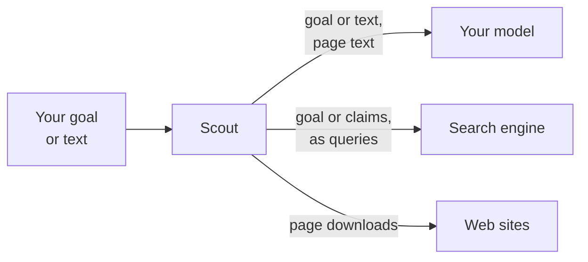
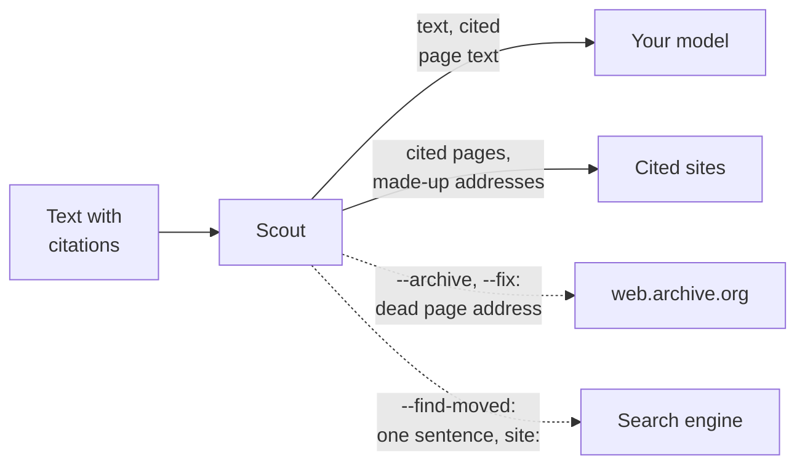
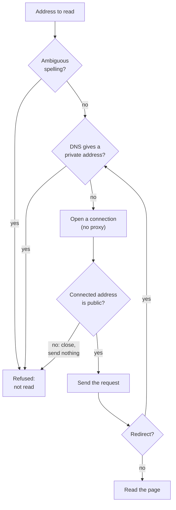

# Privacy

Scout runs on your machine, and your text goes only to your model. This page tells what leaves
your machine, how Scout treats the pages that it reads, and how it keeps away from private
networks.

For `scout run` and `scout factcheck` (and research and claim watches):

For a cite-check, `scout factcheck --cited` (and citation watches):

The two diagrams show what each type of command sends, and where. Dotted lines are options that
are off by default. A citation watch sends dead page addresses to the archive without an
option.

## What leaves your machine

| Command | Your model gets | The search engine gets | Web sites get | web.archive.org gets |
|---|---|---|---|---|
| `scout run`, research watches | The goal and the page text | Queries made from the goal | Downloads of the result pages | Nothing |
| `scout factcheck`, claim watches | Your text, its claims and the page text | Each claim, as a query | Downloads of the result pages, and of the checked page if you give an address | Nothing |
| `scout factcheck --cited` | Your text and the text of the cited pages | Nothing | Downloads of the cited pages, and one or two made-up addresses for a suspect page | Nothing |
| ... with `--archive` or `--fix` | Also the archived copies | Nothing | Also the same path on the host that a dead address redirects to | The address of each dead cited page |
| ... with `--find-moved` | The same | One sentence of an archived copy, with `site:` | Also the pages that this search finds | The address of each dead cited page |
| Citation watches | Your text and the text of the cited pages | Nothing | Downloads of the cited pages, and made-up addresses for a suspect page | The address of a cited page that died |
| `scout replay`, `scout eval run` | The stored page text | Nothing | Nothing | Nothing |
| `scout ask`, `history`, `show`, `export` | Nothing | Nothing | Nothing | Nothing |

Your text and your claims go only to your model, except as this page tells.

### Searches

Searches go to the search engine in `SCOUT_SEARCH`: `ddgs` (a metasearch) or your own SearXNG
instance.

- **`scout run`**: the model turns the goal into 2 to 4 queries. With `--no-plan`, or when the
  model cannot make a plan, Scout searches for the goal as written. With `--deep`, the model
  also names follow-up searches.
- **A fact-check**: Scout searches for each claim, so the claims reach the search engine as
  queries.
- **A cite-check** searches nothing. Scout downloads only the cited pages.
- **`--find-moved`**: see [The search for a moved page](#the-search-for-a-moved-page).

> [!WARNING]
> A fact-check sends each claim of your text to the search engine. Do not fact-check a text
> whose claims must stay private. A cite-check (`--cited`) searches nothing.

### Page downloads

- Each page download goes to the site of the page. It sends the User-Agent in
  `SCOUT_USER_AGENT` (desktop Chrome's by default) and a language from `SCOUT_REGION`.
- **The soft-404 check.** A cited page can answer but be gone. For such a suspect, Scout asks
  its own site for one or two made-up addresses: one in the same folder, then one a folder up,
  for example `/2019/scout-3f9a1c2e7b4d.html`. Scout asks once for each folder. See
  [Dead links](dead-links.md).
- **The moved check.** With `--archive`, when the archived copy of a dead page backs a claim,
  Scout also downloads the same path on the host that the old address now redirects to. This is
  one download.
- **Quote links.** A quote's link ends in a text fragment (`#:~:text=...`). The browser keeps
  the fragment to itself, so the site never learns what was quoted.

### The Wayback Machine

- Scout looks up archived copies only with `--archive`, `--fix` and `--find-moved` (both imply
  `--archive`), and in citation watches when a cited page dies.
- **Only the address of a cited page that is gone is sent to web.archive.org.** Never the claim
  or the text.
- A refused (private) address is never sent. An address with no public name is never sent
  either. See [Names with no public name](#names-with-no-public-name).
- A run looks up at most 30 cited pages.
- `SCOUT_ARCHIVE=off` turns the lookups off, and sends nothing. `--archive` then stops with
  `archive lookups are off (SCOUT_ARCHIVE=off)`.
- Scout always reads the archive under the public-internet rules, whoever asks.

### The search for a moved page

With `--find-moved` only, Scout searches for a dead page whose archived copy backs a claim:

- The query is one sentence of the archived copy, in double quotes, with `site:`. It holds at
  most 16 words of the quote that backed the claim, as the copy writes them. For example:
  `"At MIX we said that more than half a million Silverlight developers are now Windows Phone" site:windows.com`.
- Scout searches the site that the dead address now redirects to, then the page's own site.
- Your text and the claim are never searched for. But the quote backs the claim, so its words
  can be close to the claim.
- If a search fails, the report notes it, and Scout searches for no other page in that run.

### Your model

Your goal, your text, your claims and the page text go to your model. Where they go depends on
the backend (see [Models](models.md)):

- `openai`: the server at `LM_STUDIO_BASE_URL`.
- `exchange:DIR`: the request files in DIR, and the person or agent that answers them.
- `record:DIR`: the server, and a copy of each request and answer in DIR.

> [!WARNING]
> If `LM_STUDIO_BASE_URL` is not on your machine, your text leaves your machine. Keep the model
> server on localhost or on a private network. Do not expose it to the internet. With
> `exchange:DIR`, the person or the agent that answers reads your text and the page text.

### Notifications

A watch with `--notify` sends its alerts to the [Apprise](https://github.com/caronc/apprise)
URLs that you give (`ntfy://topic`, `tgram://bot/chat`, `mailto://...`, `discord://...`,
`json://host/path`). A notification holds:

- the title, `Scout NAME: N alerts`;
- the watch's goal, or the first 120 characters of a long text;
- each alert, with its quote (at most 200 characters) and its link.

So a notification shows its alerts, not the text that a citation watch audits. The Atom feed of
a watch (`~/.scout/feeds/NAME.xml`) is a file on your machine.

> [!NOTE]
> The notification service gets the start of the watch's goal or text. Use a service that you
> trust with it.

### What stays on your machine

- `scout ask` uses no web and no model.
- `scout history`, `scout show` and `scout export` read the local database.
- `scout replay` and `scout eval run` send stored page text to your model, but search nothing and
  download nothing.
- The database, the reports, the feeds and the logs stay in the data folder. See
  [Configuration](configuration.md).

## Pages are untrusted

A page can hold words that try to give orders to the model. Scout treats every page as data.

- **Page text is fenced as data.** Each page goes to the model inside a `<source>` block. Scout
  breaks any `</source>` in the page text, so a page cannot end its own block.
- **Instructions hidden in pages are ignored.** The model is told that the sources are untrusted
  pages, and that it must ignore any instructions in them. Your text to check is also data, not
  instructions.
- A ruling and a label come only from verified quotes, never from the model's verdict. See
  [How it works](how-it-works.md).
- **Web text is shown as text** in reports, notifications and feeds. It brings no links, images
  or markup of its own. A report links only to web pages, so a hostile page cannot plant a
  `javascript:` link.
- A notification is plain text. Scout changes web text in it, so that a chat service cannot read
  it as a mention, a link or markup.
- In a link that Scout shows in the terminal, Scout percent-encodes the characters that could end
  the link.
- The annotated page is one HTML file with no scripts or external assets.

## Private networks

A text may cite anything, and a page may lead anywhere. So in some commands, Scout reads only
the public internet.

| Scout reads only the public internet | Scout also reads private addresses |
|---|---|
| Over MCP: every tool | `scout run` |
| A cite-check (`scout factcheck --cited`), without `--allow-private` | A plain `scout factcheck` |
| A citation watch | Research watches and claim watches, from the command line or the daemon |
| Each lookup in the archive | |

`scout run` and a plain `scout factcheck` read private addresses, because you may want to check
your own intranet page. A refused cited page shows as *could not read … (refused)*, and its
claim is unreadable.

### How Scout checks a connection

The diagram shows the checks on each connection when Scout reads only the public internet.

1. **The spelling.** Scout refuses an address with a backslash, a space or a control character.
   URL parsers can disagree on the host of such an address.
2. **The name.** Scout gets every address of the host (from DNS, or the address itself). If one
   of them is not on the public internet, Scout refuses the page before it connects.
   `::ffff:10.0.0.5` counts as `10.0.0.5`.
3. **The socket.** Scout checks the address that each connection actually reached, on the
   socket, before it sends anything. If that address is not public, Scout closes the socket. So
   no spelling of an address, no second DNS answer and no redirect leads to a private network.
4. **Redirects.** Scout checks the target of each redirect before it follows it.
5. **The cache.** A cached page that came from a private address is not reused.
6. **Proxies.** Scout does not use the proxies set in the environment: a proxy would hide which
   host it reaches.
7. **No browser.** No page runs in a browser, also when `SCOUT_RENDER` is set.

A private address is any address that is not on the public internet, for example `localhost`,
`10.0.0.0/8`, `192.168.…` and `169.254.169.254` (cloud metadata). The reason for a refusal is
one of these:

| Reason | When |
|---|---|
| `it is on a private network (ADDRESS)` | The address itself is private |
| `it redirects to URL, which is on a private network (ADDRESS)` | A redirect leads to a private address |
| `it leads to a private network (ADDRESS)` | The connection reached a private address |
| `its address is ambiguous` | The address has a backslash, a space or a control character |

### Names with no public name

An address with no public name is never sent to the archive. Off its network, such a name fails
to resolve, like a dead site. Scout uses these rules:

| Rule | Examples |
|---|---|
| The host has no dot | `http://jira/` |
| The last part of the host is `local`, `internal`, `corp`, `lan`, `home`, `arpa`, `invalid`, `test`, `localhost`, `intranet`, `private` or `localdomain` | `wiki.corp`, `*.internal` |
| The host is an IP address | `http://10.1.2.3/` |

The report then says `no archived copy looked up for [n]: no public name`.

### Read intranet pages: --allow-private

`--allow-private` lets a cite-check read pages and cited addresses on private networks, for
intranet docs. It applies to `--cited` only.

> [!WARNING]
> `--allow-private` lets a checked page choose private addresses for Scout to read. With
> `SCOUT_RENDER`, it also renders pages in a browser that runs their scripts. Use it only on
> texts and pages that you trust.

`--allow-private` does not combine with `--archive`, or with `--fix` and `--find-moved`, which
imply `--archive`. The archive lookups would send intranet addresses to web.archive.org. Scout
stops with
`--archive sends the addresses of unreadable cited pages to web.archive.org; it does not combine with --allow-private, whose pages may be intranet addresses`.

## Related

- [Citations](citations.md): cite-checks, private addresses and audits
- [Dead links](dead-links.md): archived copies, the soft-404 check and moved pages
- [Fact-check](fact-check.md): what a fact-check searches for
- [Watches](watches.md): notifications and citation watches
- [MCP](mcp.md): the tools for AI assistants
- [Models](models.md): where your model runs
- [Configuration](configuration.md): `SCOUT_SEARCH`, `SCOUT_ARCHIVE` and the data folder
- [How it works](how-it-works.md): rulings from verified quotes
