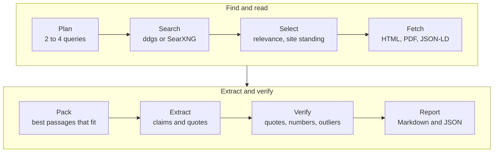
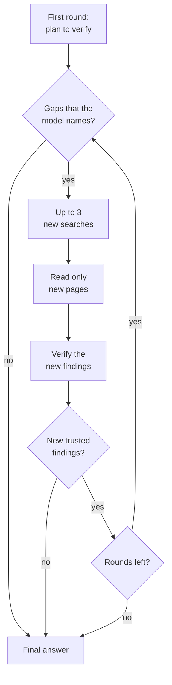
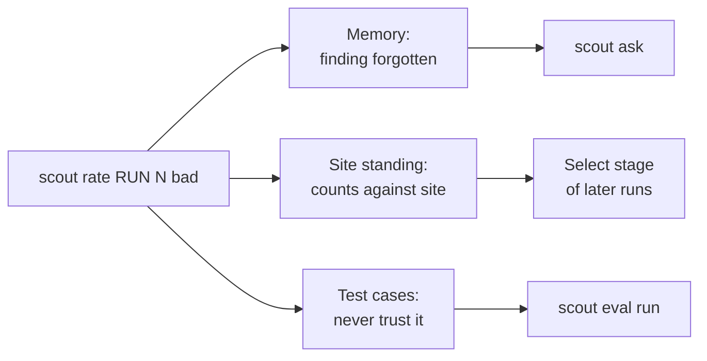

# Research

This page tells how `scout run` researches a goal, what its report holds, and how to export,
recall and rate the results.

`scout run` sends a goal through eight stages. The diagram shows what each stage does.



## Run a goal

```bash
scout run "What are the new features in Python 3.13?"
scout run "cheapest RTX 5090 price" --kind price --recency week
scout run "What are the new features in Python 3.13?" --deep
```

| Option | What it does |
|---|---|
| `-n`, `--max-results N` | Pages to read, 1 to 20. The default is `SCOUT_MAX_RESULTS` (6). |
| `--kind price\|news\|release\|general` | Skip the classification of the goal. |
| `--recency day\|week\|month\|year\|any` | How recent sources must be. `any` turns the time filter off. |
| `--region TEXT` | Search region, for example `us-en`, `in-en`, `de-de`. The default is `SCOUT_REGION` (`us-en`). |
| `--no-plan` | Search for the goal as written. |
| `--deep` | Search more where the findings leave gaps (see [Deep research](#deep-research)). |
| `--rounds N` | With `--deep`: search rounds at most, 2 to 5. The default is 3. |
| `--llm TEXT` | Another backend for this command, for example `exchange:./answers` (see [Models](models.md)). |
| `--json` | Print the result as JSON. |
| `--no-save` | Do not keep the run or write report files. |

`scout -v run …` shows progress, and `scout -vv run …` shows debug output.

## The pipeline

[How Scout works](how-it-works.md) tells the core rule behind the stages. This section gives the
details of each stage. The model works in two stages, plan and extract. With `--deep`, it also
names follow-up searches and writes the final answer.

### Plan

The model turns the goal into 2 to 4 search queries, a kind (`price`, `news`, `release` or
`general`) and how recent sources must be.

- If the plan of the model is unusable, a keyword heuristic takes over, and Scout adds a note.
- `--no-plan` does not ask the model: Scout searches for the goal as written.
- `--kind` and `--recency` replace what the plan says.
- `SCOUT_PLANNER_MODEL` lets a small model plan the searches while the main model reads.

The keyword heuristic searches for the goal as written. It sets the kind and the recency from the
words of the goal:

| Words in the goal (examples) | Kind | Recency |
|---|---|---|
| price, cost, cheapest, deal, msrp | price | month |
| news, latest, recent, announced, update | news | week |
| release, version, changelog, features | release | year |
| other words | general | any |

The word "today" sets the recency to one day.

### Search

The search engine is `SCOUT_SEARCH`: `ddgs` (the default) or `searxng:http://localhost:8080` (JSON
must be enabled on that instance).

- For a news goal, Scout searches the news first. If that finds nothing, it does a plain search.
- If no result is from the period asked, Scout searches again without a date limit and adds a
  note, for example `nothing from the last week; searched without a date limit`.

### Select

Scout chooses the results to read, in this order:

1. Results that share little of the distinctive terms of the goal are dropped, with the note
   `ignored N off-topic search result(s)`. If too few results are about the goal, Scout keeps all
   of them and ranks them.
2. Among the rest, sites whose quotes verify well rank a little higher. Sites whose
   findings you rated wrong rank a little lower. Site standing never makes an off-topic result
   relevant.
3. Sites that failed several times in a row (3 times) are skipped for a week, with the note
   `skipped sites that keep failing: …`. Then they get another chance.
4. Scout reads at most 2 pages from one site.

For a price goal, product pages rank above search result pages and category pages.

### Fetch

Scout downloads the selected pages at the same time. One bad page does not stop the run.

- Pages are decoded correctly (gzip, brotli, zstd).
- PDFs are read as PDFs.
- Binary junk is rejected.
- Pages are cached and revalidated with ETags (and `Last-Modified`).
- Prices that pages publish as schema.org data are read exactly, rental rates ("per hour")
  included.
- Pages that show their text only with JavaScript can be read in a headless browser. Set
  `SCOUT_RENDER=playwright`, then install the browser:

  ```bash
  pip install -e ".[render]"
  playwright install chromium
  ```

For a price goal, the schema.org prices become findings directly, with no model: the cheapest
offer for each product, and the 3 cheapest of these on each page. The report shows such a finding
with "(price published by the page as structured data)" in place of a quote.

If a page could not be read, its search result snippet can stand in for it. The "Read" column of
the Sources table shows `yes`, `snippet only (STATUS)` or `no (STATUS)`.

### Pack

The passages most relevant to the goal fill the actual context window of the model. Scout asks the
server for the size of the window (at most once a day), and `scout check` shows it.
`SCOUT_CONTEXT_TOKENS` sets it by hand.

- Each page first gets its best passage. The rest of the space goes to the best passages that are
  left.
- One page sends at most `SCOUT_MAX_PAGE_CHARS` characters (6000) to the model.
- `[...]` marks text left out between two passages. The model must not quote across it.
- A note tells how many readable pages did not fit (`N readable page(s) did not fit the context
  window`).
- If the server says that the prompt is too long, Scout sends less text one time, with the note
  `the sources did not fit the model's context window; sent less text`.

### Extract

Page text is fenced as untrusted data, so instructions hidden in pages are ignored.

The model writes a short answer (1 to 4 sentences) from the sources only. It also writes at most
12 findings, most important first. Each finding has a claim, a quote copied character for
character from one source, and the number of that source. When sources disagree, each version is
a finding of its own. The model can also say why a page makes a fact doubtful.

### Verify

Each quote must be on its page and state the numbers of its claim.

- A near match is accepted, but never with a different number.
- Scout compares numbers of two or more digits. A number can also be in the title or the date of
  the page.
- A version such as 3.13.0 is one number, and the same as 3.13.

Scout then sets findings aside: prices far from the others, accessory prices, facts that the
model doubts, and old news. [How Scout works](how-it-works.md#reasons-to-set-a-finding-aside) has
the table of reasons.

### Report

The report has these parts:

| Part | What it shows |
|---|---|
| Answer | The answer of the model, with the confidence level and its reason |
| Findings | The trusted findings, numbered, each with its quote and a link to its page |
| Not used (could not be verified or looks wrong) | The findings that Scout set aside, each with the reason |
| Sources | A table of the pages: number, title and site, if Scout read it, date, and the query that found it |
| Notes | What went wrong or was left out |

The last line names the Scout version, the run number, the model, the planner (`model` or
`heuristic`), the time and the duration.

The confidence level comes from the evidence, not from the opinion of the model:

| Level | When |
|---|---|
| high | 3 or more trusted findings, from 2 or more sites, and at least 70% of all findings trusted |
| medium | At least one trusted finding |
| low | No trusted finding |

For a news goal, the level goes down one step when the newest verified source is undated or more
than 30 days old.

## Deep research

`scout run --deep` searches more where the findings leave gaps. The diagram shows the loop.



- After each round, the model names follow-up searches (up to 3).
- Scout reads only pages that it did not read yet. It verifies their findings the same way.
- The loop stops when the model sees no gaps, when a round adds no trusted finding, or after
  `--rounds` rounds (3 by default, 2 to 5).
- Prices far from the others are judged again when more prices are known.
- Then the model writes the final answer from the trusted findings alone (verified, and not set
  aside), and cites them by number (`[2]`). A note says `deep research: N rounds, M pages read`.
- If the final answer fails, Scout keeps the answer of the first round, with a note.

> [!NOTE]
> If the loop stops after the first round (no gaps, or no new trusted finding), the answer is the
> one that the model wrote with the findings, as in a run without `--deep`.

## Where runs go

Every run is stored in `~/.scout/scout.db`. It is also written as Markdown and JSON to
`~/.scout/reports/`, in files named by the date, the time and the goal. `SCOUT_OUTPUT_DIR` sets
another folder for the report files.

- `--no-save` keeps nothing and writes no file.
- With `--json`, the output lists the files written under `saved`.
- A check is stored the same way. A fact-check also writes its annotated page (see
  [Fact-check](fact-check.md)).

### History and stored runs

```bash
scout history              # the 20 newest runs
scout history -n 50 --watch gpu
scout show 12              # the report of run 12
scout show 12 --json       # run 12 as JSON
```

`scout history` lists the runs with their number, time, watch, goal, confidence and how many
findings were trusted. `-n` (`--limit`) sets how many runs to show, and `--watch NAME` shows only
the runs of one watch. `scout show RUN` prints the report of a stored run again, and `--json`
prints it as JSON.

### Export

`scout export FOLDER` writes stored runs to FOLDER, one file for each run.

```bash
scout export ~/notes/scout                     # every run, as notes
scout export ~/notes/scout --run 12 --run 14   # only runs 12 and 14
scout export ~/scout-pages --format html       # web pages
```

| Option | What it does |
|---|---|
| `--format note` | Markdown notes with YAML front matter, for Obsidian and other Markdown vaults (the default) |
| `--format html` | Self-contained web pages |
| `--run RUN` | Only this run. You can give it more than one time. |
| `--overwrite` | Replace files that are already there. Without it, runs already there are skipped. |

The front matter of a note has the goal, the date, the confidence, the run number, the pages read
and the tag `scout`. A note is named by the date, the goal and the run number.

## Quote links

A quote's source link ends in a text fragment (`#:~:text=...`) made from the page's own words.
Chrome and Edge (80+), Safari (16.1+) and Firefox (131+) scroll to the quote and highlight it.
Other browsers open the page at its top. The browser keeps the fragment to itself: the site never
learns what was quoted.

The diagram shows how Scout makes the link.


- **The terms come from the text that Scout extracted**, so they match the curly quotes, dashes
  and case of the page, whatever the copy of the model looked like.
- **A short quote is one term.** A quote of 8 words or fewer on one line is one term. A longer
  quote gets a start term and an end term of 4 to 10 words. Scout makes each term long enough
  that the browser finds the quote, not an earlier passage.
- **A prefix tells repeated words apart.** A table row or a list item whose first words appear
  earlier on the page gets a prefix (`text=stairs.-,2nd%20floor,...`).
- **A label joined to its value is its own term.**
- **Text without spaces** (Chinese, Japanese) is placed to the character.

When nothing is highlighted, search the page for the quote. This occurs when the page changed, or
when the page lays out the passage in a way that the terms miss.

- A PDF opens at its start.
- The Sources table links to plain pages.
- An alert about a quote that left its page links to the page alone.

In JSON, each finding has the fragment as `anchor`. `anchor` is null when Scout could not place
the quote (a search snippet, a published price), or when a term would be longer than 120
characters. It is also null in runs saved before Scout placed quotes, and their links stay plain.

## Memory and feedback

Scout remembers every trusted finding. You can ask it what it knows, and correct it.

| Command | What it does |
|---|---|
| `scout ask QUESTION` | What earlier runs verified about it: no web, no model |
| `scout rate RUN N good\|bad` | Judge finding N of a run (as its report numbers them) |
| `scout ratings [--export FILE.jsonl]` | The ratings, or a dataset of them |
| `scout sites [--forget SITE]` | What Scout learned about each site |

### Ask

```bash
scout ask "Python 3.13 release date"
scout ask "RTX 5090 price" -n 3 --json
```

`scout ask` searches the memory, not the web, and does not ask the model. It shows each fact with
its quote, its site, the run that found it, and when Scout saw it first and last. The link of each
fact opens its page at the quote. `-n` (`--limit`) sets how many facts to show (8 by default), and
`--json` prints them as JSON.

### Rate

```bash
scout rate 12 3 bad --note "accessory, not the card"
scout rate 12 1 good
```

N is the number of the finding in the report of the run. In a fact-check, N is the `[n]` number
of the report. In a cite-check, N is the number in "finding N". `--note` tells why, in a few
words. A second rating of the same finding replaces the first.

A trusted finding rated bad:

1. Is forgotten. Later runs that find it again do not bring it back. A rating of good brings it
   back.
2. Counts against its site.
3. Becomes something a test case must never trust again.

A finding rated good becomes something a test case expects. A finding that Scout did not trust
was not believed in the first place, so a bad rating of it does not count against its site.

The diagram shows where a bad rating goes.



### Ratings

`scout ratings` lists the findings that people rated: the run, the number, the verdict, the
finding, if Scout trusted it, and the note. `scout ratings --export FILE.jsonl` writes every
rating to a JSON Lines file, as a dataset.

`scout eval export RUN case.json` turns a run into a test case, and its ratings become what the
case expects. [Models](models.md) tells how to score models and prompts against test cases.

### Sites

`scout sites` shows what Scout learned about each site that it read: how many pages it read, how
many failed, how many quotes verified, how many findings people rated wrong, and its standing
(from -1 to +1). A site that Scout skips for now shows "skipped (failing)".

`scout sites --forget SITE` forgets what Scout learned about SITE.

## Related

- [How Scout works](how-it-works.md): the core rule, rulings and labels, what Scout stores
- [Fact-check](fact-check.md): check the claims of a text against independent pages
- [Watches](watches.md): run a goal again on a schedule, with alerts
- [Models](models.md): backends, `scout check`, `scout replay` and `scout eval`
- [Configuration](configuration.md): `SCOUT_SEARCH`, `SCOUT_RENDER`, `SCOUT_MAX_RESULTS` and the
  other variables
- [Privacy](privacy.md): what leaves your machine
