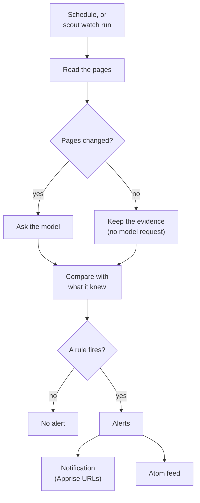
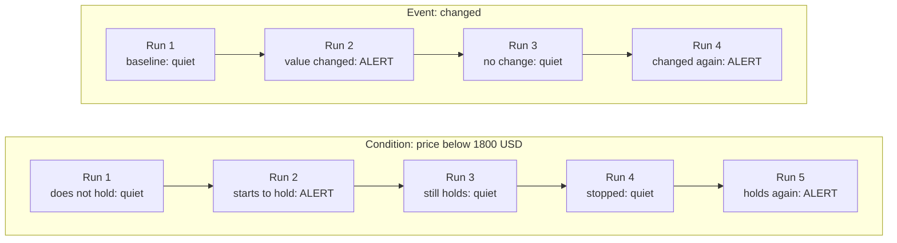
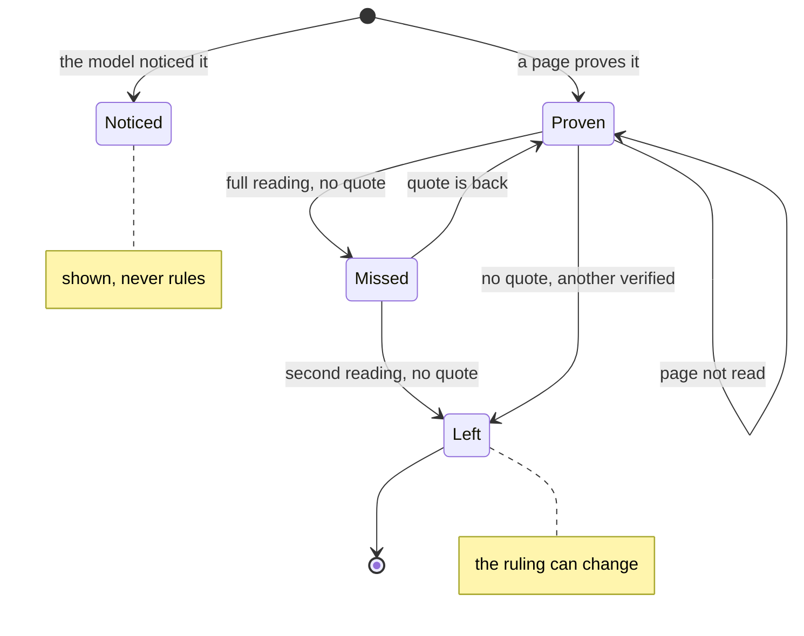
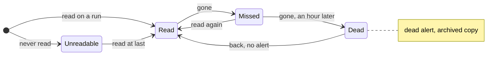
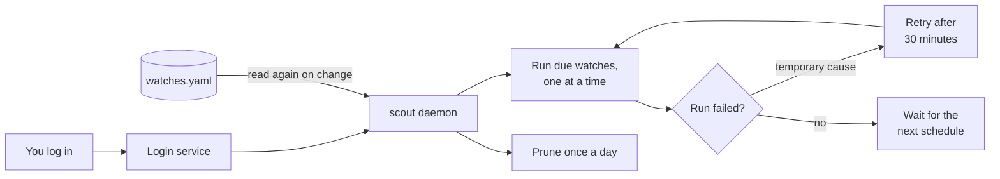

# Watches

A watch runs a goal, the claims of a text, or the citations of a text again on a schedule, and
tells you what changed.

Model output changes from run to run, but pages may not. So Scout reports a change only when a
page changed. A new wording of a finding, or a finding that the model did not report again, stays
quiet.

The diagram shows one run of a watch.



## Quick start

```bash
scout watch add gpu "cheapest RTX 5090 price" --every 6h \
    --alert "price below 1800 USD" --alert "drop 5%" --notify ntfy://my-topic
scout watch run gpu        # run now; the first run is the baseline
scout daemon               # run every watch on its schedule
```

1. Add the watch with `scout watch add`.
2. Run it once with `scout watch run`. The first run is the baseline: later runs compare with it.
3. Start `scout daemon`. It runs every watch on its schedule.

A watch runs its goal again on a schedule (`--every 6h`, or `--cron "0 9 * * *"`). It compares
what it finds with what it knew.

## Kinds of watch

There are three kinds of watch:

| Kind | Option | The goal | Each run | Default alert rules |
|---|---|---|---|---|
| Research watch | (none: the default) | A question | Researches the goal, as `scout run` does | `new`, `changed` |
| [Claim watch](#claim-watches) | `--check` | A short text (up to 1,500 characters) | Fact-checks the claims of the text, as `scout factcheck` does | `changed` |
| [Citation watch](#citation-watches) | `--cited` | A web address, or a text that cites pages | Audits every cited sentence, as `scout factcheck --cited --all` does | `changed`, `dead` |

You can also start from a [pack](#packs): a ready-made watch.

## Add a watch

```bash
scout watch add NAME GOAL [OPTIONS]
```

NAME has 1 to 40 lowercase letters, digits and dashes. It starts with a letter or a digit.

| Option | Default | Meaning |
|---|---|---|
| `--every TEXT` | `1d` | How often the watch runs: `30m`, `6h`, `1d`, `1w`. The shortest interval is 15 minutes. |
| `--cron TEXT` | | A cron schedule, in place of `--every`: `"0 9 * * *"` is 09:00 every day. |
| `--alert TEXT` | `new`, `changed` (research watch) | When to alert, for example `"price below 1800 USD"`. Repeat the option for more rules. See [Alert rules](#alert-rules). |
| `--notify TEXT` | | Where alerts go: an Apprise URL, for example `ntfy://my-topic`. Repeat the option for more URLs. See [Notifications](#notifications). |
| `--kind [price\|news\|release\|general]` | the model classifies the goal | Skip the classification of the goal. Not for a claim watch or a citation watch. |
| `--recency [day\|week\|month\|year\|any]` | | How recent sources must be. Not for a claim watch or a citation watch. |
| `--region TEXT` | | Search region, for example `us-en`, `in-en`, `de-de`. Not for a citation watch. |
| `-n`, `--max-results INTEGER` | `SCOUT_MAX_RESULTS` (6); 3 per claim with `--check` | Pages to read per run (1 to 20). With `--check`, pages per claim. Not for a citation watch. |
| `--stop-when-alerted` | off | Pause the watch after it alerts. |
| `--check` | off | GOAL is a short text of claims. Scout fact-checks it on every run and alerts when the ruling of a claim changes. |
| `--cited` | off | GOAL is a web address or a text that cites pages. Scout audits its citations on every run and alerts when a cited page no longer backs a claim or goes dead. |

- Use `--every` or `--cron`. Do not use the two together. `--every` takes a number and a unit:
  `m`, `min`, `minute(s)`, `h`, `hr`, `hour(s)`, `d`, `day(s)`, `w` or `week(s)`.
- The default rules depend on the kind of watch: `changed` for a claim watch, `changed` and
  `dead` for a citation watch. Each kind accepts only its own rules (see the rule tables).
- Scout tests each `--notify` URL when you add the watch, not at the first alert.

```
$ scout watch add gpu "cheapest RTX 5090 price" --every 6h --alert "price below 1800 USD" --alert "drop 5%"
Watching gpu every 6h. Run it now: scout watch run gpu
```

## Packs

A pack is a ready-made watch for a common need: a price, a release, news, a restock. Packs are
YAML recipes.

```bash
scout pack list                                            # the packs, and what each needs
scout pack add price product="RTX 5090" below="1800 USD"
```

```
Watching rtx-5090-price every 6h: cheapest RTX 5090 price right now
  alerts on: drop 5%, price below 1800 USD
```

`scout pack add NAME PARAM=VALUE...` adds the watches of the pack, filled in with the values. Its
option `--notify TEXT` gives an Apprise URL for the alerts (repeat it for more URLs).

Scout has these packs:

| Pack | What it does | Needs | May take | The watch it adds |
|---|---|---|---|---|
| `news` | A daily look at what is new on a topic. | `topic` | `keyword` | `TOPIC-news`: "latest news about TOPIC", every `1d`, kind `news`, recency `week`. Rules: `new`, `mentions "KEYWORD"`. |
| `price` | Follow a product's price and hear when it drops or goes under your limit. | `product` | `below` | `PRODUCT-price`: "cheapest PRODUCT price right now", every `6h`, kind `price`. Rules: `drop 5%`, `price below BELOW`. |
| `release` | Hear when a project ships a new version. | `project` | | `PROJECT-release`: "latest PROJECT release: version number and release date", every `1d`, kind `release`. Rules: `new`, `changed`. |
| `restock` | Hear when a sold-out product can be bought again. | `product` | | `PRODUCT-stock`: "where to buy PRODUCT: in stock or sold out", every `3h`, kind `price`. Rule: `in stock`. It pauses after it alerts. |

- The watch name starts with the value of the first parameter, in lowercase letters, digits
  and dashes (up to 30 characters): `RTX 5090` gives `rtx-5090-price`.
- If you do not give an optional parameter, the rule that uses it goes away. Without `below`,
  the `price` pack alerts only on `drop 5%`.
- Scout refuses the pack if a watch with the same name exists.

### Add your own pack

Put a YAML file in `~/.scout/packs/`. The file name (without `.yaml`) is the name of the pack.
A pack there replaces a pack of Scout with the same name. A pack has three keys:

| Key | Meaning |
|---|---|
| `description` | What the pack does (`scout pack list` shows it) |
| `params` | Each parameter and its help text. A help text that starts with "optional" makes the parameter optional. |
| `watches` | A list of watch settings, as in the [watches file](#the-watches-file). `{param}` is replaced by the value of the parameter. `{slug}` is the value of the first parameter, made fit for a watch name. |

This is the `price` pack of Scout:

```yaml
description: Follow a product's price and hear when it drops or goes under your limit.
params:
  product: the product, e.g. "RTX 5090"
  below: optional; alert under this price, e.g. "1800 USD"
watches:
  - name: "{slug}-price"
    goal: "cheapest {product} price right now"
    every: 6h
    kind: price
    alerts:
      - drop 5%
      - price below {below}
```

## Alert rules

No model decides when to alert. A rule is plain words, and Scout tests it on the verified
findings. Case does not matter.

| Alert rule (research watches) | Also written | Fires |
|---|---|---|
| `new` | `new finding`, `new findings`, `new fact`, `new facts` | a finding appeared that was not on the page before |
| `changed` | `any change`, `change`, `changes` | a value changed by 1% or more, or a finding left its page |
| `price below 1800 USD` | `below`, `under`, `<` (the word `price` is optional) | when a price starts to be below the limit |
| `price above 2500` | `above`, `over`, `>` | when a price starts to be above the limit |
| `drop 5%` | `drops`, `fall`, `falls`, `drop by 5%`, `price drop 5%` | a price fell by 5% or more between two runs |
| `rise 10%` | `rises`, `up`, `rise by 10%` | a price rose by 10% or more between two runs |
| `mentions "free-threaded"` | | a new finding contains the text |
| `in stock` | `back in stock` | a published offer became available |

- A limit with a currency (`1800 USD`, or `$1800`, which is USD) applies to prices in that
  currency and to prices with no currency.
- A rate (a price "per hour") never meets a price limit.
- `in stock` reads the offers that a page publishes as schema.org data. An offer is available
  when its availability is `InStock`, `LimitedAvailability`, `OnlineOnly` or `InStoreOnly`.
- On the first run (the baseline), `new` and `changed` do not fire.
- Claim watches and citation watches have their own rules: see
  [claim alert rules](#claim-alert-rules) and [citation alert rules](#citation-alert-rules).

### New, noticed or changed

Scout judges each change by the pages, not by the model output:

- A finding that the model reports for the first time, but that was on its page at the last
  run, is *noticed*, not *new*. A noticed finding does not alert.
- A value counts as changed only when its old evidence left the page that Scout read again. If
  the old value is still on the page, the page shows two values, and the new value is a finding
  of its own.
- A finding leaves when Scout reads its page again and its quote is not on it. The alert says
  `no longer on SITE`. A page that Scout could not read proves nothing. One bad fetch changes
  nothing.
- Later runs repeat the searches of the first run, so that the results stay comparable.
- When a run reads exactly the same pages as the last run, Scout keeps the findings and does
  not ask the model. The run says `no page changed, so the model was not asked again`. A day on
  which nothing changed costs no GPU time.

### Events and conditions

Each alert comes exactly once:

- **Events** (`new`, `changed`, `drop 5%`, `rise 10%`, `mentions`) alert once per change. One
  run sees each change.
- **Conditions** (`price below 1800 USD`, `price above 2500`, `in stock`) alert when they start
  to hold, or when you add the rule while it holds. They stay quiet while they hold. They alert
  again only after a run in which they did not hold. A price that moves around under the limit is
  one alert, not one alert for each price.
- The next run tries again to deliver an alert that it could not deliver. Scout tries for 3
  days, or for two intervals of the schedule if that is longer.

The diagram compares the two kinds of rule over a series of runs.



## Notifications

Notifications go through [Apprise](https://github.com/caronc/apprise) URLs. Apprise is the
`notify` extra: `pip install -e ".[notify]"`.

| URL | Where the alerts go |
|---|---|
| `ntfy://topic` | an ntfy topic (phone push) |
| `tgram://bot/chat` | a Telegram chat |
| `mailto://...` | an e-mail address |
| `discord://...` | a Discord channel |
| `json://host/path` | a webhook |

- One notification carries all the alerts of the watch that are not delivered yet. Its title
  is `Scout NAME: N alerts`.
- The body starts with the label of the watch. Then each alert follows, with its quote (up to
  200 characters) and the link that opens the page at the quote. The last line is
  `details: scout watch changes NAME`.
- The body is plain text. Web text in it cannot become a link, a mention or markup.
- If the delivery fails, `scout watch run` says `notification failed: ... (the next run tries
  again)`, and `scout watch changes` shows the error.

### The label

Notifications, feeds and lists name a watch by its goal. They name a long text by its first 120
characters. So a notification shows its alerts, not the text that a citation watch audits.

## The Atom feed

Every run also writes the Atom feed of the alerts of the watch again:
`~/.scout/feeds/NAME.xml`. Subscribe to it in any feed reader.

```bash
scout watch feed NAME      # print the feed
```

- The feed holds the 50 newest alerts. The link of each entry opens the page at its quote.
- `scout watch remove NAME` deletes the feed file.

## Commands

| Command | What it does |
|---|---|
| `scout watch add/list/show/remove/pause/resume` | Manage watches (kept in `~/.scout/watches.yaml`) |
| `scout watch run NAME` | Run one now |
| `scout watch changes NAME` | Its alerts, with the page and quote behind each |
| `scout watch trend NAME [--csv FILE]` | How its prices and numbers moved, with sparklines |
| `scout watch feed NAME` | Print its Atom feed |
| `scout pack list`, `scout pack add NAME PARAM=VALUE...` | Ready-made watches |
| `scout daemon` | Run every watch on schedule; reloads the watches file when it changes, retries a failed run after 30 minutes |
| `scout service install` | Start the daemon at login (systemd user unit, LaunchAgent, or Windows Startup script; no admin rights). `--dry-run` shows what it would do |
| `scout service uninstall` | The daemon no longer starts at login |
| `scout logs` | The end of the daemon's log |
| `scout prune` | Drop old cached searches and page versions (the daemon does it daily) |

What each `scout watch` command shows:

- `list`: each watch with its schedule, its alert rules, its last run (time and confidence) and
  its state (`active` or `paused`).
- `show NAME`: the watch, its schedule, rules and notification URLs, what it knows, and its 5
  latest alerts. A research watch lists its findings with their values, sites and the date
  since when each holds. For a claim watch or a citation watch, see their sections.
- `run NAME`: the run, its alerts, and how many alerts it delivered. For a research watch, the
  run tells how many findings are new, noticed, changed, the same or gone.
- `changes NAME`: the alerts, newest first, each with when it came, its link and its delivery.
- `trend NAME`: each value with its unit, first, last, low and high values, its change in percent
  and a sparkline of its history.
- `pause NAME`: the daemon stops the runs of the watch. The watch keeps what it knows.
  `resume NAME` starts them again.
- `remove NAME`: Scout forgets the findings, prices and alerts of the watch. Its runs stay in
  the history.

Options of the other commands:

| Command | Option | Default | Meaning |
|---|---|---|---|
| `scout watch run` | `--llm TEXT` | `SCOUT_LLM` | Another model backend for this run, for example `exchange:./answers` |
| `scout watch changes` | `-n`, `--limit INTEGER` | 20 | How many alerts to show |
| `scout watch trend` | `--csv FILE` | | Also write every observation to this CSV file |
| `scout watch remove` | `--yes` | | Do not ask for confirmation |
| `scout pack add` | `--notify TEXT` | | Where alerts go: an Apprise URL |
| `scout service install` | `--dry-run` | | Only show what it would do |
| `scout service install`, `scout service uninstall` | `--yes` | | Do not ask for confirmation |
| `scout logs` | `-n`, `--lines INTEGER` | 40 | How many lines to show |

### The watches file

Scout keeps the watches in `~/.scout/watches.yaml`. You can edit it by hand. The daemon reads it
again when it changes. The `scout watch add` command of the [quick start](#quick-start) writes
this entry:

```yaml
watches:
- name: gpu
  goal: cheapest RTX 5090 price
  every: 6h
  alerts:
  - price below 1800 USD
  - drop 5%
  notify:
  - ntfy://my-topic
```

| Key | Value | Same as |
|---|---|---|
| `name`, `goal` | text | NAME, GOAL |
| `every` or `cron` | text | `--every`, `--cron` |
| `kind`, `recency`, `region` | text | `--kind`, `--recency`, `--region` |
| `max_results` | a whole number | `-n` |
| `alerts`, `notify` | a list of text | `--alert`, `--notify` |
| `stop_when_alerted`, `paused` | `true` or `false` | `--stop-when-alerted`, `scout watch pause` |
| `check` | `true` or `false` | `--check` |
| `cited` | `true` or `false` | `--cited` (it also needs `check: true`) |

### One run at a time

A watch has one run at a time. Scout refuses `scout watch run` while the daemon runs that watch:
`watch 'gpu' is already running`.

### Baselines

The first run of a watch is its baseline: `first run: this is what later runs are compared
with`. Some changes start a new baseline:

- An edit to the goal of a watch starts a new baseline. Its value history (`scout watch trend`)
  stays.
- A switch between a research watch, a claim watch and a citation watch starts a new baseline.
- A claim watch starts a new baseline when you edit its text.
- A citation watch does not start a new baseline when you edit its text. A switch between a web
  address and a text starts one, and so does another web address.
- A watch removed and added again under the same name forgets what it knew. A citation watch
  then starts a new baseline. A research watch or a claim watch with the same goal continues
  from its last run: a finding already on the pages is noticed, not new, and the first rulings
  of a claim watch do not alert.

## Claim watches

Watch a claim, not a page:

```
$ scout watch add py-latest "Python 3.14 is the latest stable version of Python." --check
$ scout watch run py-latest            # python.org changed since the last run
py-latest run 40: 1 claim checked, 1 changed
  🔔 changed: Python 3.14 is the latest stable version of Python: supported → refuted
  1. Refuted (was supported): Python 3.14 is the latest stable version of Python.
     "Python 3.15.0 is the latest stable release of Python." (python.org)
```

With `--check`, the goal is a short text, up to 1,500 characters. On every run, Scout
fact-checks its claims as `scout factcheck` checks them ([Fact-check](fact-check.md)). `-n` sets
the pages per claim, 3 by default.

- The first run lists the claims. Later runs check the same claims, so the claims do not drift.
- The watch remembers the verified quotes behind each claim, and rules on them.

### Evidence that a page proves

A ruling rests only on quotes that a page proves:

- the quotes cited when the watch began,
- a quote that appeared on a page that the watch had read in full without it,
- a quote on a page that dates itself on or after the last run. A date from a search engine
  does not count.

The ruling changes, and can alert, only when such a quote arrives or leaves. There is one alert
per change. When the cause is a quote that left, the alert says `no longer on SITE`.

A quote leaves when its page, read in full, no longer carries it:

- at once, when that reading verified another quote,
- otherwise after a second reading without it. So one bad fetch (a cookie wall, a page that did
  not render) changes nothing.

Each page counts on its own, also two pages of one site.

What the model only noticed is shown as *noticed*. That is a quote already on its page, a quote
on a page read for the first time, or a quote in a search snippet. A noticed quote never alerts
and never rules. `scout watch show` counts it apart.

A page that is not in the search results, or that Scout could not read, proves nothing: its
quotes keep their effect. A claim whose pages read exactly as last time keeps its evidence, and
Scout does not ask the model. So a day on which nothing changed costs no GPU time.

The diagram shows the life of a quote in a claim watch.



### Claim alert rules

| Alert rule (claim watches) | Fires when a page changed a claim's ruling |
|---|---|
| `changed` (the default) | to anything else |
| `refuted` (also `now refuted`, `disputed`, `contradicted`) | to refuted, or to disputed because a quote that refutes the claim arrived |
| `supported` (also `now supported`, `backed`) | to supported |

A claim watch accepts only `changed`, `supported` and `refuted`. A research watch cannot use
`supported` or `refuted`.

### Show and store

- `scout watch show NAME` lists each claim with its ruling, since when the ruling holds, and how
  many quotes back it. It counts the noticed quotes apart.
- Scout stores each run as a fact-check. `scout show RUN` prints it, and
  `scout export FOLDER --run RUN --format html` writes its annotated page.
- An edit to the text starts a new baseline.
- A claim watch checks a text, not a web address. It takes no `--kind` or `--recency`.

## Citation watches

Watch the sources that a text cites. Scout tells you when a cited page dies, or no longer says
what the text cites it for. Otherwise it stays quiet.

```
$ scout watch add rail https://wiki.example.org/Railway_history --cited --notify ntfy://my-topic
Watching rail every 1d (citations). Run it now: scout watch run rail
$ scout watch run rail                 # the first run audits every cited sentence
rail run 61: 11 claims checked: 7 backed, 1 contradicted, 2 not found, 1 unreadable
  first run: this is what later runs are compared with
  4. Contradicted [4]: Station 3 opened in 1903 with 5 platforms.
     "Station 3 opened in 1913 with 5 platforms." (archive.example.net)
  9. Unreadable [12]: The line carried a million riders in 1920.
     could not read [12] news.example.com (not found: HTTP 404)
$ scout watch run rail                 # the next day: no cited page changed
rail run 62: 11 claims checked (11 kept: their pages read as before): no change
  no cited page changed, so the model was not asked again
$ scout watch run rail                 # a reference added at the top; a cited page lost a quote
rail run 63: 12 claims checked (10 kept, 2 judged): 1 changed, 1 new
  🔔 changed: The depot employed 400 people in 1925: backed → not found (no longer on records.example.org)
  6. Not found (was backed) [3]: The depot employed 400 people in 1925.
     no longer on records.example.org: "In 1925 the depot employed 400 people."
  1. New, backed [1]: Station 1 opened in 1901 with 3 platforms.
     "Station 1 opened in 1901 with 3 platforms." (one.example.org)
$ scout watch run rail                 # a cited page gone on two runs, hours apart
rail run 65: 12 claims checked (12 kept): 1 cited page dead
  🔔 dead: https://history.example.com/depot (not found: HTTP 404; archived 2026-09-28 with the quote), cited for: The depot opened in 1899.
     it said: "The depot opened in 1899."
     archived copy: https://web.archive.org/web/20260928101500/https://history.example.com/depot#:~:text=The%20depot%20opened%20in%201899.
```

With `--cited`, the goal is a web address, or a text that cites pages, of any length. The text
can use any citation style that `scout factcheck --cited` reads ([Citations](citations.md)).
Every run is a citation audit (`scout factcheck --cited --all`) that remembers the last one.

### How a citation watch compares runs

- **Scout knows a claim by its sentence and the addresses it cites**, not by its numbers. When
  a reference is added at the top and every `[n]` shifts, nothing changes. When `[1][2]` becomes
  `[2][1]`, nothing changes. One fact cited to two pages is two claims.
- **Only what changed costs model time.** The first run lists and judges every cited sentence
  (up to 300 claims). Later runs list only the parts of the text with a sentence that is new,
  was edited, or got or lost a citation. They judge only the claims whose cited pages read
  differently. A run in which no cited page changed reads the pages and asks the model nothing.
- The model passed over some sentences. Scout does not list them again until they change.
- **Alerts rest on the pages**, as in claim watches. A quote that leaves its page counts after a
  second reading without it (at once if that reading verified another quote). When the model
  reads an unchanged quote differently, that is only *noticed*.
- A cited page that Scout cannot read proves nothing: its claims keep their labels. The run
  says so: `1 cited page could not be read this time (not alerted unless it fails again)`.
- A sentence removed or edited takes its claim with it, quietly, after it is absent from the
  text on two runs in a row (`1 left the text`). If it comes back after one run away (a partial
  read, an edit that was reverted), it rules as before and alerts nothing.
- A run lists at most 20 claims and 20 cited pages. `scout show RUN` shows the rest.

### The archived copy of a dead page

When a cited page dies, Scout looks up its newest working copy on the Wayback Machine (not an
archived error page). The copy is from before the run that first found the page gone. Scout
checks, word for word, whether the copy still holds the quote that the page was cited with
([Dead links](dead-links.md)).

The alert says what Scout found:

| The alert says | Meaning |
|---|---|
| `archived DATE with the quote` | The copy holds the quote. |
| `archived DATE without the quote` | The page had changed before it died. |
| `archived DATE, copy unreadable` | Scout could not read the copy. |
| `not archived` | The archive has no copy. |

- The alert links to the copy, opened at the quote. The link is in the notification, the feed,
  `scout watch changes` and MCP.
- In MCP, `archive` says `archived`, `not archived`, or `not looked up` when the archive did not
  answer. See [MCP](mcp.md).
- The lookup makes no model request. If the archive does not answer, or does not serve the copy,
  the alert stays as it was.

> [!WARNING]
> A citation watch sends the address of each dead cited page to web.archive.org, never the claim
> or the text. To stop it, set `SCOUT_ARCHIVE=off` (see [Configuration](configuration.md)).

### Public internet only

A citation watch reads only the public internet. Scout refuses a cited address on a private
network, and the claim is *unreadable* ([Privacy](privacy.md)). A citation watch searches
nothing, so it takes no `--kind`, `--recency`, `--region` or `-n`.

### Citation alert rules

| Alert rule (citation watches) | Fires |
|---|---|
| `changed` (default; also `any change`, `changes`) | a cited page changed a claim's label (backed → not found, …); never on a claim's first judgment |
| `dead` (default; also `dead link`, `dead links`, `unreadable`) | a cited page that had been read is gone on every run from one at least an hour before (see below). The alert links to the newest archived copy of the page and says whether it still holds the quote. |
| `backed` (also `now backed`, `supported`) | a label changed to backed, or a sentence added after the first run is backed |
| `contradicted` (also `now contradicted`, `refuted`, `disputed`) | a label changed to contradicted, or to disputed because a quote that contradicts the claim arrived, or a sentence added after the first run is contradicted by its own cited page |

A page is gone when Scout gets one of these:

- not found, or another client error,
- a redirect to a home page or an error page,
- a page that its site shows for any address,
- no answer because the site no longer resolves.

A timeout, a server error or a refusal is no news of the page. The page must be gone on every
run from one at least an hour before. So a watch that runs every 15 minutes still finds it. When
Scout can read the page again, the run says `back`, but does not alert.

The diagram shows the states of a cited page.



### Unreadable claims

A claim whose pages Scout could never read is *unreadable*. Its first real label, later, is new
(not a change). So only `backed` or `contradicted` can fire for it, and its page never alerts
`dead`.

### Show, store and resume

- `scout watch show NAME` gives the tally of labels, the claims that are not backed with the
  pages they cite, and the cited pages that Scout could not read.
- Scout stores each run as a citation audit. `scout show RUN` prints it all, and
  `scout export FOLDER --run RUN --format html` writes its annotated page.
- A first run can stop for an exchange wait (exit 75), a model error or Ctrl+C. Run it again:
  it continues where it stopped.
- A switch between a web address and a text starts a new baseline. An edit to the text does
  not.

## The daemon

`scout daemon` runs every watch on its schedule until you stop it (Ctrl+C).

```bash
scout daemon
```

- One daemon runs at a time. A second one stops with `another scout daemon is already running`.
- It runs one watch at a time. A local model answers one request at a time, so the runs wait in
  a queue.
- It reads the watches file again when it changes (it looks every 30 seconds). So
  `scout watch add`, or an edit by hand, has an effect without a restart. If the file has an
  error, the daemon keeps its current schedule and writes the problem to its log.
- It does not run a paused watch.
- An interval watch is due one interval after its last run, or at once if that time is past. A
  cron watch follows its calendar.
- A run missed while the computer slept runs once when the computer wakes.
- A run that failed for a temporary cause (the model server is down, the search engine limits
  Scout, the exchange backend waits for an answer) runs again after 30 minutes.
- It drops old cached searches and page versions once a day, as `scout prune` does.
- When it stops, it finishes a run in progress.

> [!NOTE]
> `SCOUT_MODEL_TTL` lets LM Studio unload a model that it loaded on demand. So a daemon that runs
> every few hours leaves your GPU free between runs (see [Models](models.md)).

### Start the daemon at login

`scout service install` starts the daemon at login. It needs no administrator rights.

1. Run `scout service install --dry-run` to see the files and commands.
2. Run `scout service install`, and answer the question.

| System | What it writes | What it runs |
|---|---|---|
| Linux | a systemd user unit, `~/.config/systemd/user/scout.service` | `systemctl --user daemon-reload`, then `systemctl --user enable --now scout.service` |
| macOS | a LaunchAgent, `~/Library/LaunchAgents/dev.scout.daemon.plist` | `launchctl load -w` on that file |
| Windows | a script, `scout-daemon.cmd`, in the Startup folder of your Start Menu | nothing; at login the script starts the daemon with `pythonw.exe`, without a console window |

- When Scout uses a `.env` file, the service sets `SCOUT_ENV_FILE` to it, so the daemon reads
  the same settings.
- `scout service uninstall` removes the service.

The diagram shows how the service, the daemon and the watches file work together.



### Logs

The daemon writes its log to `~/.scout/logs/scout.log`. The log rotates at 1 MB and keeps 3 old
files.

```bash
scout logs            # the last 40 lines
scout logs -n 100
```

### Prune

`scout prune` drops old cached searches and pages. It keeps what recent runs read. The daemon
does it once a day.

- Cached searches stay for 7 days. Cached pages stay for 90 days.
- A page version stays while it is the newest version of its page, or while a run of the last
  90 days read it.

## Related

- [Fact-check](fact-check.md): the checks that a claim watch runs
- [Citations](citations.md): cite-checks and `--all` audits, which a citation watch runs
- [Dead links](dead-links.md): archived copies of dead pages
- [MCP](mcp.md): watches from an AI assistant
- [Configuration](configuration.md): the data folder (`SCOUT_DATA_DIR`), `SCOUT_ARCHIVE`
- [Privacy](privacy.md): what leaves your machine, private networks
- [Models](models.md): the exchange backend and `SCOUT_MODEL_TTL`
